Zoomの画面共有機能を使うと，PCやモバイルデバイスで自分が見ている画面を，参加者全員に共有することができます.  共有画面でWord やPower Pointファイルなどを開くと，参加者にその資料を示しながら説明を進めることが可能です.

## 画面共有を始める

1. Zoomメニュー「画面を共有」を押します. 

1. 共有する画面を選択するウィンドウが開きます. 
「ベーシック」タブから，デスクトップ，既に開いているアプリケーションを選択できます.  

    * **【Desktop】** 自分のデスクトップそのものを共有し，PCに表示されている全ての内容を示すことができます.
    * **【既に開いているアプリケーション】** WordやPowerPoint，Webブラウザなど，自分が開いているアプリケーション単位で共有することができます. デスクトップそのものが共有されるわけではないので，一つの資料のみを共有する時などに便利です.

3. 必要に応じて，ウィンドウ下部に表示されているオプションにチェックを入れます. （このオプションは画面共有中にも，画面共有メニュー「詳細」タブから設定できます. ）  
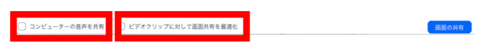

    * **【コンピューターの音声を共有】** チェックを入れると，画面共有中に自分のPCで再生するサウンドを，参加者に共有できます.
    * **【ビデオクリップに対して画面共有を最適化】** チェックを入れると，画面共有中にフルスクリーンモードでビデオクリップを再生する際，最適化された形で参加者のデバイスに表示できます.

4. 共有したい画面を選択した状態で，右下に表示されている青色の「画面の共有」ボタンを押すと，共有が開始され，参加者がその画面を見ることができます.   
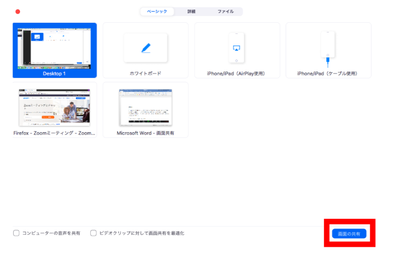

## 画面共有を終了する

画面の共有を終える際は，画面共有メニュー下部，緑色のミーティングIDの右に，赤色で表示されている「共有の停止」をクリックします. すると，自動で共有画面が閉じ，通常のミーティング画面に戻ります.

## 画面共有中の操作メニュー

自分の画面が参加者に共有されている際には，画面上部または下部に，このようなメニューが表示されます. 画面共有時に現れるメニューについて詳しく説明します．

  
* **【コメントを付ける】** クリックすると表示される注釈ツールを用いて，共有画面に注釈を付けることができます.
* **【詳細】** 以下の操作ができます. クリックすると選択画面が表れます.  

    + 教員（ホスト）のみ利用可能なメニュー
        + **出席者のコメント追加を無効にする**：参加者が注釈ツールを用いて共有画面に注釈を付けることを禁止できます.
        + **注釈者の名前を表示**：参加者が共有画面に注釈を付けた際，その参加者の名前が画面に表示される状態にできます.
        + **ブレイクアウトルームの設定**
        + **ミーティングの終了**

## （教員向け）画面共有に関する設定や留意点

ここでは, 画面共有に関する設定と，授業で画面共有機能を使用する際の留意点について説明します.

### 画面共有時のプライバシーに配慮する
デスクトップごと画面共有すると，意図せず個人情報が見えてしまうことがあるため注意が必要です. そのような事態を防ぐため, ウィンドウ単位で画面を共有することもできます．

### 画面共有中にメニューを表示する
画面共有中, 画面共有メニューが画面の上部か下部に隠れてしまうことがあります. 「共有の停止」の左に表示されている緑色のミーティング ID のところにマウスカーソルを当てるとメニューが出てきます．

### 画面共有時に発生してしまう学生の全画面表示をやめてもらう
画面共有中は学生の PC 画面は基本的に全画面表示になってしまい，他のウィンドウに移動することができなくなります．ここで学生が Zoom の画面をダブルクリックすると全画面表示ではなくなり，他のウィンドウに移動しやすくなります． 
教員が画面共有している間，学生には Web ブラウザなど Zoom 以外のウィンドウを使ってもらいたい際には，Zoom の画面をダブルクリックしてもらうよう指示出しすることをおすすめします．

### 画面共有中の操作に関する設定をする

#### 注釈を付けられる人を設定する
画面共有メニュー「詳細」から「出席者のコメント追加を無効にする」を選択すると，参加者が注釈ツールを用いて共有画面に注釈を付けることを禁止できます.

#### 注釈を付けた参加者の名前を表示する
画面共有メニュー「詳細」から「注釈者の名前を表示」を選択すると，参加者が共有画面に注釈を付けた際その参加者の名前が画面に表示される状態にできます. 
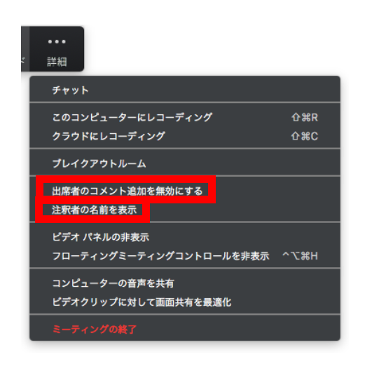

### 画面共有に関する設定を行う

1. Zoomメニュー「画面を共有」横の「∧」マークをクリックすると表れる選択画面で，「高度な共有オプション」を選択します.  

2. 「アドバンス共有オプション」ウィンドウが開きます.  
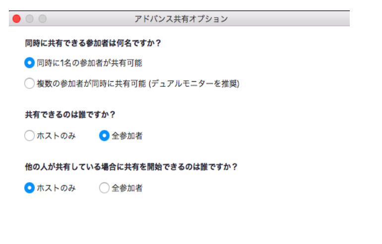

#### 同時に画面を共有できる人数を設定する 
+ 「同時に共有できる参加者は何名ですか？」の項目において，「同時に１名の参加者が共有可能」あるいは「複数の参加者が同時に共有可能（デュアルモニターを推奨）」を選択できます.  
この設定は，Zoomメニュー「画面を共有」横の「∧」マークをクリックすると表れる選択画面からも可能です.
+ 「複数の参加者が同時に共有可能（デュアルモニターを推奨）」を選択すると，「共有できるのは誰ですか？」および「他の人が共有している場合に共有を開始できるのは誰ですか？」の設定は無効になり，複数の参加者が同時に画面共有をすることが可能になります. 
+ 複数の参加者による画面共有がなされる場合，デュアルモニターを使用している閲覧者には，各モニターに最近共有された２つの画面が表示されます.  
同時に複数の資料などを比較したい場合には便利な機能です. 
Zoomアプリケーションの「設定」→「一般」で，「デュアルモニターの使用」にチェックを入れることで，デフォルトに設定できます.
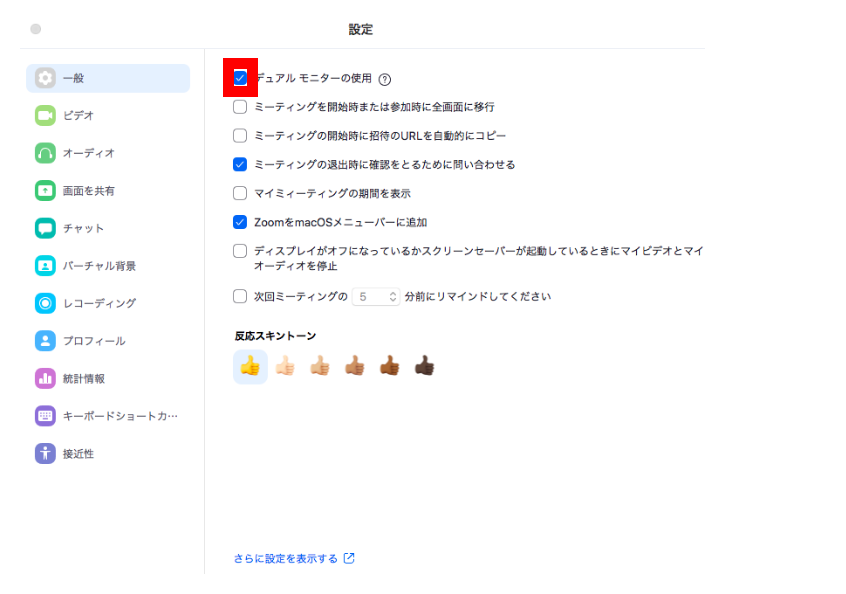
+ シングルモニターを使用している閲覧者には，最近共有された画面が表示されます. 
閲覧者は共有画面上部の「オプションを表示」を選択して，表示する画面を変更できます.

※注意事項 
「複数の参加者が同時に共有可能（デュアルモニターを推奨）」を選択すると，画面共有時の「ビデオクリップに対して画面共有を最適化」のオプションは利用できなくなります. 
また，複数の参加者が同時に画面共有を行なっている場合，共有している人は自分の画面しか見ることができません.

#### 画面共有をできる人を設定する
「同時に１名の参加者が共有可能」に設定されている場合，「共有できるのは誰ですか？」の項目において, 「ホストのみ」あるいは「全参加者」を選択できます.  
「ホストのみ」を選択すると，教員以外の参加者による画面共有を禁止することができます. 
画面共有をできる人については，Zoomメニュー「セキュリティ」をクリックすると表示される選択画面で，「（参加者に次を許可：）画面を共有」のチェックを外す／入れることでも設定可能です. 
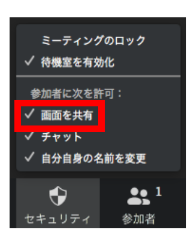

#### 他の人が共有している場合に共有を開始できる人を設定する  
「同時に１名の参加者が共有可能」に設定されている場合, 「他の人が共有している場合に共有を開始できるのは誰ですか？」の項目において, 「ホストのみ」あるいは「全参加者」を選択できます. 
「全参加者」を選択すると，すでに誰かが画面共有をしている際にも，全ての参加者が新たに画面共有を開始することができます.

### 画面共有中に注釈を付ける

画面共有メニュー「コメントを付ける」をクリックすると表示される，このような注釈ツールを用いて, 共有画面に注釈を付けることができます.

* **【マウス】** いずれかの注釈ツールを選択した状態でクリックすると, マウスポインターへ切り替えられます.
* **【選択】** 共有画面上に追加された注釈を選択して移動させたり，大きさを変更することができます.
* **【テキスト】** 共有画面上にテキストを入力することができます. テキストのフォーマットは，「フォーマット」から変更できます.  
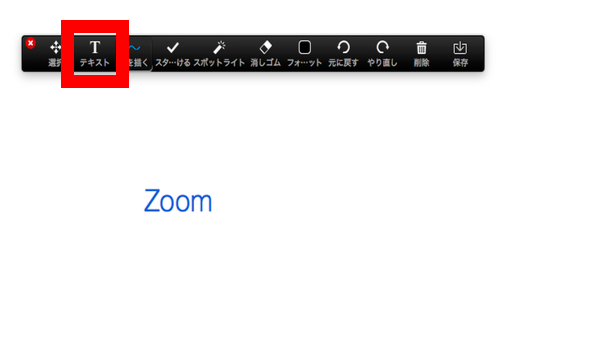  

* **【絵を描く】** 画面上に描画ができます. クリックすると描画のスタイルの選択画面が表れます. 

* **【スタンプを付ける】** 画面上にスタンプを押すことができます. クリックするとスタンプの選択画面が表れます. 
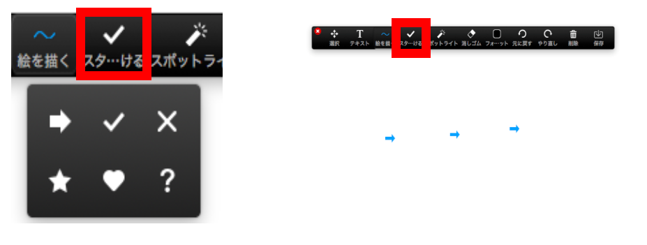

* **【スポットライト】** 画面上でスポットライトを動かし，または矢印を表示して，示したい部分を強調することができます. クリックするといずれかの選択画面が表れます.
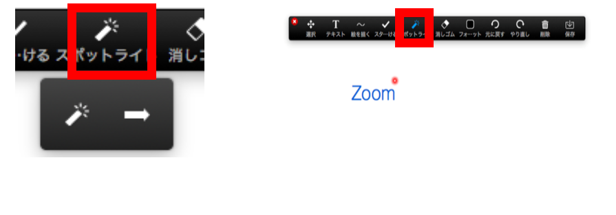

* **【消しゴム】** 追加したテキストや描画, スタンプ等を消すことができます.

* **【フォーマット】** テキストや描画，スタンプ等の，色や大きさ他のフォーマットを変更することができます. クリックすると変更画面が表れます. 
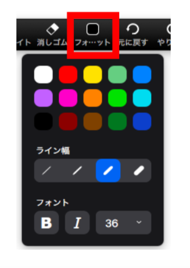

* **【元に戻す】** 最後に変更した注釈を破棄できます.
* **【やり直し】** 「元に戻す」をクリックして破棄した注釈を，再び追加できます.
* **【削除】** 注釈を削除できます. クリックすると選択画面が表れます. 
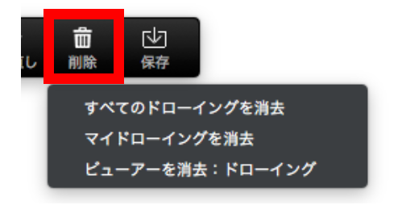

    + すべてのドローイングを消去：共有画面上の全ての注釈を消去できます.
    + マイドローイングを消去：自分が追加した注釈を消去できます.
    + ビューアーを消去　ドローイング：（教員のみ）参加者の注釈を消去できます.
* **【保存】** 共有画面上の全ての注釈を，スクリーンショットとして保存できます. スクリーンショットは，ローカル記録に保存されます.

## 閲覧者が画面操作する

教員や他の参加者の画面を閲覧している学生も，共有画面に注釈を付けたり，自分のデバイスにおける共有画面の表示形式を変更することができます. 
共有画面上部，緑色の「〇〇の画面を表示しています」という表示の右にある「オプションを表示」横の「∨」マークをクリックすると，選択画面が表れます.

### 共有画面に注釈を付ける
「コメントを付ける」を選択すると，注釈ツールが開き，共有画面上に注釈を付けることができます. 注釈ツールの使い方については先述の通りです. (画面共有中に注釈を付けるを参照してください. )  
ただし教員が「出席者のコメント追加を無効にする」設定にしている場合，注釈を付けることはできません.

### 共有画面の表示形式を変更する
共有画面の表示サイズを変更できます.  
「全画面表示の終了」，「ビデオパネルの非表示」の設定もできます. 
また，「左右表示モード」にチェックを入れると，共有画面が左側に，スピーカーが右側に表示されます. セパレーターを動かすことで，各々の表示サイズを変更することができます.  Zoomアプリケーションの「設定」→「画面を共有」で, 「左右表示モード」にチェックを入れることで，画面共有時のデフォルトに設定できます.

