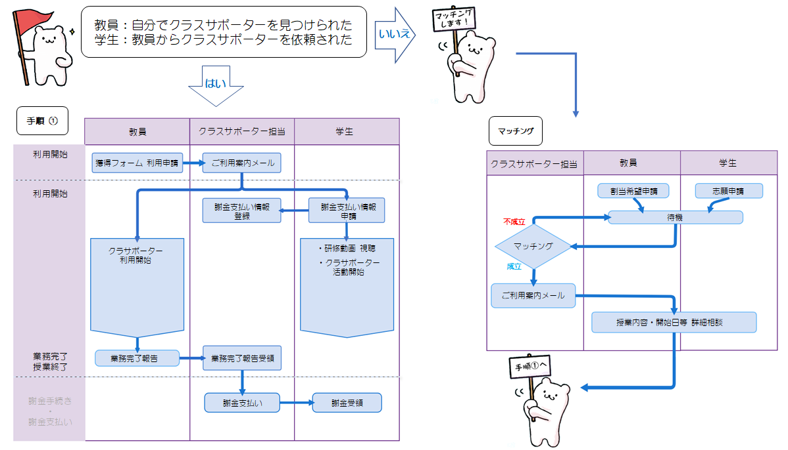

  

    

      【クラスサポーター制度とは】
    

    

      この要領は，全学的なオンライン授業を導入するにあたり，ハイブリッド授業、オンライン授業に限りオンラインの操作が不慣れな先生への、初期動作などを学生がサポートするという仕事を行うクラスサポーターについて必要な事項を定め，授業の円滑な実施を図ることを目的とします．
    

  

  

    

      【クラスサポーターとは】
    

    

      オンライン授業を行う先生を支援する学生です．「先生がオンライン授業に備える，その準備に付き合う，先生が授業中に気づきにくい（音が届いていないなどの）トラブルを学生側から介入する」等，オンラインの操作が不慣れな先生への，初期動作を学生がサポートするという仕事を想定しています．
    

  

  

    

      【クラスサポーターの仕事内容の範囲（想定している仕事例）】
      <small>※本文より一部抜粋</small>
    

    

      <ul>
        <li>音の聞こえ具合やカメラの映り具合のチェック</li>
        <li>会議システムの機能を使ったときの見え方のチェック</li>
        <li>教員の声が聴こえない時「先生，聴こえ（見え）ていませんよ」と声をかける</li>
        <li>画面を共有したつもりでできていない時に「先生，見えていませんよ」と声をかける</li>
        <li>最悪な事故（声が通っていないと知らずに30分しゃべり続ける，など）を防止する</li>
        <li>機材の運搬、準備、片付け等</li> 
      </ul>
    

  

本学に在籍をしている学部生・大学院生がクラスサポーターになることができます． 
クラスサポーター制度を利用する場合には，下記をよくお読みになり，制度を理解した上でお申し込みください．

お知らせ
---------------------------

* 2022/3/31: 4月1日よりSセメスターのクラスサポーター制度の受付を開始します．本ページをよくお読みになり、先生方は「クラスサポーター獲得報告フォーム」または「クラスサポーター割当希望フォーム」, クラスサポーター希望の学生は「クラスサポーター志願フォーム」を記入の上制度利用をお願いします。 
各フォームの締め切りは以下の通りとなります. 
　<a href="https://forms.office.com/r/qJJkPymJPt" target="_blank">「クラスサポーター獲得報告フォーム」</a>：5月31日  
　<a href="https://forms.office.com/r/RJ3MhLNkHQ" target="_blank">「クラスサポーター割当希望フォーム」</a>：5月20日  
　<a href="https://forms.office.com/r/4d6fCUJTEs" target="_blank">「クラスサポーター志願フォーム」</a>：：5月20日 

　（下記はリンク先は申込後の返信にてお知らせします） 
　謝金支払い情報フォーム：6月30日 
　業務完了報告フォーム：9月15日

<!--
* 2022/3/30: 4月1日よりSセメスターのクラスサポーター制度を開始します．-->

重要なポイント
---------------------------
* **通年授業の場合は1年を通して1コマの扱いとなります.**　Sセメで利用された場合はAセメで改めてお申込みすることは出来ませんのでご注意下さい.
* 受講している学生にクラスサポーターを依頼する場合には、「受講しながらサポートする」範囲を逸脱するもの、また当該授業の受講生という立場から利益相反に該当するようなサポートはNG です。受講の支障にならないように配慮が必要です.
* クラスサポーターを依頼する際、登校の必要がある場合には登校できることを確認した上で依頼してください.
* 機材の準備・後片付け等の作業がある場合は該当曜限の前後に作業可能であることを学生と相談し、確認をお願いいたします.
* **上限 10 時間は超えないようにお願いします.**
* TA がいる授業でのクラスサポーター制度のご利用はご遠慮下さい.
* TA 業務に係るような重い仕事はクラスサポーターにさせられません.
* 本学に籍のない満期退学者はクラスサポーターになれません.
* 留学生の場合は、資格外活動許可を有していることが必要です.
* 1授業1クラスサポーターといたします. 2人以上必要な場合には、事前にクラスサポーター担当までご連絡ください. ※クラスサポーター担当 class-support.adm@gs.mail.u-tokyo.ac.jp
* 機材の操作説明等は、先生から学生に行うようにしてください.
* 交通費は支給できません.
* このページにリンクされているフォームにアクセスするにはoffice 365にログインしている必要があります．<a href="https://www.u-tokyo.ac.jp/adm/dics/ja/mslicense.html" target="_blank">こちら</a>を参照いただき，ログインの上アクセスをお願いします．[よくある質問と回答](#anchor1)にもログイン関連をまとめていますので，ご利用下さい．
* どうしてもアクセスできない場合には，チャットサポート（この画面の右下をクリック）で相談するか，クラスサポーター授業担当（末尾に連絡先があります）にご連絡ください．
* 非常勤講師の方は10桁のIDを部局の事務にご確認の上，ご利用ください．
* 各フォームにご登録頂く際には，通常使用されている**必ず連絡のつく**メールアドレスをご登録ください．

## 制度の趣旨

* **オンラインの操作が不慣れな先生への，初期動作等を学生がサポートするという仕事をさせることを想定して実施しています．**
* 学科や専攻を超えたhelpのつながりもできることを目指しています．
* 学科や専攻でTAを割り当てていない場合でも，希望するすべての授業に1名のクラスサポーターを本部予算でつけられるようにしています． 
* 学科や専攻で既にオンライン授業サポートのためのTAがついている場合， クラスサポーターは不要（冗長）な場合が多いと思われます（禁止するものではありません）．
* **クラスサポーターになることが成績評価に影響することはありません．**

クラスサポーターの仕事内容の範囲（想定している仕事の例）
---------------------------

* **※ハイブリッド授業など登校が必須になるような仕事についてはクラスサポーターとなる学生が無理なく引き受けられる場合に限ります**
  * 音の聞こえ具合のチェック
  * カメラの映り具合のチェック
  * 機材の運搬、準備、後片づけ等
  * ハイブリッド授業の進行についての予行演習
  * 教員の声が聴こえない時「先生，聴こえ（見え）ていませんよ」と声をかける
  * 画面を共有したつもりでできていない時に「先生，見えていませんよ」と声をかける
  * （授業形態により）chat質問のチェック
  * 一言で言えば最悪な事故（声が通っていないと知らずに30分しゃべり続ける，など）を防止する
  * 出来る範囲でのWeb会議システムへの習熟, 出来る範囲でのトラブル解決

  
* 注意: **授業中のサポートは授業を受けながらでも出来る程度のものを想定しています**

クラスサポーターとして想定していない仕事内容
---------------------------

* 「先生がWeb会議システムを全く知らなくても済むようにWeb会議の設定などを毎回整える」 などは<u>想定していません</u>
* 「黒板前で動き回る教員をカメラで追従して撮影する, などは<u>想定していません</u>
* 「授業に入れない学生, 音が鳴らない学生などへの個別対応が, 授業を受けられなくなる数発生した場合にすべて対応する（受講に支障があるレベル）」などの仕事は<u>想定していません</u>（もちろん授業中の教員がやることも<u>想定していません</u>）

あくまで「先生がオンライン授業に備える, その準備に付き合う（試行錯誤の相手をする）， 先生が授業中に気づきにくい（音が届いていないなどの）トラブルを学生側から介入する」などの仕事を想定しています． それ以上の仕事は学科， 専攻， 本人とも同意の上， 別途TAを雇うなどしてください． 10時間を超えるサポートをクラスサポーターにお願いしないでください．  

## 制度利用の流れ 

<h4 class="no_toc">【教員用】 </h4>
制度を利用するには，下記の通り2つの方法があります．

**教員自身がサポーターを見つけられた場合**

1. <a href="https://forms.office.com/r/qJJkPymJPt" target="_blank">クラスサポーター獲得報告フォーム</a> で利用申請を行います．
    * 満期退学者など，本学の所属でない人はクラスサポーターに指名できません．
    * 留学生へ依頼する場合には，資格外活動許可を有していることが必須です．
    * 基本的には1授業につき1サポーターです．2人以上必要な場合には，事前にクラスサポーター担当までご連絡ください．class-support.adm[at]gs.mail.u-tokyo.ac.jp    
1. クラスサポーター担当から2種類のフォームが届きます． 
 
   ※獲得フォームにて申請後，クラスサポーター担当から受領メールが自動配信されます． 
 
　メール受領後，活動を開始して頂くことができます． 　　　
    * **謝金支払い情報登録フォーム：** 謝金支払いに必要な情報を学生が記入するフォーム  
学生も同じリンクを受け取っています．こちらのフォームに入力されませんと支払い手続きができませんので，先生が記入する必要はありませんが，学生がフォームに記入したことを確認してください．
    * **業務完了報告フォーム：** 先生ご自身で記入いただくフォーム  
クラスサポーターの業務が完了したら，提出します．業務完了報告が提出された後，クラスサポーター担当が謝金支払い手続きを行います．
1. クラスサポーターの業務完了後，業務完了報告フォームにて報告します．
 
   ※業務完了報告の提出がないと謝金の支払いができません． 
  　クラスサポーター業務完了前に報告した場合には再提出をお願いしていますのでご注意ください． 
  　業務が完了していれば，授業終了日前でも報告可能です． 

**クラスサポーターをマッチングしてほしい場合**
1. <a href="https://forms.office.com/r/RJ3MhLNkHQ" target="_blank">クラスサポーター割当希望フォーム</a> で制度の利用申請を行います．
2. マッチング成立後，クラスサポーターをご案内するメールが届きます．
3. 学生と連絡をとり，開始日・科目名・時間割コード・曜限などを互いに確認します．
4. 双方が同意しましたら，獲得報告フォームを提出してください．
5. クラスサポーター担当から2種類のフォームが届きますので確認します．
 
※獲得フォームにて申請後，クラスサポーター担当から受領メールが自動配信されます． 
 　メール受領後，活動を開始して頂くことができます．
    * **謝金支払い情報登録フォーム：** 謝金支払いに必要な情報を学生が記入するフォーム  
学生も同じリンクを受け取っています．こちらのフォームに入力されませんと支払い手続きができませんので，先生が記入する必要はありませんが，学生がフォームに記入したことを確認してください．
    * **業務完了報告フォーム：** 先生ご自身で記入いただくフォーム  
クラスサポーターの業務が完了したら，提出します．業務完了報告が提出された後，クラスサポーター担当が謝金支払い手続きを行います．
1. クラスサポーターの業務完了後，業務完了報告フォームにて報告します．
  * 業務完了報告フォームの提出がないと謝金の支払いができません．
  * クラスサポーター業務完了前に報告した場合には再提出をお願いしていますのでご注意ください． 
  * 業務が完了していれば，授業終了日前でも報告可能です．

**【留意事項】**
* 制度利用の申請（フォームへの入力）はこのサイトTOPにある「お知らせ」に記載の期限までにお願いします．
* ご自身でサポーターを見つけた場合，下記を学生に理解頂けましたらクラスサポーター制度を利用することができます．
  * 謝金支払い情報を登録する際，住所などの個人情報の他，マイナンバー，口座番号確認する書類の提出が必要となります（画像のアップロード） 
  * 謝金 1科目あたり13,000円（税込み）であること  
  * 最大で10時間分の活動時間であること（研修動画視聴は含まない）
  * 先生からの完了報告提出後，学生への支払い手続きを行います．
* クラスサポーターには，必ずしも高度なITスキルを持つことを要求してはいません．先生の授業をhelpしたい意志があり，オンライン授業に参加可能な学生なら誰でもできる業務を想定しています．
* 10時間で何をしていただくかの詳細はクラスサポーターとご相談ください．授業前の準備や，実際の授業中に必要な手伝いが含まれます．授業中の手伝いは，授業を受けながら出来る程度を想定しているため，授業時間すべてをカウントする必要はありません．
* 留学生は他の労働時間も含めて週28時間が上限と定められているため，それを超えないように調整してください．
* 留学生は資格外活動許可を取得していることが必要です．未取得の場合はすぐに取得手続きを行ってください．取得後でないと業務を開始することはできません．留学生で休学中の場合は資格外活動が認められていないためクラスサポーターになることができません．

<h4 class="no_toc">【学生用】 </h4>
- ITに習熟していることを要求・期待していません．オンライン授業に参加できており，先生の授業をhelpしたいという意志があり， 必要に応じて学ぶ意志があれば充分です．学習に支障のない範囲で引き受けたり，志望したりしてください．
 

**教員からの依頼を受けてクラスサポーターになる場合**　　　 
1. 教員の申請後に届く，謝金支払い情報フォームに到着後1週間をめどに，速やかに必要事項を記入します． 
※支払いには，学生証・口座情報・マイナンバー・留学生は在留カードと資格外活動許可書が必要です．必ず準備してから必要事項を入力してください．
1. <a href="https://drive.google.com/file/d/1bGzESYskaSerVURdrugYMiFSFwpvu0te/view?usp=sharing" target="_blank">制度理解のため、クラスサポーター制度研修資料</a>を読み、クラスサポーターの流れ、全体を確認します．
 
過去にクラスサポーターの経験があり、研修動画を視聴されたことがある場合も一部変更箇所があるため一読が必要です（2022年度から研修動画の視聴はなくなりました）**この作業はクラスサポーター業務10時間に含まれません．（2022年度から研修動画の視聴はなくなりました）**
 
<a href="https://drive.google.com/file/d/1bGzESYskaSerVURdrugYMiFSFwpvu0te/view?usp=sharing" target="_blank">【クラスサポーター制度研修資料】</a>
 
<a href="https://drive.google.com/file/d/1bGzESYskaSerVURdrugYMiFSFwpvu0te/view?usp=sharing" target="_blank">【オンライン授業をスムーズに行うコツ】</a>
：2020年5月に行われたクラスサポーター制度説明会の中で 学生がグループになりどういうサポートしたか、困った事、こんな事があった 等を情報共有してもらったものをまとめたものです。
 
1. 謝金の支払い
 
クラスサポーター業務終了後，教員からの業務完了報告の後に謝金のお支払い手続きをとります． 

**クラスサポーターを行ってみたい場合**
 
※空き時間などを利用して自分が履修していない授業や， 個人的に頼まれた教員以外の授業．
1. <a href="https://forms.office.com/r/4d6fCUJTEs" target="_blank">クラスサポーター志願フォーム</a> でエントリーします．
1. マッチング成立後，詳細をご案内するメールが届きます．
 
教員の条件に応じたマッチング（授業実施曜限など）を行うため，志望してもクラスサポーターとして割り当てられないこともある点ご了承ください．  

1. 教員の申請後に届く，謝金支払い情報フォームに到着後1週間をめどに，速やかに必要事項を記入します．
 
※支払いには，学生証・口座情報・マイナンバー・留学生は在留カードと資格外活動許可書が必要です．必ず準備してから必要事項を入力してください． 

2. <a href="https://drive.google.com/file/d/1bGzESYskaSerVURdrugYMiFSFwpvu0te/view?usp=sharing" target="_blank">制度理解の為、クラスサポーター制度研修資料</a>を読み、クラスサポーターの流れ、全体を確認します．
 
過去にクラスサポーターの経験があり、研修動画を視聴されたことがある場合も一部変更箇所がある為一読が必要です（2022年度から研修動画の視聴はなくなりました）**この作業クラスサポーター業務10時間に含まれません．（2022年度から研修動画の視聴はなくなりました）**
 
<a href="https://drive.google.com/file/d/1bGzESYskaSerVURdrugYMiFSFwpvu0te/view?usp=sharing" target="_blank">【クラスサポーター制度研修資料】</a>
 
<a href="https://drive.google.com/file/d/1bGzESYskaSerVURdrugYMiFSFwpvu0te/view?usp=sharing" target="_blank">【オンライン授業をスムーズに行うコツ】</a>
：2020年5月に行われたクラスサポーター制度説明会の中で 学生がグループになりどういうサポートしたか、困った事、こんな事があった 等を情報共有してもらったものをまとめたものです。
 

3. 謝金の支払い
 
クラスサポーター業務終了後，教員からの業務完了報告の後に謝金のお支払い手続きをとります．

**【留意事項】**

* 下記をご理解していただいた場合のみ，クラスサポーター活動を行うことができます．
  * 謝金支払い情報を登録する際，住所などの個人情報の他，マイナンバー，口座番号確認する書類の提出が必要となります（画像のアップロード） 
  * 謝金 1科目あたり13,000円（税込み）であること  
  * 最大で10時間分の活動時間であること（研修動画視聴は含まない）
  * 先生からの完了報告提出後，学生への支払い手続きを行います．
* クラスサポーターには，必ずしも高度なITスキルを持つことを要求してはいません． 先生の授業をhelpしたい意志があり， オンライン授業に参加できている学生なら誰でもできるものを想定しています．
* 10時間で何をしていただくかの詳細は教員とご相談ください．10時間には授業前の準備や， 実際の授業中に必要な手伝いが含まれます．授業中の手伝いは授業を受けながら出来る程度のものを想定しているため， 授業時間すべてをカウントする必要はありません．
* 留学生は他の労働時間も含めて週28時間が上限と定められているため，それを超えないように調整してください．
* 留学生は資格外活動許可を取得していることが必要です．未取得の場合はすぐに取得手続きを行ってください．取得後でないと業務を開始することはできません．留学生で休学中の場合は資格外活動が認められていないためクラスサポーターになることができません．

## よくある質問と回答例

**【教員・学生 共通】**   

<u>Q. フォームにアクセスができない </u> 

<pre class="highlight"><code
>  - 手順は2つです. 
 1.サインインする 
 2.リンク先をクリック

 【1.サインインする】 
   <a href="https://www.office.com/" target="_blank">https://www.office.com/</a>　へサインイン 
   アカウント：UTokyo Account 10桁@utac.u-tokyo.ac.jp 
   パスワード：ご自身で設定されたもの 
   ※既にサインインしている場合は1度サインアウトして再度サインインをお願いいたします. 
   <a href="https://www.youtube.com/watch?v=SiOS0M9FChk&feature=youtu.beyoutube" target="_blank">YouTube動画</a>で サインインとサインアウトの方法が確認できます. 
    
   【2.リンク先をクリック】 
   UTokyo Account 10桁 @utac.u-tokyo.ac.jpでサインインした後 
   フォームのリンク先をクリックします. 
   万が一これでも報告ができない場合は 
   以下リンク先の画面右下に表されるチャットサポートでご相談いただけます. 
   <a href="https://utelecon.github.io/" target="_blank">https://utelecon.github.io/</a> 
   平日ですと有人で相談することができ,その場で順を追って解決してもらえるので,お困りの際にはどうぞご活用ください. 

</code></pre>

<u>Q. 申請・登録・報告時の控えの受領メールについて </u> 

<pre class="highlight"><code
>  - 令和3年から,フォームで入力された「通常ご使用なさっているメールアドレス （連絡が確実に届くもの）」に記載したアドレスに自動配信されます.しばらくしても届かない場合はクラスサポーター担当へお問い合わせ下さい
</code></pre>

<u>Q. クラスサポーター業務時間のカウントについて </u> 

<pre class="highlight"><code
>  - クラスサポーター活動時間の上限は10時間です.授業の途中であっても10時間に達した時点で活動終了となります.一方「授業中の時間をすべてカウントする必要はない」ということも示しておりますので,実働に応じてカウントしていただくなど,適宜ご判断いただければと思います.
</code></pre>

<u>Q. 10時間以下の謝金支払いについて </u> 

<pre class="highlight"><code
>  - 謝金は1つの科目に対しての単価ですので 1科目あたり,13,000円（税込み）です. 3時間でも10時間でも,同一です.
</code></pre>

<u>Q. マッチングについて </u> 

<pre class="highlight"><code
>  - 曜限などの条件が適合する志願学生を探しています.見つかり次第ご案内メールをお送りしますのでお待ちください.見つからない場合もございますので,ご理解願います.
</code></pre>

 

**【教員】**

<u>Q. 通年授業の場合、SセメとAセメの申し込みが必要ですか </u> 

<pre class="highlight"><code
>  - 通年授業の場合は1年を通して1科目（1コマ）の扱いとなります.ご利用されるタイミングに合わせて、SセメもしくはAセメのどちらかでお申込みください．　　　
</code></pre>

<u>Q. 締め切り後のクラスサポーターの申し込みについて </u> 

<pre class="highlight"><code
>  - 所属の部局でご相談ください．　　　
</code></pre>

<u>Q. 業務完了報告の提出日  </u> 

<pre class="highlight"><code
>  - クラスサポーター業務の完了後です.完了前の報告は,再提出をお願いしています. 
</code></pre>

 

**【学生】** 

<u>Q. 謝金支払い情報登録時のマイナンバーのWEB登録をしたくありません.</u>

<pre class="highlight"><code
>  - 限定された職員のみがマイナンバーの確認作業を行っております.セメスターごとの情報管理をしており,作業終了後にその都度,情報を破棄しております. 安心してご登録をお願いしたいのですが,「ウェブ画面に入力または 添付したくない」という場合は,第2本部棟3階311号室にあります「大学総合教育研究センター」事務室まで厳封してお持ちいただくか,以下への郵送での提出も可能です.  
   　〒113-0033　東京都文京区本郷 7-3-1
   　東京大学　大学総合教育研究センター
   　クラスサポーター謝金担当　宛
</code></pre>

<u>Q. 謝金入金日はいつですか. </u>

<pre class="highlight"><code
>    - 教員による業務完了報告提出後,手続きします.
</code></pre>

<u>Q. 謝金の入金金額と明細について</u>
  

<pre class="highlight"><code
>    - 13000円より,税金分3.063％に相当する金額がひかれています.確定申告をすれば戻りますので,お手数ですが,手続きをお願いいたします.なお,明細書は学部（大学院）ごとに学内便で配布予定です.1月末ごろになりましたら源泉徴収票も出る予定です. 
</code></pre>

  

<u>Q. クラスサポーターの謝金の受け取りについて</u>
  

<pre class="highlight"><code
>    - 謝礼は口座振り込みのみです.
</code></pre>

問い合わせ先
---------------------------------------------
オンライン授業学生担当  
class-support.adm[at]gs.mail.u-tokyo.ac.jp  

<u>問い合わせメールのテンプレート</u>

<pre class="highlight"><code
>氏名 : 
所属 : 所属部局・学部・研究科等を記入してください．
構成員分類 : 教職員か学生かを記入してください．
身分・学年 : 
共通ID（10桁の数字） : 
問い合わせ内容 : 
以下のa，bを可能な限り埋めてください．

a) どのような質問ですか？　　　
b) 依頼前・依頼後・マッチング後・採用後など状況を教えてください．　　　
</code></pre>

