[多要素認証に関する説明ページのトップに戻る](.)

## はじめに
{:#introduction}

多要素認証 (Multi-Factor Authentication, MFA) とは，アカウントへのサインイン時に，パスワードに加えて，SMSや専用のアプリなどで本人確認を行う認証方法です．多要素認証を利用すると，なんらかの事情でパスワードが他人に知られた場合でも，アカウントにサインインされる可能性を低くすることができ，セキュリティを向上することができます．

このページでは，多要素認証の利用を有効化するための初期設定手順について説明します．全体の流れは以下のようになります．

- まず，手順1および手順2で，サインイン時に利用する「本人確認方法」を登録します．本人確認方法には以下の種類がありますので，トラブルに備えて必ず2個以上を登録してください（同じ種類のものを2個でもかまいません）．
    - **「Microsoft Authenticator」アプリ**を使う方法：「Microsoft Authenticator」は，Microsoftが提供している多要素認証のための専用のアプリです．UTokyo Accountの多要素認証はMicrosoftのシステムを利用しているため，他の認証アプリよりスムーズに利用できます．2台以上のスマホを持っている場合は，それぞれのスマホで登録することができます．
    - **「Microsoft Authenticator」以外の認証アプリ**を使う方法：「Google認証システム」など，「Microsoft Authenticator」以外の認証アプリを使うこともできます．スマホアプリだけでなく，セキュリティキーと呼ばれる専用の機器と連携させて利用するパソコンのアプリもあります（一例としては，「YubiKey」というセキュリティキー製品と連携して使う「Yubico Authenticator」というアプリがあります）．
    - **電話番号**を使う方法：電話番号を登録しておき，その電話番号でSMSまたは音声通話（自動音声ガイダンス）の着信を受け取って本人確認を行う方法です．
    - **FIDOセキュリティキー**を使う方法：FIDOセキュリティキーと呼ばれる専用の機器を用いて本人確認を行う方法です．一部のシステムでは対応していないため，他の本人確認方法を登録した上で，2個目以降の本人確認方法として利用してください．詳細は「[UTokyo Account多要素認証におけるFIDOセキュリティキーの利用方法](fido-security_key)」をご覧ください．
    - （教職員向け）**貸出ハードウェアトークン**を使う方法：上記の本人確認方法方法がいずれも利用できない場合，「ハードウェアトークン」という専用の機器を貸し出しています（教職員向け）．初期設定の手順が他の本人確認方法と異なりますので，[UTokyo Portalの案内ページ（教職員専用）](https://univtokyo.sharepoint.com/sites/utokyoportal/wiki/d/UTokyo_Account_Token.aspx)を参照して利用してください．
- 手順3は，登録した本人確認方法を利用して実際にサインインできるか確認する手順です．
- 最後の手順4は，多要素認証を有効化するための申請を行う手順です．

手順1から順に，**手順4までのすべての作業を行ってください**．なお，手順を終えると，その後**UTokyo Accountにサインインする際，毎回，設定したSMSや専用のアプリなどで本人確認することが求められます**．本人確認方法（スマホのアプリや電話番号）が利用できない状態ではUTokyo Accountにサインインすることができなくなりますので，十分ご注意ください．

### 初期設定手順の動画

このページで説明している初期設定手順を動画でも説明しています．

<iframe width="560" height="315" src="https://www.youtube.com/embed/km-v8v_LvwM" title="YouTube video player" frameborder="0" allow="accelerometer; autoplay; clipboard-write; encrypted-media; gyroscope; picture-in-picture; web-share" allowfullscreen></iframe>

## 手順1：1個目の本人確認方法を登録する
{:#first.mfa-initial-step-heading}

まず，多要素認証で使う本人確認方法（SMSや専用の認証アプリ）を設定します．ここではまず1個目の本人確認方法を設定し，この後の手順2で2個目以降を設定します．なお，ここで設定する1個目の本人確認方法がデフォルト（自動で選ばれる方法）になるので，最もよく使う本人確認方法を登録するのがいいでしょう．

<ol class="mfa-initial-procedure">
<!--
<li><a href="https://gidp.adm.u-tokyo.ac.jp/idp/profile/Logout">UTokyo Accountのサインアウトページ</a>にアクセスしてください．</li>
<li>「サインアウト 正常にサインアウトしました」という画面が表示されるまでしばらく待ってください．</li>
-->
<li><a href="https://account.activedirectory.windowsazure.com/proofup.aspx?proofup=1&whr=utac.u-tokyo.ac.jp">多要素認証の設定ページ</a>にアクセスしてください．</li>
<li>（サインイン済みでなければ）サインイン画面が表示されるので，UTokyo Accountのユーザ名（10桁の数字）とパスワードを入力してください．</li>
<li>「詳細情報が必要」という画面が表示されるので，「次へ」を押してください．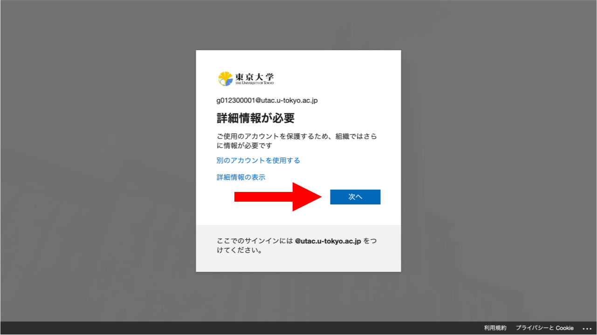</li>
<li>
多要素認証の本人確認方法を設定する画面になります．設定の手順は本人確認方法の種類によって異なります．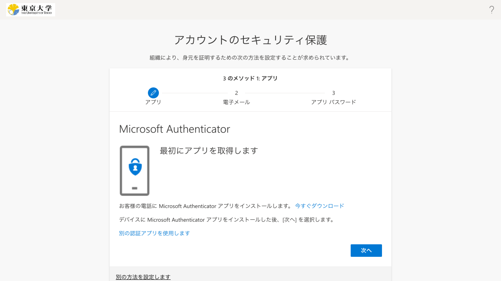
<ul>
<li>
<strong>「Microsoft Authenticator」アプリを使う方法</strong>：「Microsoft Authenticator」は，Microsoftが提供している多要素認証のための専用のアプリです．UTokyo Accountの多要素認証はMicrosoftのシステムを利用しているため，他の認証アプリよりスムーズに利用できます．

登録手順

<ol>
<li>スマホに「Microsoft Authenticator」アプリをインストールしてください．Androidの人は<a href="https://play.google.com/store/apps/details?id=com.azure.authenticator">Google Play</a>から，iPhoneの人は<a href="https://apps.apple.com/app/microsoft-authenticator/id983156458">App Store</a>からダウンロードできます．</li>
<li>アプリのインストールを終えたら元の画面に戻って作業を続けます．デフォルトでMicrosoft Authenticatorの設定をする画面になっているので，そのまま「次へ」を押してください．</li>
<li>以降の手順はこの作業をスマホ（Microsoft Authenticatorアプリをインストールしたもの）でしているかそれ以外（パソコンなど）でしているかによって異なります．
<ul>
<li>
<strong>スマホでこの作業をしている場合</strong>：「このリンクをクリックして、アカウントをアプリにペアリングします。」を押してください．Microsoft Authenticatorアプリに移動し，自分のUTokyo Accountが表示されればOKです．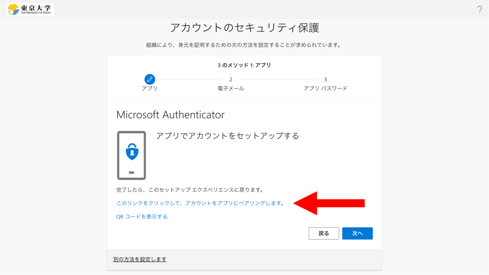</li>
<li><strong>スマホ以外（パソコンなど）でこの作業をしている場合</strong>
<ol>
<li>画面の指示に従ってQRコードを表示してください．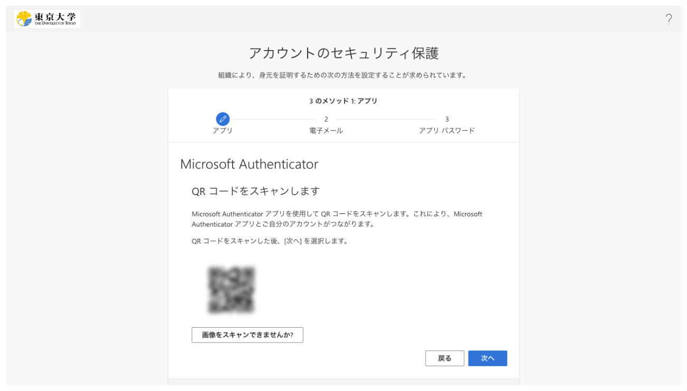</li>
<li>スマホでMicrosoft Authenticatorアプリを開き，画面右上の「+」を押してから，「職場または学校アカウント」「QRコードをスキャン」の順に選択してください．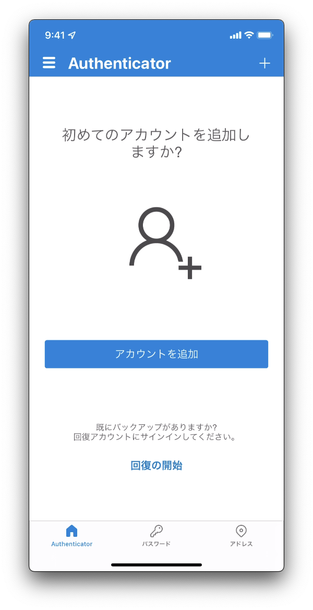</li>
<li>QRコードを読み取ってください．</li>
<li>アプリ上に自分のUTokyo Accountが表示されればOKです．</li>
</ol>
</li>
</ul>
</li>
</ol>

</li>
<li>
<strong>「Microsoft Authenticator」以外の認証アプリを使う方法</strong>：「Google認証システム」など，「Microsoft Authenticator」以外の認証アプリを使うこともできます．スマホアプリだけでなく，セキュリティキーと呼ばれる専用の機器と連携させて利用するパソコンのアプリもあります（一例としては，「YubiKey」というセキュリティキー製品と連携して使う「Yubico Authenticator」というアプリがあります）．

登録手順

<ol>
<li>画面の中ほどにある「別の認証アプリを使用します」というリンクを探して押してください．{{ mfa_totp_trouble }}</li>
<li>
    画面の指示に従って進むとQRコードが表示されるので，お使いの認証アプリでQRコードを読み取り，設定を行ってください． 
    ※「YubiKey」と「Yubico Authenticator」アプリを使う場合の設定手順については，「<a href="yubikey-totp">UTokyo Account多要素認証におけるYubico Authenticatorアプリの利用方法</a>」をご覧ください．
    
</li>
</ol>

</li>
<li>
<strong>電話番号を使う方法</strong>：電話番号を登録しておき，その電話番号でSMSまたは音声通話（自動音声ガイダンス）の着信を受け取って本人確認を行う方法です．

登録手順

<ol>
<li>画面の下の方にある「別の方法を設定します」というリンクを探して押してください．</li>
<li>「どの方法を使用しますか?」欄で「電話」を選び，「確認」を押してください．</li>
<li>「どの電話番号を使用しますか?」欄は，適切な国番号（日本の場合は「Japan (+81)」）を選択してから，自分の電話番号を入力してください．また，この電話番号を使って本人確認を行う方法として，「コードをSMSで送信する」と「電話する」のうちから好みの方を選んでください．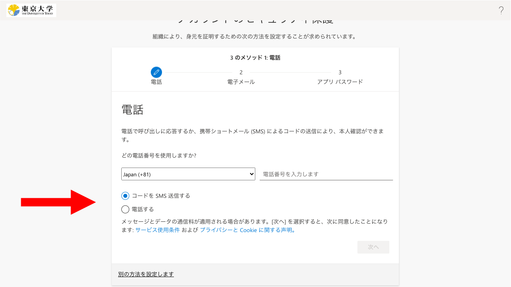</li>
<li>「次へ」を押してください．</li>
<li>電話番号の確認が行われます．「コードをSMSで送信する」を選んだ場合は，SMSに確認コード（6桁の数字）が届き，それを画面に入力するよう求められるので，そのようにしてください．「電話する」を選んだ場合は，音声通話が着信し，自動音声ガイダンスで「#」ボタンを押すように言われるので，そのようにしてください（スマホで通話中に「#」ボタンを表示するには，画面に表示されている「キーパッド」ボタンを押します）．</li>
</ol>

</li>
</ul>
</li>
<li>（既に登録しているのでなければ）メールアドレスの入力を求められます．なるべくECCSクラウドメール以外のメールアドレスを入力してください．続いてそのメールアドレスに送られてくる「コード」（6桁の数字）を入力するよう求められるので，そのようにしてください．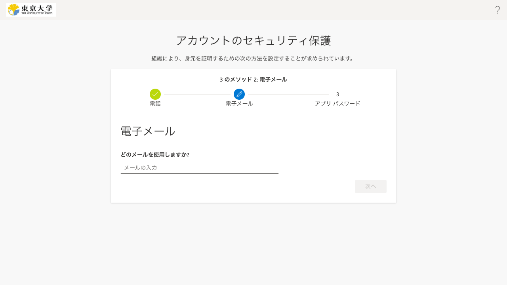</li>
<!--
<li>「アプリ パスワード」という画面が出て，「アプリ パスワード名」を入力するよう求められることがあります（この画面が出ないこともあります）．適当な英数字を入力して「次へ」を押してください．（「アプリ パスワード」とは多要素認証に非対応のシステムを利用するためのものですが，UTokyo Accountでは利用しないので，特に気にせずに適当に入力して問題ありません）</li>
<li>「アプリ パスワード」の画面が出た場合は，引き続き「アプリ パスワードが正常に作成されました。パスワードをクリップボードにコピーし、アプリに貼り付けます。」と表示されますが，無視して「完了」を押してください．</li>
-->
<li>画面上に「成功」と表示されたらOKです．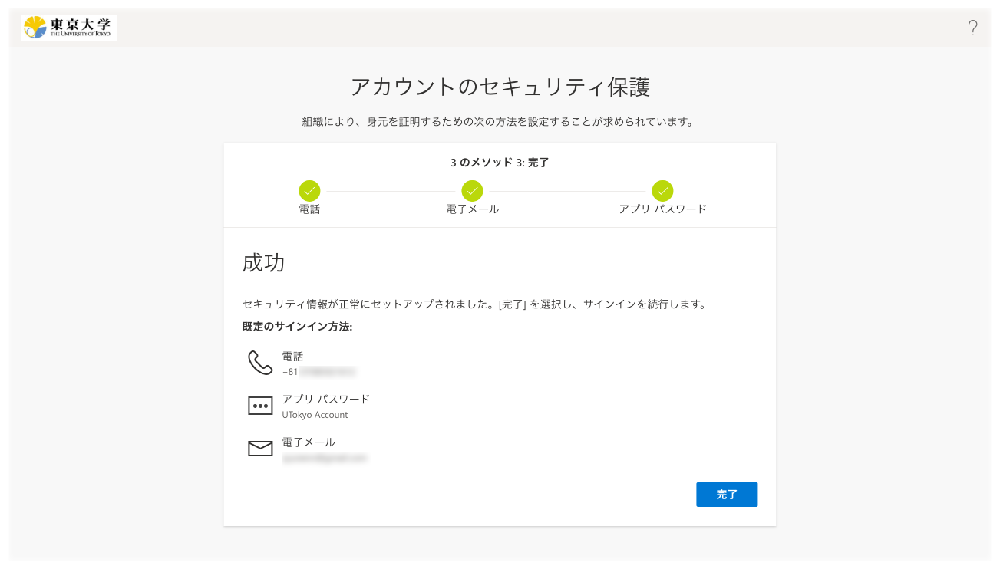</li>
</ol>

初期設定はまだ完了していません．引き続き手順2～4を行ってください．

## 手順2：追加の本人確認方法を登録する
{:#alternative.mfa-initial-step-heading}

続いて，**[多要素認証の設定ページ](https://mysignins.microsoft.com/security-info?domain_hint=utac.u-tokyo.ac.jp)**から，追加の（2個目以降の）本人確認方法を登録します．

本人確認方法を1個しか登録していなくても多要素認証を利用することはできますが，故障や機種変更などで登録されている本人確認方法が使えなくなった場合，UTokyo Accountにサインインできなくなってしまいます．このような事態を防ぐため，必ず**複数の本人確認方法を登録してください**．

<ul class="mfa-initial-procedure">
<li>
<strong>「Microsoft Authenticator」アプリを使う方法</strong>：「Microsoft Authenticator」は，Microsoftが提供している多要素認証のための専用のアプリです．UTokyo Accountの多要素認証はMicrosoftのシステムを利用しているため，他の認証アプリよりスムーズに利用できます．2台以上のスマホを持っている場合は，2台目以降のスマホを追加で登録することもできます．

登録手順

<ol>
<li>（まだしていなければ）スマホに「Microsoft Authenticator」アプリをインストールしてください．Androidの人は<a href="https://play.google.com/store/apps/details?id=com.azure.authenticator">Google Play</a>から，iPhoneの人は<a href="https://apps.apple.com/app/microsoft-authenticator/id983156458">App Store</a>からダウンロードできます．</li>
<li><a href="https://mysignins.microsoft.com/security-info?domain_hint=utac.u-tokyo.ac.jp">多要素認証の設定ページ</a>で，「方法の追加」を押してください．</li>
<li>「どの方法を使用しますか?」欄で「認証アプリ」を選び，「追加」を押してください．</li>
<li>Microsoft Authenticatorの設定をする画面が出るので，そのまま「次へ」を押してください．</li>
<li>以降の手順はこの作業をスマホ（Microsoft Authenticatorアプリをインストールしたもの）でしているかそれ以外（パソコンなど）でしているかによって異なります．
<ul>
<li><strong>スマホでこの作業をしている場合</strong>：「このリンクをクリックして、アカウントをアプリにペアリングします。」を押してください．Microsoft Authenticatorアプリに移動し，自分のUTokyo Accountが表示されればOKです．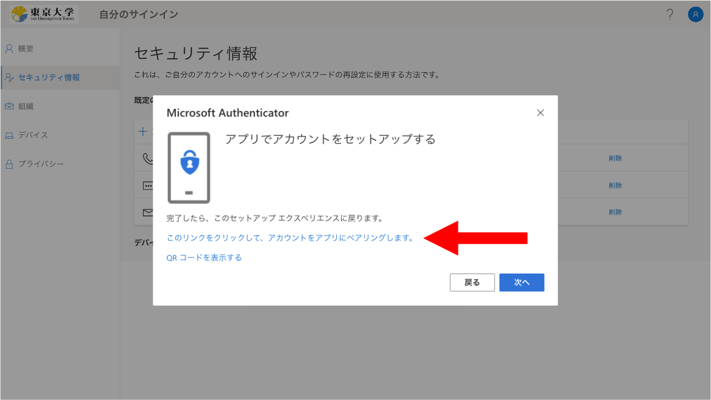</li>
<li><strong>スマホ以外（パソコンなど）でこの作業をしている場合</strong>
<ol>
<li>画面の指示に従って進み，QRコードを表示してください．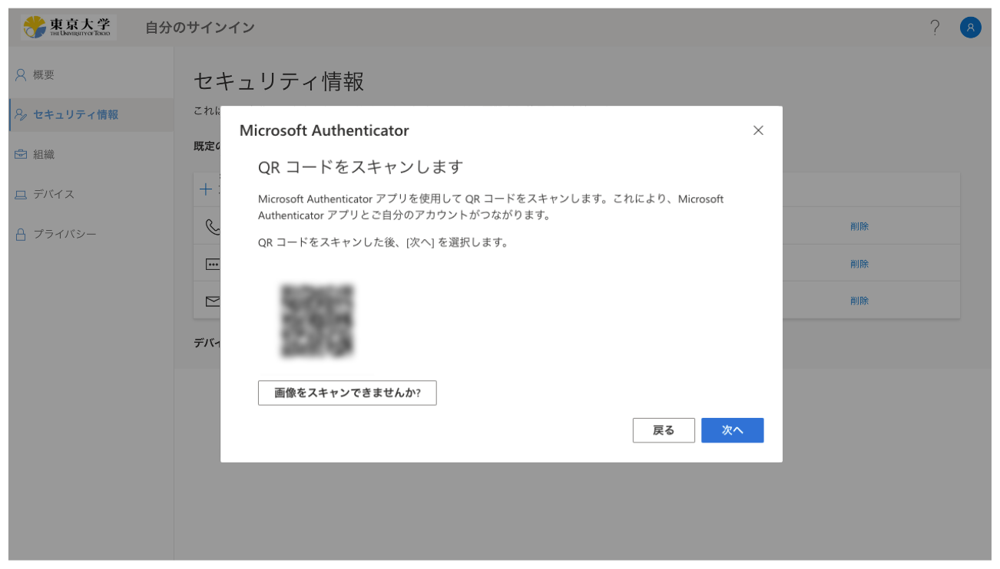</li>
<li>スマホでMicrosoft Authenticatorアプリを開き，「アカウントを追加」「職場または学校アカウント」「QRコードをスキャン」の順に選択してください．</li>
<li>QRコードを読み取ってください．</li>
<li>アプリ上に自分のUTokyo Accountが表示されればOKです．</li>
</ol>
</li>
</ul>
</li>
</ol>

</li>
<li>
<strong>「Microsoft Authenticator」以外の認証アプリを使う方法</strong>：「Google認証システム」など，「Microsoft Authenticator」以外の認証アプリを使うこともできます．スマホアプリだけでなく，セキュリティキーと呼ばれる専用の機器と連携させて利用するパソコンのアプリもあります（一例としては，「YubiKey」というセキュリティキー製品と連携して使う「Yubico Authenticator」というアプリがあります）．

登録手順

<ol>
<li><a href="https://mysignins.microsoft.com/security-info?domain_hint=utac.u-tokyo.ac.jp">多要素認証の設定ページ</a>で，「方法の追加」を押してください．</li>
<li>「どの方法を使用しますか?」欄で「認証アプリ」を選び，「追加」を押してください．</li>
<li>「別の認証アプリを使用します」というリンクを探して押してください．{{ mfa_totp_trouble }}</li>
<li>
    画面の指示に従って進むとQRコードが表示されるので，お使いの認証アプリでQRコードを読み取り，設定を行ってください． 
    ※「YubiKey」と「Yubico Authenticator」アプリを使う場合の設定手順については，「<a href="yubikey-totp">UTokyo Account多要素認証におけるYubico Authenticatorアプリの利用方法</a>」をご覧ください．
    
</li>
</ol>

</li>
<li>
<strong>電話番号を使う方法</strong>：電話番号を登録しておき，その電話番号でSMSまたは音声通話（自動音声ガイダンス）の着信を受け取って本人確認を行う方法です．「電話」「代替の電話」「会社電話」の3種類をそれぞれ1つまで（合計3つまで）登録することができ，それぞれの違いは次の通りです．
<ul>
<li><strong>電話</strong>：主に使う電話（携帯電話）を登録するものです．本人確認時の方法としてSMSと音声通話の両方が選べます．初期設定時に電話番号で設定を行った場合は「電話」として登録されています．</li>
<li><strong>代替の電話</strong>：予備の電話（自宅の固定電話など）を登録するものです．本人確認時の方法は音声通話のみで，SMSを選ぶことができません．</li>
<li><strong>会社電話</strong>：予備の電話として会社（大学）の電話を登録するものです．本人確認時の方法は音声通話のみで，SMSを選ぶことができません．他の種類の電話と違って内線番号（直通番号ではなく代表番号に繋がってから追加の番号を入力する必要のある内線）を設定できます．</li>
</ul>

登録手順

<ol>
<li><a href="https://mysignins.microsoft.com/security-info?domain_hint=utac.u-tokyo.ac.jp">多要素認証の設定ページ</a>で，「方法の追加」を押してください．</li>
<li>「どの方法を使用しますか?」欄で登録したい種類の電話番号を選び，「追加」を押してください．</li>
<li>「どの電話番号を使用しますか?」欄は，適切な国番号（日本の場合は「Japan (+81)」）を選択してから，自分の電話番号を入力してください．また，電話番号の種類として「電話」を選んだ場合は，この電話番号を使って本人確認を行う方法として「コードをSMSで送信する」と「電話する」のうちから好みの方を選んでください．</li>
<li>電話番号の確認が行われます．SMSの場合は，SMSに確認コード（6桁の数字）が届き，それを画面に入力するよう求められるので，そのようにしてください．音声通話の場合は，電話が着信し，音声ガイダンスで「#」ボタンを押すように言われるので，そのようにしてください（スマホで通話中に「#」ボタンを表示するには，画面に表示されている「キーパッド」ボタンを押します）．</li>
</ol>

</li>
<li><strong>FIDOセキュリティキーを使う方法</strong>：FIDOセキュリティキーと呼ばれる専用の機器を用いて本人確認を行う方法です．一部のシステムでは対応していないなどの注意事項がありますので，確認した上で利用してください． <a href="fido-security_key">注意事項・登録手順</a>
</li>
</ul>

<!--

ヘルプ：「多要素認証の設定ページ」にアクセスする際にサインインを求められ，多要素認証の本人確認が求められる場合 <mark>TODO</mark>

-->

なお，「方法の追加」を押した後に表示される「どの方法を使用しますか?」欄で，上記の他に「電子メール」と「アプリ パスワード」を選ぶことができますが，これらは多要素認証の本人確認方法とは異なる用途のためのもので，サインイン時の本人確認に使うことはできません．

初期設定はまだ完了していません．引き続き手順3・4を行ってください．

## 手順3：サインインできるか確認する
{:#try.mfa-initial-step-heading}

次に，ここまでに登録した本人確認方法を利用してUTokyo Accountにサインインすることができるか確認します．

1. [UTokyo Accountのサインアウトページ](https://univtokyo.sharepoint.com/sites/utokyoaccount/_layouts/15/SignOut.aspx)にアクセスしてください．
1. 「サインアウトしました」という画面が表示されるまでしばらく待ってください．
1. [多要素認証の設定ページ](https://mysignins.microsoft.com/security-info?domain_hint=utac.u-tokyo.ac.jp)へアクセスしてください．
1. サインイン画面が表示されたら，UTokyo Accountのユーザ名（10桁の数字）とパスワードを入力してください．
1. 続いて多要素認証の本人確認が行われます．本人確認方法により手順が異なりますので，画面の指示に従って操作してください．
    - **「Microsoft Authenticator」アプリの場合**：スマホに通知が送られ，サインイン画面に表示されている2桁の数字を入力するように求められるので，そのようにしてください．
        

            
※「Microsoft Autheticator アプリを現在使用できません」の表示について

            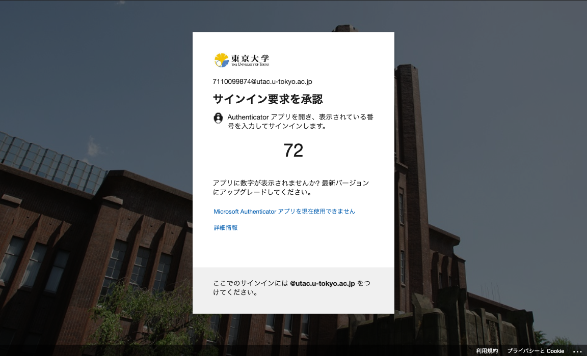
            画面に「Microsoft Authenticator アプリを現在使用できません」との表示が現れますが，これは，もしあなたがMicrosoft Authenticatorを使用できない状態にある場合にはここを押してくださいという旨のヘルプメッセージであり，システムがMicrosoft Authenticatorを使用できない状態にある旨のエラーメッセージではありません．
        

    - **「Microsoft Authenticator」以外の認証アプリの場合**：アプリに表示されるコード（6桁の数字）を入力するように求められるので，そのようにしてください．
    - **電話番号でSMSを使う場合**：SMSにコード（6桁の数字）が送られ，それを入力するように求められるので，そのようにしてください．
    - **電話番号で音声通話を使う場合**：電話が着信し，音声ガイダンスで「#」ボタンを押すように言われるので，そのようにしてください（スマホで通話中に「#」ボタンを表示するには，画面に表示されている「キーパッド」ボタンを押します）．
    

        
表示されているもの以外の本人確認方法を使いたい場合

        サインイン時の本人確認方法は，登録されている方法のいずれか（通常，最初に登録したもの）がデフォルトとして自動的に選ばれます．他の本人確認方法を使いたい場合は，画面上の「別の確認オプションを使用する」（あるいは「問題がありますか? 別の方法でサインインする」「Microsoft Authenticator アプリを現在使用できません」）というリンクを押してください．
        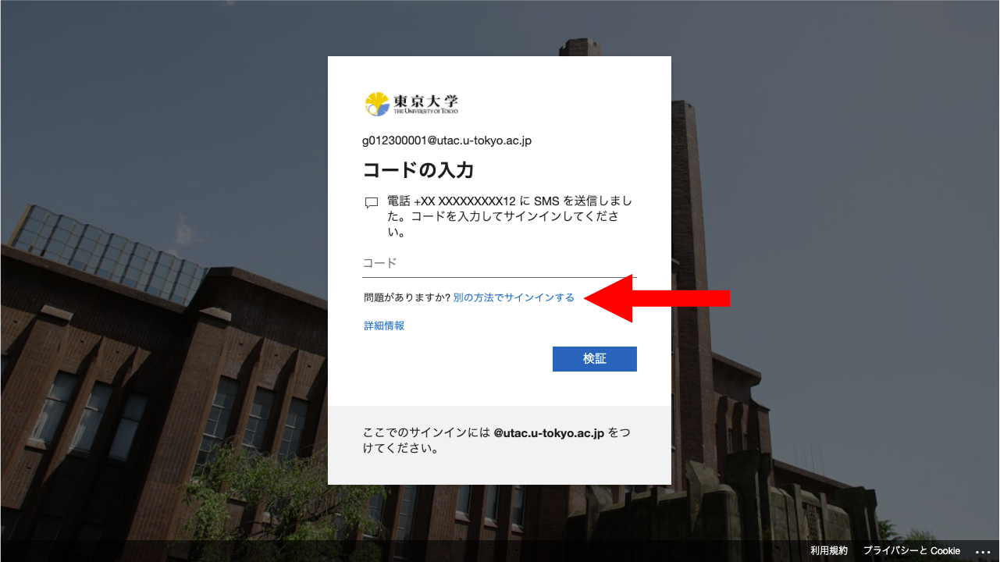
        また，デフォルトの方法を変更したい場合は，下の「<a href="/utokyo_account/mfa/change#default">既定（デフォルト）の本人確認方法を変更する</a>」の説明に従って作業してください．
    

1. 「セキュリティ情報」と書かれた多要素認証の設定ページが表示されればOKです．
{:.mfa-initial-procedure}

初期設定はまだ完了していません．引き続き手順4を行ってください．
  
※この手順3がうまくいかなかった場合は，次の手順4へ進まず，<a href="/support/">サポート窓口</a>に問い合わせてください．

## 手順4：多要素認証の利用を申請する
{:#apply.mfa-initial-step-heading}

最後に，多要素認証の利用申請を行います．この申請を行うと，以降，UTokyo Accountにサインインする際に毎回，上の手順3と同様の手順による本人確認が求められるようになります．

なお，事務業務端末（職員向け）のリモートアクセス (Citrix Workspace) が接続中の場合，多要素認証の利用申請を行うと接続が強制的に切断されるため，あらかじめ接続を終了（サインアウト）してから以下の手順を行ってください．



1. [UTokyo Account利用者メニュー](https://utacm.adm.u-tokyo.ac.jp/webmtn/LoginServlet)にアクセスしてください．
2. UTokyo Accountのユーザ名（10桁の数字）とパスワードを入力してログインしてください．
3. 左のメニューにある「多要素認証利用申請」を押してください．
4. 表示される多要素認証に関する説明をよく読んでから，下の方にある「多要素認証を利用する」を「はい」にして，「保存」を押してください．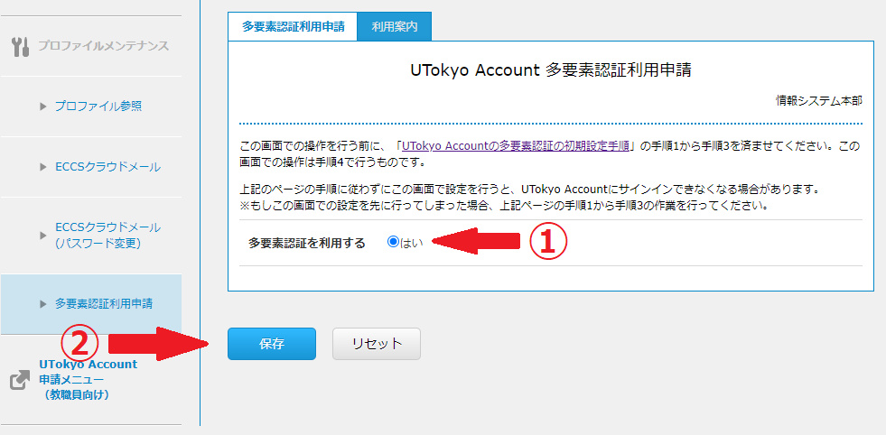
{:.mfa-initial-procedure}

以上で多要素認証の初期設定手順は完了です．<strong>設定がシステム全体に反映されるまで最大約40分かかります</strong>ので，多要素認証の利用が必須なUTokyo VPNおよびUTokyo Slackを利用したい場合は，それまでしばらくお待ちください．
  
なお，UTokyo VPNを利用したい場合は，<a href="/utokyo_vpn/">UTokyo VPNのページ</a>に記載されている作業も必要ですので，約40分の経過後，引き続き作業を行うようお願いします．

## おわりに
{:#note}

手順を終えると，その後**UTokyo Accountにサインインする際，毎回，設定したSMSや専用のアプリなどで本人確認することが求められます**．登録した本人確認方法（スマホのアプリや電話番号）が利用できない状態ではUTokyo Accountにサインインすることができなくなりますので，十分ご注意ください．

特に，機種変更の際は，古いスマホが利用できるうちに，「[UTokyo Account多要素認証の本人確認方法の登録変更手順](change)」に従って新しいスマホを追加登録してください．スマホを処分すると認証アプリによる本人確認はできなくなりますし，電話番号が変わると電話番号による本人確認はできなくなります．登録の変更をする際にもサインイン時の本人確認は必要となるので，本人確認できずにUTokyo Accountにサインインできないという事態にならないよう，必ず事前に変更を行うことが重要です．

また，多要素認証の有効化は，自身の操作では元に戻すことができません．多要素認証の利用をやめてパスワードだけでサインインできる状態に戻したい場合，「多要素認証の利用終了」という手続きが必要ですので，「[UTokyo Account多要素認証の本人確認方法再登録および利用終了について](reregister_and_terminate)」を参照してください．
