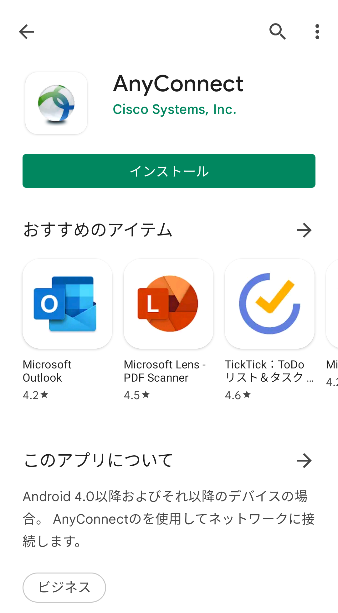
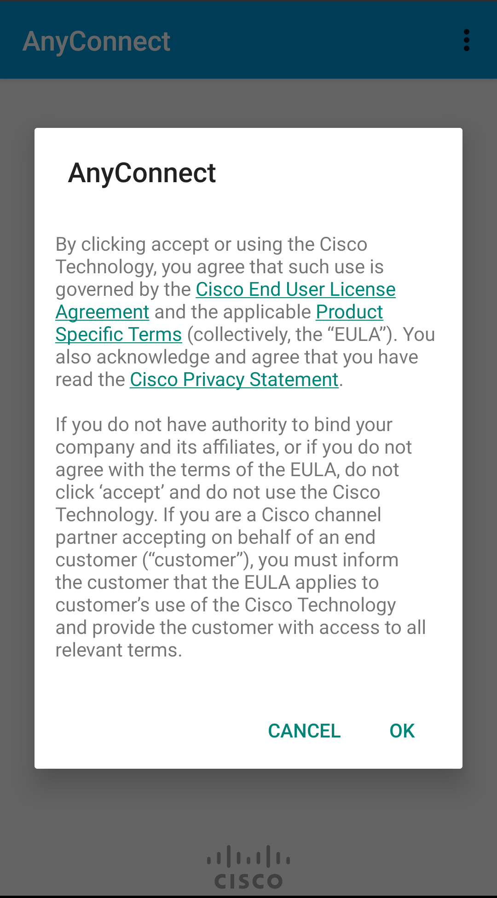
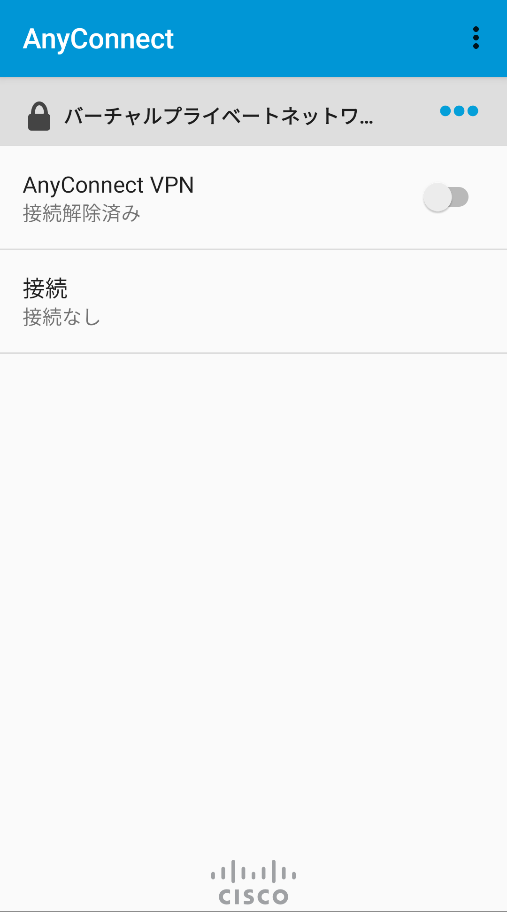
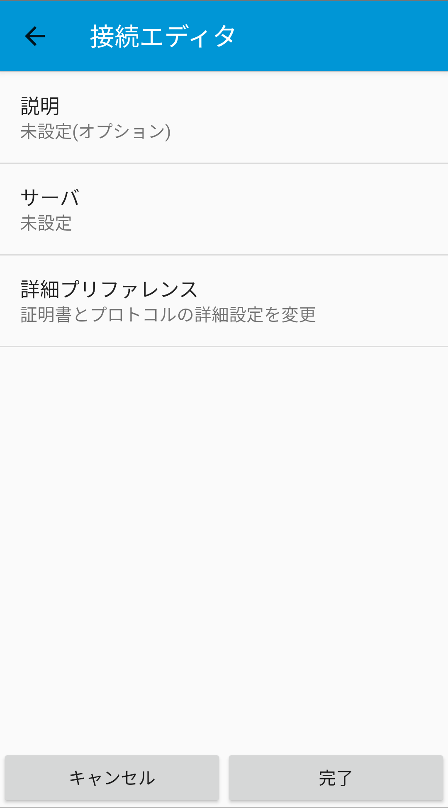
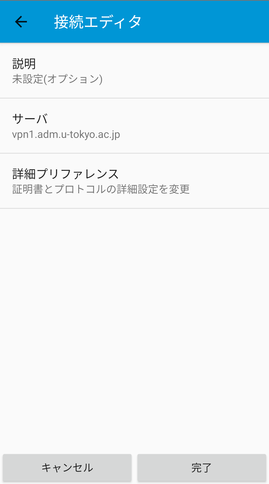
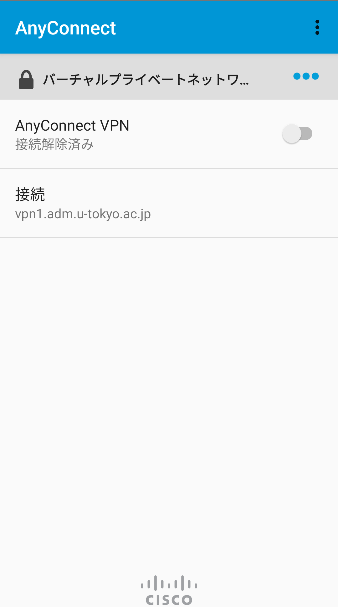
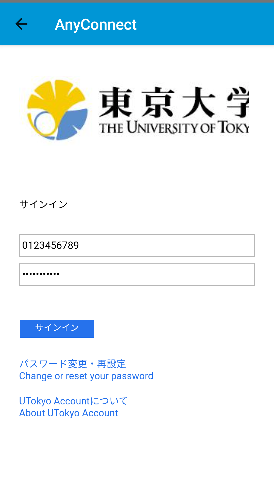
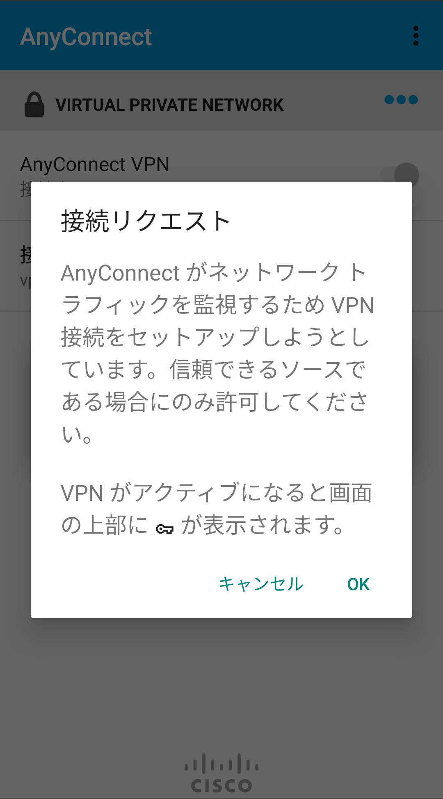

## 準備編: VPNクライアントアプリケーションのインストール
{:#utokyo-vpn-ios-android}

まずはUTokyo VPNに接続するために必要なアプリを端末にインストールします．手順は通常のAndroidアプリと同様です．

**手順A:** Playストアアプリから以下に示したCisco Systems社のAnyConnectというアプリをインストールします．

**手順B:** インストールを終えてAnyConnectアプリを開くと，下の左のような画面が出るので「OK」をタップしてください．下の右のような画面が出たらインストールは完了です（端末の設定によっては日本語もしくは英語で表示されることがあります）．

<ul style="display: flex;">
<li style="list-style: none;">
  </li>
<li style="list-style: none;">
  </li>
</ul>

## 利用編: UTokyo VPNへの接続
{:#utokyo-vpn-android-connect}

以下の **手順D** 以降はVPNを利用するたびに必要です．特にスマホを起動した直後に自動的にVPNに接続されるわけではありませんので，ご注意ください．

**手順C:** アプリを起動した直後の画面で「接続」をタップし，続いて「新しいVPN接続の追加」をタップします．下記左図のような「接続エディタ」が表示されるので，「サーバ」をタップして **vpn1.adm.u-tokyo.ac.jp** と入力します．「OK」を押して下記右図のようになっていることを確認したうえで画面下の「完了」をタップします．

<ul style="display: flex;">
<li style="list-style: none;">
  </li>
<li style="list-style: none;">
  </li>
</ul>

**手順D:** アプリを起動した直後の画面で，下記左図のように「接続」に「vpn1.adm.u-tokyo.ac.jp」と記載されていることを確認してください．次に，「AnyConnect VPN」の横のトグルボタンをONにして，下記右図のようにUTokyo Accountの認証ウィンドウが表示されたらご自身のUTokyo Accountでログインしてください．

<ul style="display: flex;">
<li style="list-style: none;">
  </li>
<li style="list-style: none;">
  </li>
</ul>

このとき，以下のような許可を求める画面が出ることがあります．その場合は「OK」を押してください．

**手順E:** 認証に成功すれば，VPNへの接続は完了です．ZoomやWebExなどVPNを経由する必要のない一部の通信や電子ジャーナルサイトなどを除く全ての通信は，このVPNを経由して，東京大学キャンパスネットワークに接続している状態で行われます．

**手順F:** アプリ起動直後の画面に戻って現在の状態を確認します．下記の画面のようにAnyConnect VPNの下に「接続済み」と表示されていれば，お使いのスマホはUTokyo VPNに接続している状態です．

VPNを切断する際は，この画面のトグルボタンをタップして「接続解除済み」にしてください．

 
 
<a href="index" target="_blank">UTokyo VPN全体のページに戻る</a>
