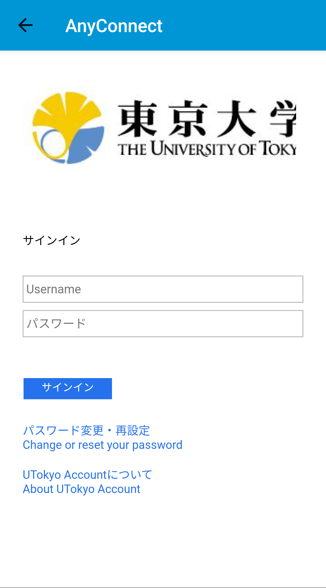
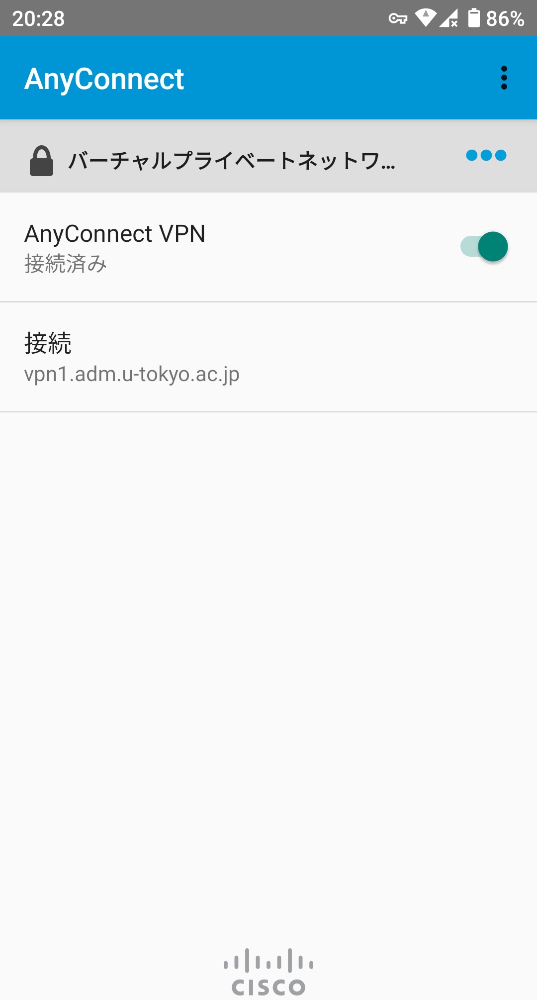

## 準備編: VPNクライアントアプリケーションのインストール
{:#utokyo-vpn-ios-setup}

<!-- 最新版にアップデートしていることは前提とする -->

まずはUTokyo VPNに接続するために必要なアプリを端末にインストールします．手順は通常のiOSアプリと同様です．

**手順A:** Playストアアプリから以下に示したCisco Systems社のAnyConnectというアプリをインストールします．

**手順B:** 

**手順C:**

## 利用編: UTokyo VPNへの接続
{:#utokyo-vpn-ios-connect}

以下の **手順D** 以降はVPNを利用するたびに必要です．特に端末を起動した直後
に自動的にVPNに接続されるわけではありませんので，ご注意ください．

**手順D:** アプリを起動した直後の画面で，下記左図のように「接続」に「vpn1.adm.u-tokyo.ac.jp」と記載されていることを確認してください．次に，「AnyConnect VPN」の横のトグルボタンをONにして，下記右図のようにUTokyo Accountの認証ウィンドウが表示されたらご自身のUTokyo Accountでログインしてください．

<ul style="display: flex;">
<li style="list-style: none;">
  </li>
<li style="list-style: none;">
  </li>
</ul>

このとき，以下のような許可を求める画面が出ることがあります．その場合は「OK」を押してください．

**手順E:** 認証に成功すれば，VPNへの接続は完了です．ZoomやWebExなどVPNを経由する必要のない一部の通信や電子ジャーナルサイトなどを除く全ての通信は，このVPNを経由して，東京大学キャンパスネットワークに接続している状態で行われます．

**手順F:** アプリ起動直後の画面に戻って現在の状態を確認します．下記の画面のようにAnyConnect VPNの下に「接続済み」と表示されていれば，お使いのスマホはUTokyo VPNに接続している状態です．

VPNを切断する際は，この画面のトグルボタンをタップして「接続解除済み」にしてください．

 
 
<a href="index" target="_blank">UTokyo VPN全体のページに戻る</a>
