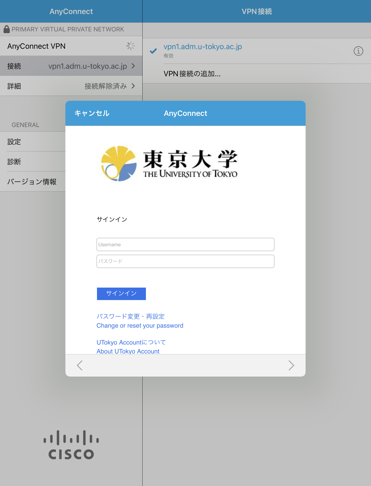
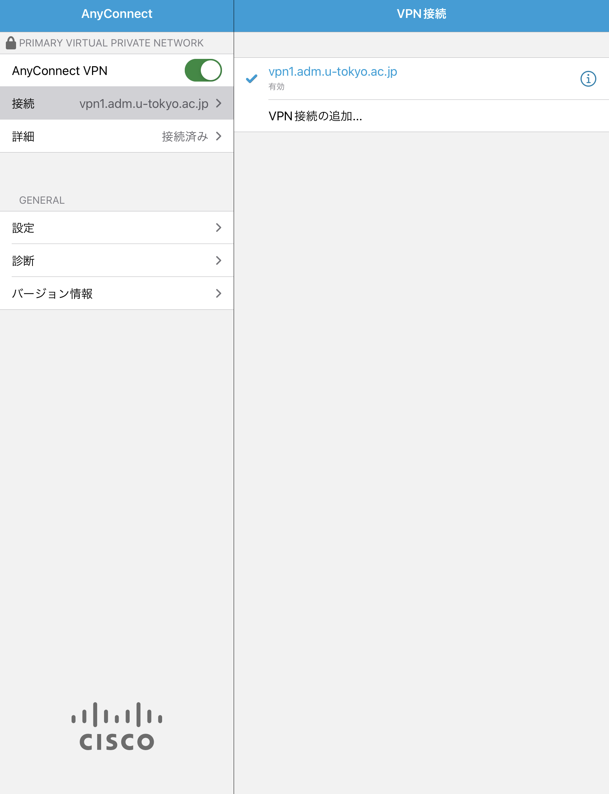

## 準備編: VPNクライアントアプリケーションのインストール
{:#utokyo-vpn-ios-setup}

<!-- 最新版にアップデートしていることは前提とする -->

まずはUTokyo VPNに接続するために必要なアプリを端末にインストールします．手順は通常のiOSアプリと同様です．

**手順A:** App Storeアプリから以下に示したCisco社のCisco AnyConnectというアプリをインストールします．

**手順B:** インストールを終えてAnyConnectアプリを開くと，下のような画面が出ることを確認します．これでインストールは完了です．

## 利用編: UTokyo VPNへの接続
{:#utokyo-vpn-ios-connect}

以下の **手順D** 以降はVPNを利用するたびに必要です．特に端末を起動した直後に自動的にVPNに接続されるわけではありませんので，ご注意ください．

**手順C:** アプリを起動した直後の画面で左上の「接続」をタップ，続いて「VPN接続の追加」をタップすると，下記左図のようなウィンドウが表示されるので，「サーバ」の横の入力欄をタップして **vpn1.adm.u-tokyo.ac.jp** と入力します．そして「保存」を押すと，下記右図のようにVPN構成の追加を求められるので「許可」を押します．さらに追加でTouch IDによる認証などを求められることもありますので，その際は認証を行ってください．

<ul style="display: flex;">
<li style="list-style: none;">
  </li>
<li style="list-style: none;">
  </li>
</ul>

**手順D:** アプリを起動した直後の画面で，下記左図のように画面右上の「接続」に「vpn1.adm.u-tokyo.ac.jp」と記載されていることを確認してください．次に「AnyConnect VPN」の横のトグルボタンをONにして，下記右図のようにUTokyo Accountの認証ウィンドウが表示されたらご自身のUTokyo Accountでログインしてください．前回のアクセスから時間をおかずに起動した場合は，この画面が表示されないで直ちにVPN接続が開始されることもあります．

<ul style="display: flex;">
<li style="list-style: none;">
  </li>
<li style="list-style: none;">
  </li>
</ul>

**手順E:** 認証に成功すれば，VPNへの接続は完了です．ZoomやWebExなどVPNを経由する必要のない一部の通信や電子ジャーナルサイトなどを除く全ての通信は，このVPNを経由して，東京大学キャンパスネットワークに接続している状態で行われます．

**手順F:** アプリ起動直後の画面に戻って現在の状態を確認します．下記の画面のように「詳細」が「接続済み」と表示されていれば，お使いの端末はUTokyo VPNに接続している状態です．

VPNを切断する際は，この画面左上のトグルボタンをタップして「詳細」が「接続解除済み」になったことを確認してください．

 
 
<a href="index" target="_blank">UTokyo VPN全体のページに戻る</a>
