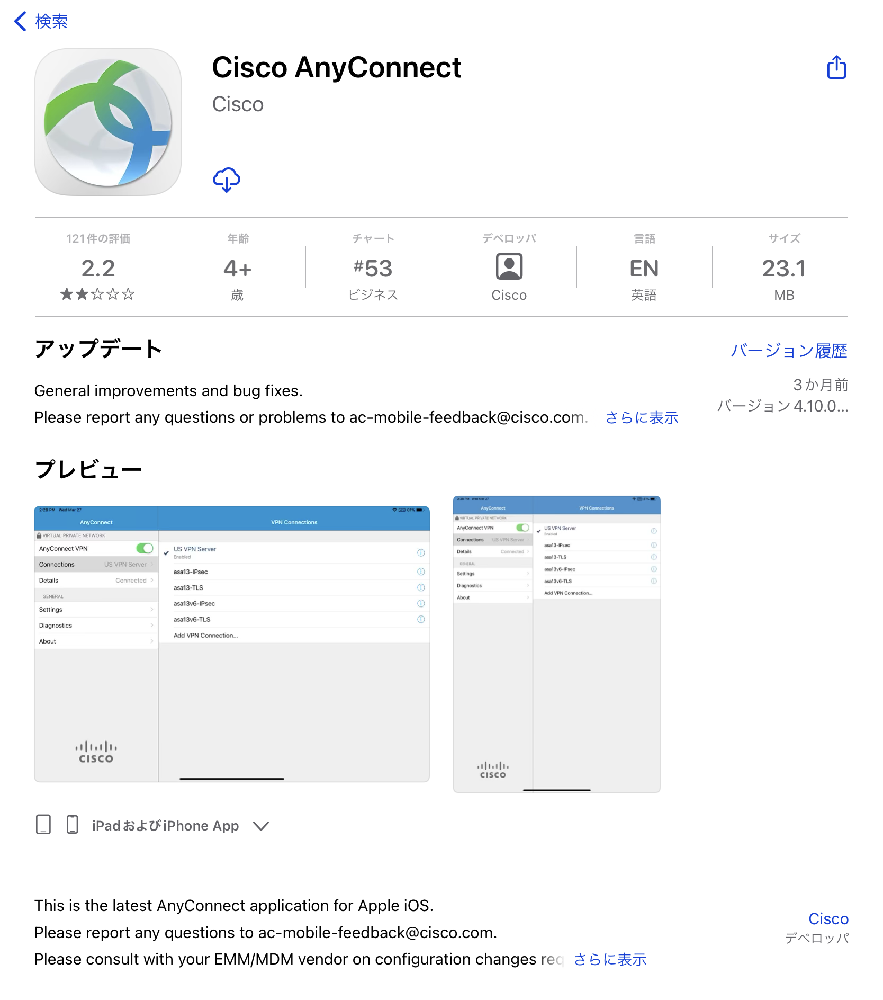
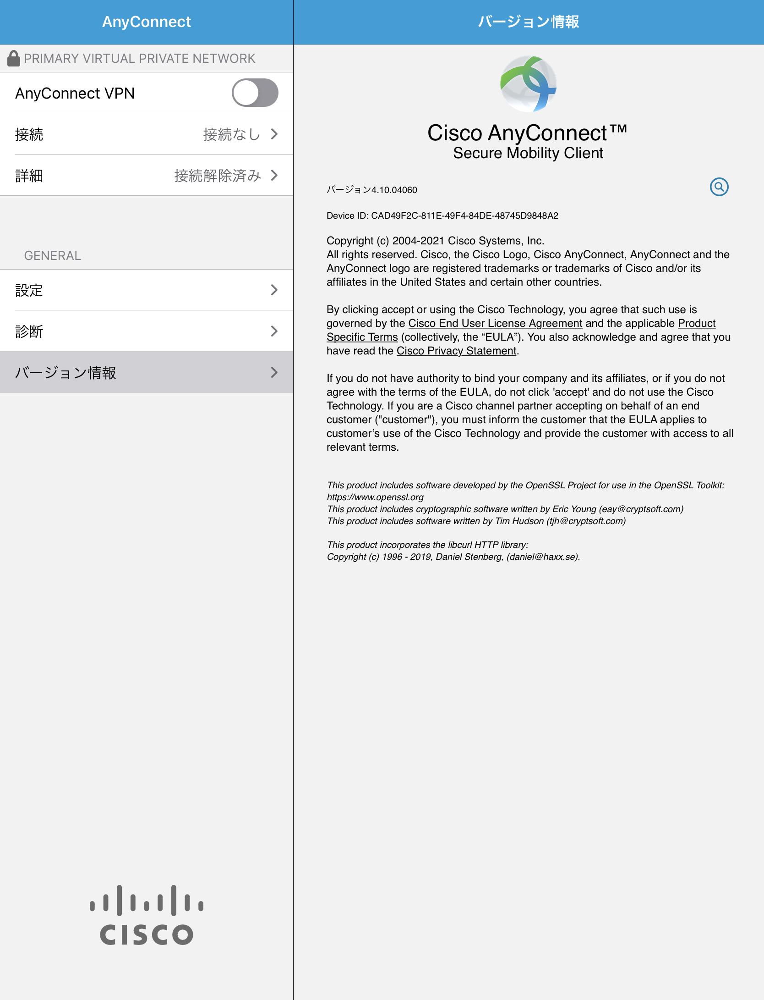
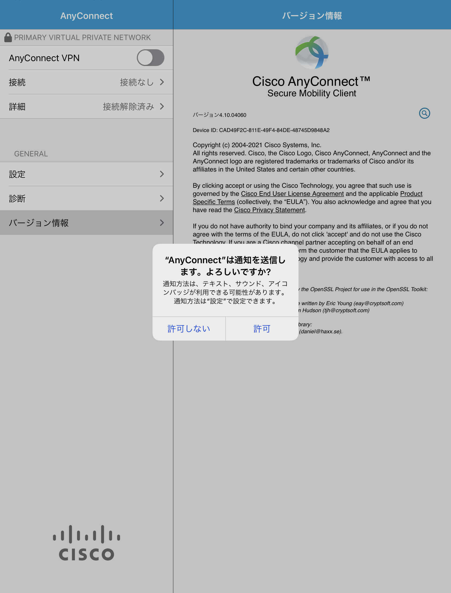
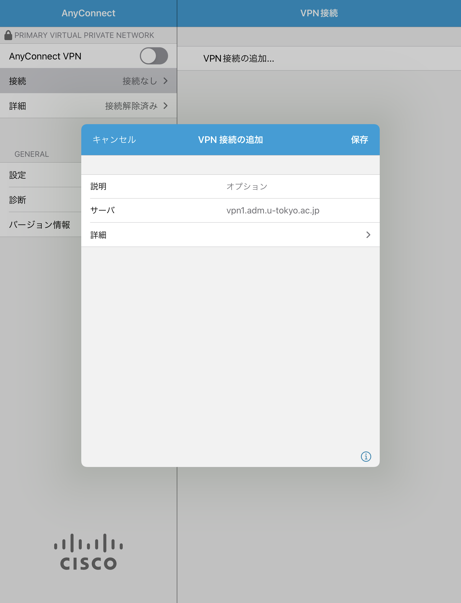
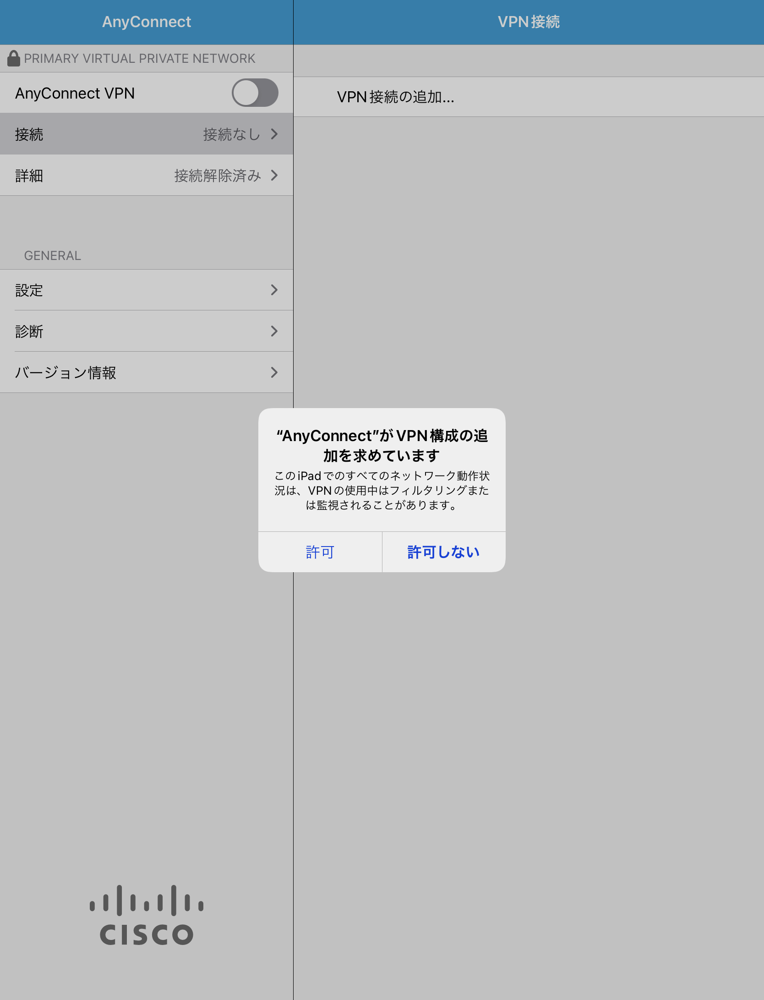
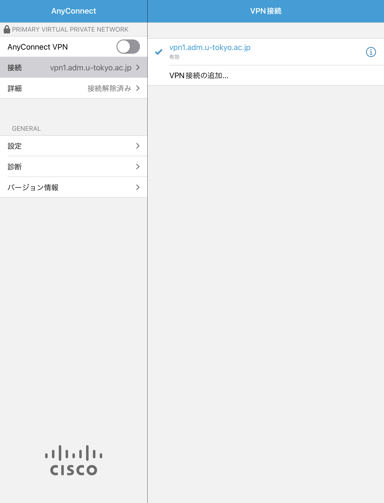
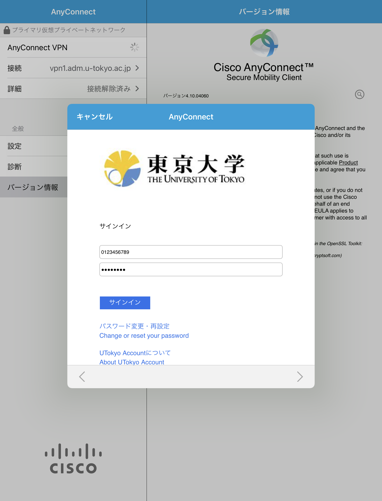
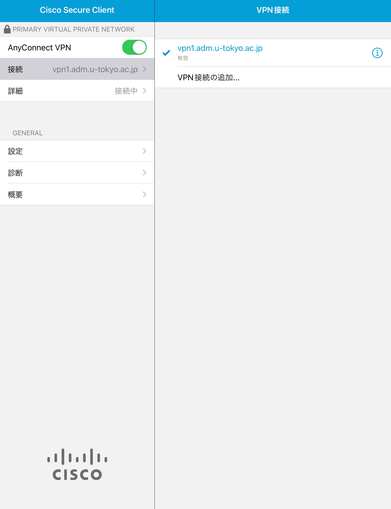

このページでは，UTokyo VPNをiPadで利用する方法を説明します．



## 準備編: UTokyo VPNの初期設定
{:#setup}

<!-- 最新版にアップデートしていることは前提とする -->

まずはUTokyo VPNに接続するために必要なアプリを端末にインストールし，初期設定を行います．手順は通常のiOSアプリと同様です．

**手順A:** [App Store](https://apps.apple.com/jp/app/cisco-anyconnect/id1135064690)にアクセスし，Cisco社のCisco Secure Clientというアプリをインストールします．

{:.medium.center.border}

**手順B:** インストールを終えてSecure Clientアプリを開くと，下の1枚目の図のような画面が出ることを確認します．これでインストールは完了です．なお，開く際に下図2枚目のように通知の送信について確認するウィンドウが表示されることがありますが，いずれを選択しても構いません．

<figure class="gallery">
  
  
</figure>

**手順C:** アプリを起動した直後の画面で左上の「接続」をタップし，続いて表示される画面で「VPN接続の追加」をタップすると，下図のようなウィンドウが表示されます．「サーバ」の横の入力欄をタップして **vpn1.adm.u-tokyo.ac.jp** と入力します．

{:.medium.center.border}

**手順D:** 「保存」を押すと，下図のようにVPN構成の追加を求められるので，内容の確認の上で「許可」を押します．さらに追加でTouch IDによる認証などを求められることもありますので，その際は認証を行ってください．

{:.medium.center.border}

## 利用編: UTokyo VPNへの接続
{:#connect}

以下の手順はVPNを利用するたびに必要です．特に端末を起動した直後に自動的にVPNに接続されるわけではありませんので，ご注意ください．

**手順E:** 下図1枚目のように画面左上の「接続」に「vpn1.adm.u-tokyo.ac.jp」と記載されていることを確認してください．次に「AnyConnect VPN」の横のトグルボタンをONにして，下図2枚目のようにUTokyo Accountの認証ウィンドウが表示されたら，ご自身のUTokyo Accountでサインインしてください．前回のアクセスから時間をおかずに起動した場合は，この画面が表示されないで直ちにVPN接続が開始されることもあります．

<figure class="gallery">
  
  
</figure>



**手順F:** 認証に成功すれば，VPNへの接続は完了です．ZoomやWebexなどVPNを経由する必要のない一部の通信や電子ジャーナルサイトなどを除く全ての通信は，このVPNを経由して，東京大学キャンパスネットワークに接続している状態で行われます．



**手順G:** 下記の画面のように「詳細」が「接続中」と表示されていれば，お使いの端末はUTokyo VPNに接続している状態です．

{:.medium.center.border}

VPNを切断する際は，この画面左上のトグルボタンをタップして「詳細」が「接続解除済み」になったことを確認してください．

---

[UTokyo VPN全体のページに戻る](.)
