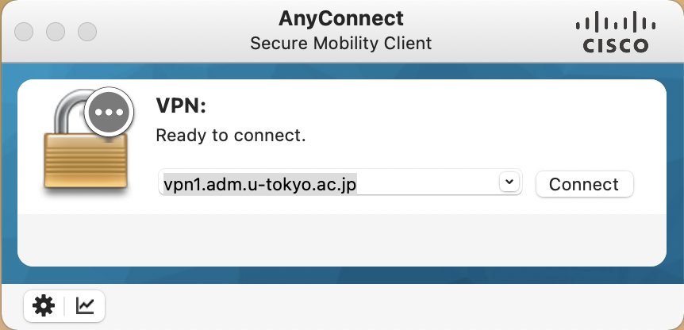

このページでは，UTokyo VPNをmacOSのコンピュータで利用する方法を説明します．



## 準備編: UTokyo VPNの初期設定
{:#setup}

まずはUTokyo VPNに接続するために必要なアプリケーションを端末にインストールします．

**手順A:**
[https://vpn1.adm.u-tokyo.ac.jp/](https://vpn1.adm.u-tokyo.ac.jp/) にアクセスします．下記のようにUTokyo Accountの認証ページが表示されたら，ご自身のUTokyo Accountでサインインしてください．

{:.medium.center.border}



**手順B:** サインインに成功すると，下記のようなAnyConnectのクライアントアプリケーションをダウンロードするためのページが表示されるので，Download for macOSをクリックして，クライアントアプリケーションをダウンロードしてください．

その後は他のmacOS用アプリケーションと同様にインストールします．

{:.medium.center.border}
{:.medium.center.border}





**手順C:** AnyConnectのインストールの途中で，下記のような「ブロックされたAnyConnectシステム拡張」というウィンドウが出る場合があります．その際は表示される手順にしたがって，「システム設定」→「セキュリティとプライバシー」のペインに表示されているCisco AnyConnect Socket Filterに関する許可を行なってください． また2枚目のようなウィンドウが表示されますので，これも許可をしてください．

<figure class="gallery">
  
  
</figure>

**手順D:** インストールが完了すると，アプリケーションフォルダに「Cisco」というフォルダが作成され，その中にAnyConnectのクライアントアプリケーションであるCisco AnyConnect Secure Mobility Client.appがインストールされています．

{:.medium.center.border}

これで準備は完了です．

macOS 11 Big Sur以降のmacOS端末にAnyConnectのクライアントアプリケーションをインストールすると，「システム環境設定」→「ネットワーク」に下記のような Cisco AnyConnect Socket Filter という3つの拡張機能が追加されます．これらの拡張機能はUTokyo VPN接続時に通信を振り分けるために必要な機能として常駐しており，通信内容の記録やホスト外への情報送付も行いません．
またこれらはUTokyo VPNに接続しているか否かに関わらず常時接続状態になります．

{:.medium.center.border}

## 利用編: UTokyo VPNへの接続
{:#connect}

以下の手順はVPNを利用するたびに必要です. 特にPCを起動した直後に自動的にVPNに接続されるわけではありませんので, ご注意ください.

**手順E:** 準備編でインストールしたCisco Anyconnect Secure MobilityClientを起動すると，下記のようなウィンドウが出てきます．VPN接続先として **vpn1.adm.u-tokyo.ac.jp** と入力し，「Connect」ボタンをクリックします．

{:.medium.center.border}

**手順F:** 「Connect」ボタンを押し，下記のようなUTokyo Accountの認証ウィンドウが表示されたらご自身のUTokyo Accountでサインインしてください．前回のアクセスから時間をおかずに起動した場合は，この画面が表示されないで直ちにVPN接続が開始されることもあります．



{:.medium.center.border}

**手順G:** 認証に成功すれば，VPNへの接続は完了です．ZoomやWebexなどVPNを経由する必要のない一部の通信や電子ジャーナルサイトなどを除く全ての通信は，このVPNを経由して，東京大学キャンパスネットワークに接続している状態で行われます．



**手順H:** 再度Cisco AnyConnect Secure Mobility Clientをクリックし，現在の状態を確認します．表示されたウィンドウで，下記のように「Connectedto vpn1.adm.u-tokyo.ac.jp」と表示されていれば，お使いの端末はUTokyo VPNに接続している状態です．

VPNを切断する際は，このウィンドウの「Disconnect」ボタンをクリックしてください．

{:.medium.center.border}

---

[UTokyo VPN全体のページに戻る](.)
