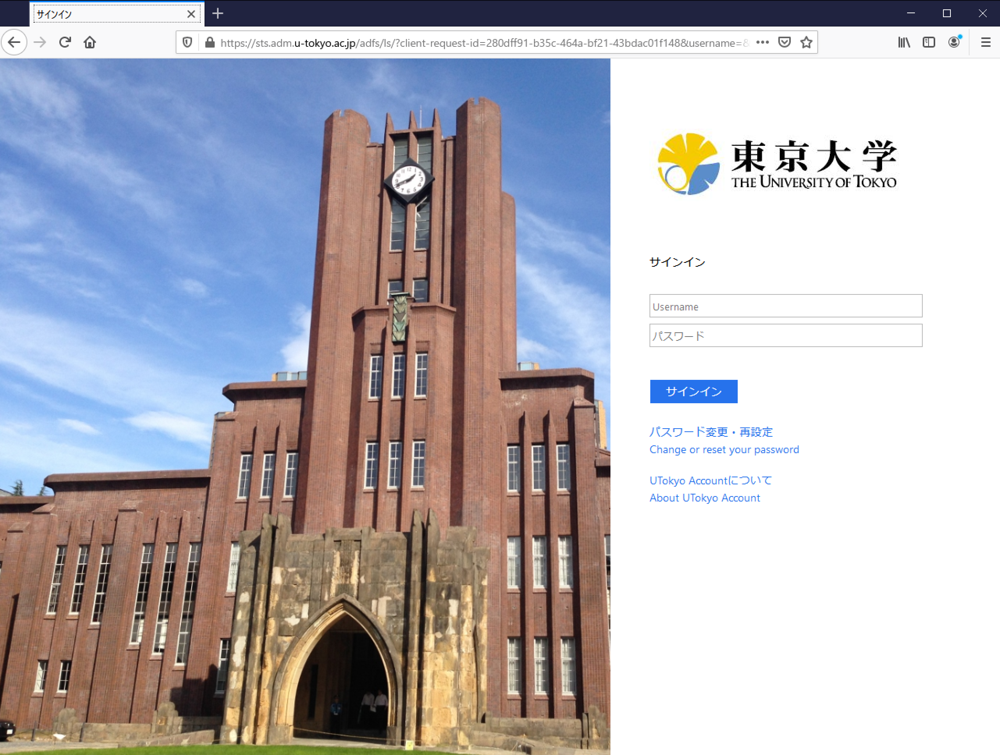
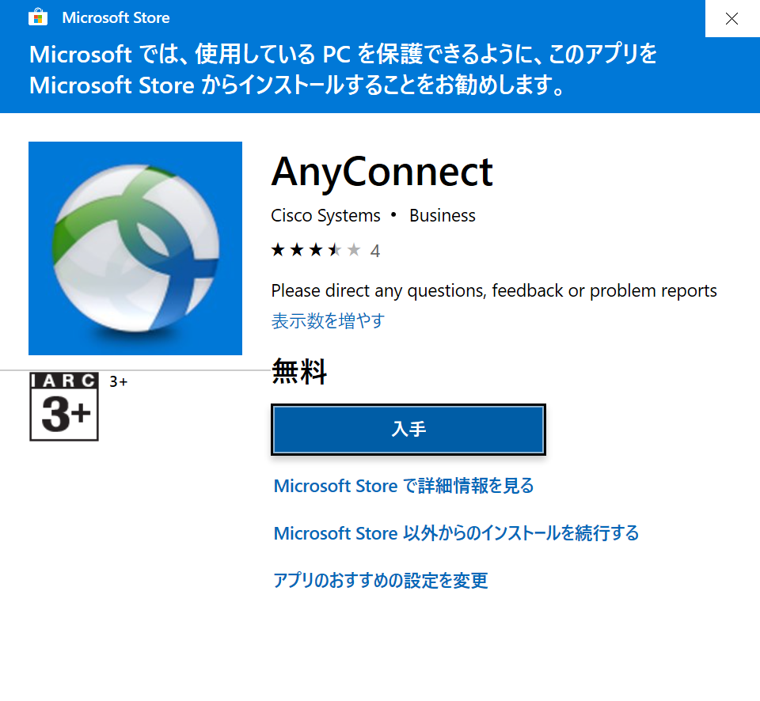
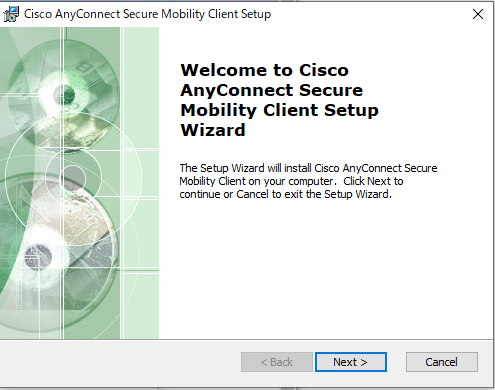
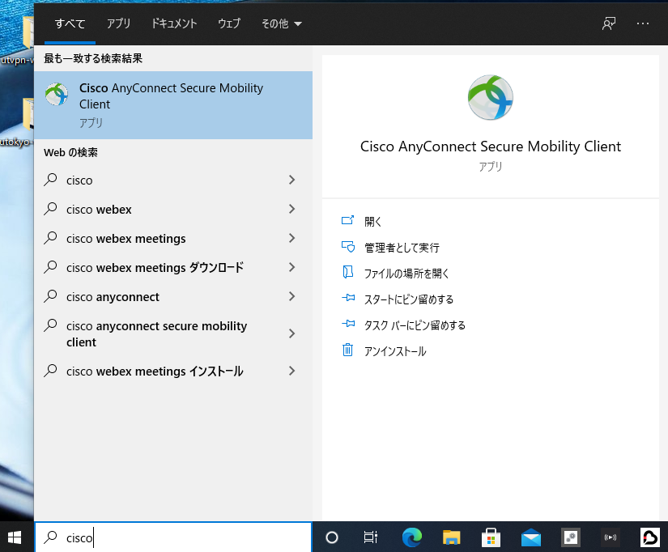
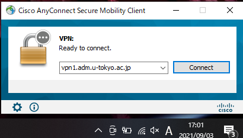
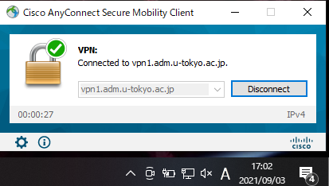

このページでは，UTokyo VPNをWindowsのコンピュータで利用する方法を説明します．



## 準備編: UTokyo VPNの初期設定
{:#setup}

まずはUTokyo VPNに接続するために必要なアプリケーションを端末にインストールします．

**手順A:** [https://vpn1.adm.u-tokyo.ac.jp/](https://vpn1.adm.u-tokyo.ac.jp/) にアクセスします．下記のようにUTokyo Accountの認証ページが表示されたら，ご自身のUTokyo Accountでサインインしてください．

{:.medium.center.border}



**手順B:** サインインに成功すると，下記のようなAnyConnectのクライアントアプリケーションをダウンロードするためのページが表示されるので，Download for Windowsをクリックして，クライアントアプリケーションをダウンロードしてください．

{:.medium.center.border}





その後はダウンロードしたファイルを開き，他のWindows用アプリケーションと同様にインストールします．もし以下のようなMicrosoft Storeの画面が開いたら，「Microsoft Store 以外からのインストールを続行する」を選択してください．  

{:.small.center.border}

**手順C:** 以下のセットアップウィザードの画面に従って，インストールを進めます．End User License Agreementではその内容を確認の上，"I accept the terms in the License Agreement"を選択し，Nextを押すと次へ進みます．

<figure class="gallery">
  
  
  
</figure>

**手順D:** インストールが完了すると，アプリにVPNクライアントアプリケーションであるCisco AnyConnect Secure Mobility Clientが追加されています．

{:.medium.center.border}

これで準備は完了です．

## 利用編: UTokyo VPNへの接続
{:#connect}

以下の手順はVPNを利用するたびに必要です. 特にPCを起動した直後に自動的にVPNに接続されるわけではありませんので, ご注意ください.

**手順E:** 準備編でインストールしたCisco Anyconnect Secure Mobility Clientを起動すると，下記のようなウィンドウが出てきます．VPN接続先として **vpn1.adm.u-tokyo.ac.jp** と入力し，「Connect」ボタンをクリックします．

{:.medium.center.border}

**手順F:** 「Connect」ボタンを押し，下記のようなUTokyo Accountの認証ウィンドウが表示されたらご自身のUTokyo Accountでサインインしてください．

{:.medium.center.border}




**手順G:** 手順Fの後，下記のように「Connected: vpn1.adm.u-tokyo.ac.jp」と表示するウィンドウが出てくると，VPNへの接続は完了です．ZoomやWebexなどVPNを経由する必要のない一部の通信や電子ジャーナルサイトなどを除く全ての通信は，このVPNを経由し，東京大学キャンパスネットワークに接続している状態で行われます．

{:.medium.center.border}

**手順H:** 再度Cisco AnyConnect Secure Mobility Clientをクリックし，現在の状態を確認します．表示されたウィンドウで，下記のように「Connected to vpn1.adm.u-tokyo.ac.jp」と表示されていれば，お使いの端末はUTokyo VPNに接続している状態です．

VPNを切断する際は，このウィンドウの「Disconnect」ボタンをクリックしてください．

{:.medium.center.border}

---

[UTokyo VPN全体のページに戻る](.)
