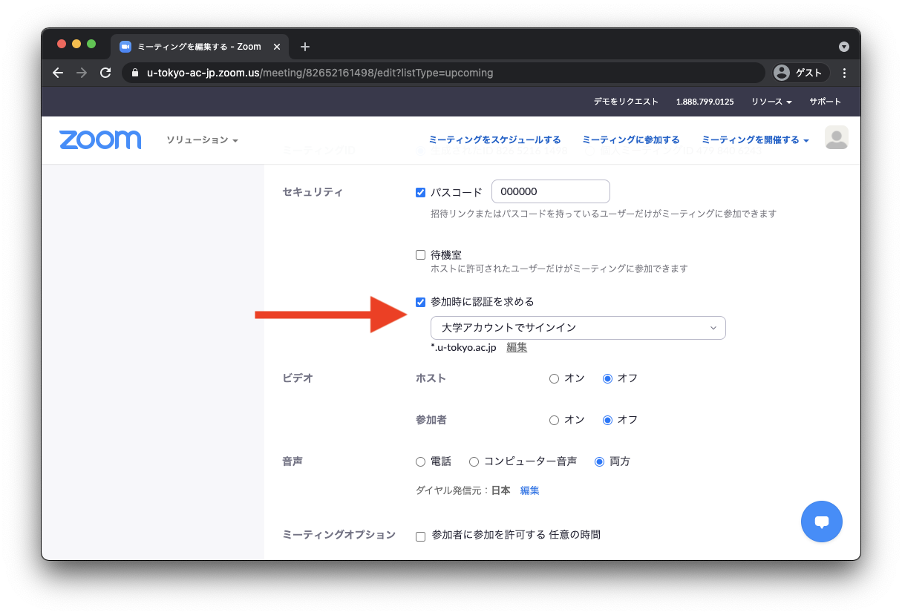

Zoomでは，ミーティングに参加できるユーザを制限することができます．特に「大学アカウントでサインイン」の設定を行うと，ミーティング参加時に本学のZoomアカウントでのサインインが必要になります．

ただし，Zoomのサインインに参加者が慣れていないうちは，設定を行わないことを推奨します．

<a href="/change2021s/">2021年春のシステム変更</a>の影響で，必要な設定に変更が生じています． 
ミーティングの設定で、参加者に「大学アカウントにサインイン」することを要求している場合，その指定ドメインが <code>g.ecc.u-tokyo.ac.jp</code>ではなく，<code>*.u-tokyo.ac.jp</code>となっていることを確認してください．前者になっている場合，本学のZoomにサインインしてもミーティングに参加できません．

## 個々のミーティングで設定する

1. Web ブラウザで<a href="https://u-tokyo-ac-jp.zoom.us/meeting#/upcoming" target="_blank"> Zoom のミーティングページ</a>へ移動します．
{:.medium}
2. 自分のスケジュールしたミーティングが，リストとして表示されます．設定を確認，変更したいミーティングにマウスを重ねると，右側に「編集」ボタンが表示されるので，このボタンを押します．
{:.medium}
3. 「セキュリティ」の中にある「参加時に認証を求める」から設定を行います．オンにした上で「大学アカウントでサインイン」を選択すると，本学の Zoom アカウントでサインインしないと入室できないようになります．「大学アカウントでサインイン」の下に`*.u-tokyo.ac.jp` と表示されることを確認してください．<strong><code>g.ecc.u-tokyo.ac.jp</code>となっている場合は，本学のZoomアカウントでサインインしていたとしても，ミーティングに参加できません．その場合は，編集ボタンを押して，<code>*.u-tokyo.ac.jp</code>に変更してください．</strong>
{:.medium}

## 標準の設定を確認する

1. Web ブラウザで<a href="https://u-tokyo-ac-jp.zoom.us/profile/setting" target="_blank"> Zoom の設定ページ</a>へ移動します．
{:.medium}
2. 「ミーティング認証オプション：大学アカウントでサインイン (Default)　」の編集ボタンをクリックします．
{:.medium}
3. 「以下の指定ドメインでZoomにサインインします」が<code>*.u-tokyo.ac.jp</code>となっていることを確認してください．なっていなければ<code>*.u-tokyo.ac.jp</code>を入力し保存してください．
{:.medium}