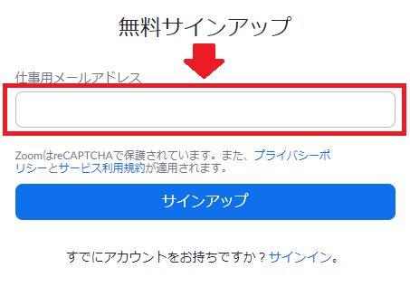
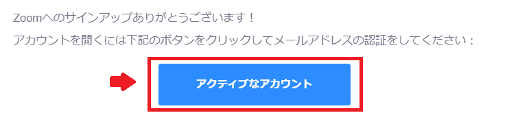

## お知らせ

* (2020/05/15) **アカウントの作成方法が大きく変わりました．招待メールを使わないで作成できます**
* 2020/05/15 の夜に個別にメールで招待メールを発行された方は[こちら](create_account_invitation)をご覧ください

## 本メールによってアクティベートされるZoomのライセンス

 * [Zoom Pro](https://www.zoom.us/pricing/?zcid=2502&creative=372836060623&keyword=%2Bzoom%20%E8%A8%98%E9%8C%B2&matchtype=b&network=g&device=c&gclid=Cj0KCQjwx7zzBRCcARIsABPRscOD9-6-XKTSyUy5gK7SieIY89abNP-_0OcXGIezRfUuLq-BCwSJfCAaAiN9EALw_wcB)
 * 1会議に500参加者まで
 * 2020年度末まで利用可能予定

## 事前準備

もしまだ, <a href="https://www.ecc.u-tokyo.ac.jp/announcement/2016/02/08_2116.html" target="_blank">「ECCSクラウドメール」 (G Suite for Education)</a> を有効化していなければ, <a href="https://utacm.adm.u-tokyo.ac.jp/webmtn/LoginServlet" target="_blank">UTokyo Account 利用者メニュー</a> から行ってください (<a href="https://hwb.ecc.u-tokyo.ac.jp/wp/literacy/email/initialize/" target="_blank">手順についての詳細</a>). xxxx@g.ecc.u-tokyo.ac.jp というメールアドレスを使える人は, すでに有効化されています．

## アカウントの作り方

1. [Zoom のサインアップ（アカウント作成）ページ](https://zoom.us/signup) に移動し，誕生日を入力後，メールアドレス入力欄に **共通ID10桁@g.ecc.u-tokyo.ac.jp（ご自身で設定した文字列@g.ecc.u-tokyo.ac.jp ではありません）** を入力して，「サインアップ」を押して下さい（**「Google でサインイン」を押さないでください**） 
[うまく作成できない場合はこちら](#ng_signup)  
   

1. [ECCSクラウドメール](https://mail.google.com/a/g.ecc.u-tokyo.ac.jp)にログインして，Zoom からメール「Zoomアカウントをアクティベートしてください」を開き，「アクティブなアカウント」をクリックして，アカウントを作成してください．  
    
  
1. アカウント作成後，[Zoom のサインインページ](https://zoom.us/signin) からサインインすると，以下の画像のように「UTokyo ZoomのZoomアカウントに参加」と出てくるので，「アカウントに参加」を押して，「続ける」を押してください．  
    

1. [Zoom のアカウントプロフィールページ](https://zoom.us/account) にて「アカウント名」が「UTokyo Zoom」になっていれば，作成成功です．
  * 「無料トライアル」と書かれていても問題ありません
  * 作成直後にユーザータイプが Basic になっていても，1時間以内に Licensed に変更されますので少々お待ちください  
    
  
  
## うまく作成できない場合は

### Zoom のサインアップがうまくできない
* 既に 共通ID10桁@g.ecc.u-tokyo.ac.jp のアカウントを作っていないかご確認ください
  * [Zoom のサインインページ](https://zoom.us/signin)にて 共通ID10桁@g.ecc.u-tokyo.ac.jp のアドレスでサインインを試してみて下さい（他のアカウントでサインインしている場合はサインアウトしてください）
  * パスワードがわからない場合は，[パスワード再発行ページ](https://zoom.us/forgot_password)にて，共通ID10桁@g.ecc.u-tokyo.ac.jp のアドレスを入力して，ECCSクラウドメールに来た Zoom からのメールを用いてパスワードを再設定してください

### ユーザータイプが Licensed ではなく Basic になってしまっている
* 共通ID10桁@g.ecc.u-tokyo.ac.jp の Zoom アカウントであれば，1時間以内に Licensed になりますので，少々お待ち下さい

## どうしても上手くいかない場合は
* 右下のチャットサポートをご利用下さい
* それでも上手くいかないときは，[トラブルサポート窓口](https://utelecon.github.io/supports/) の Zoom 専用テンプレートを用いて「メールによるサポート」を受けてください．

