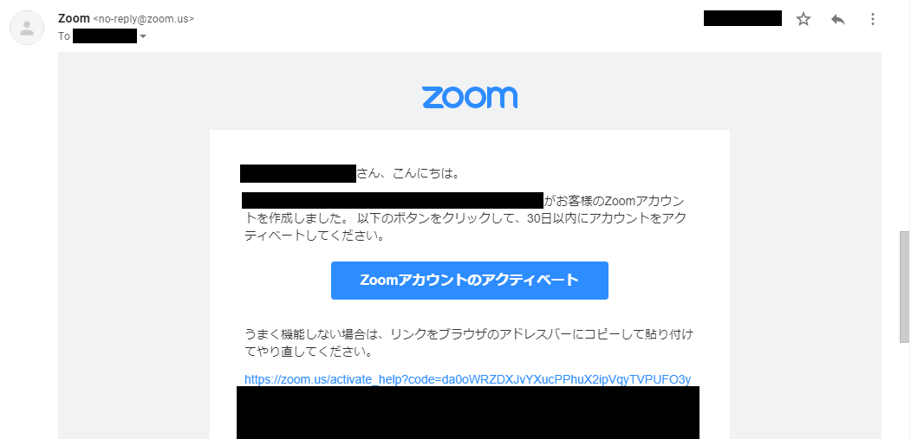
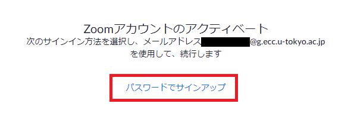
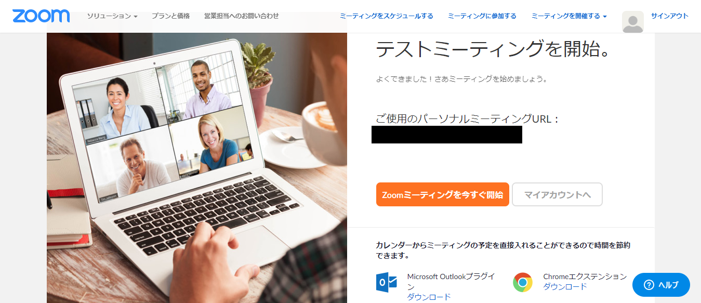
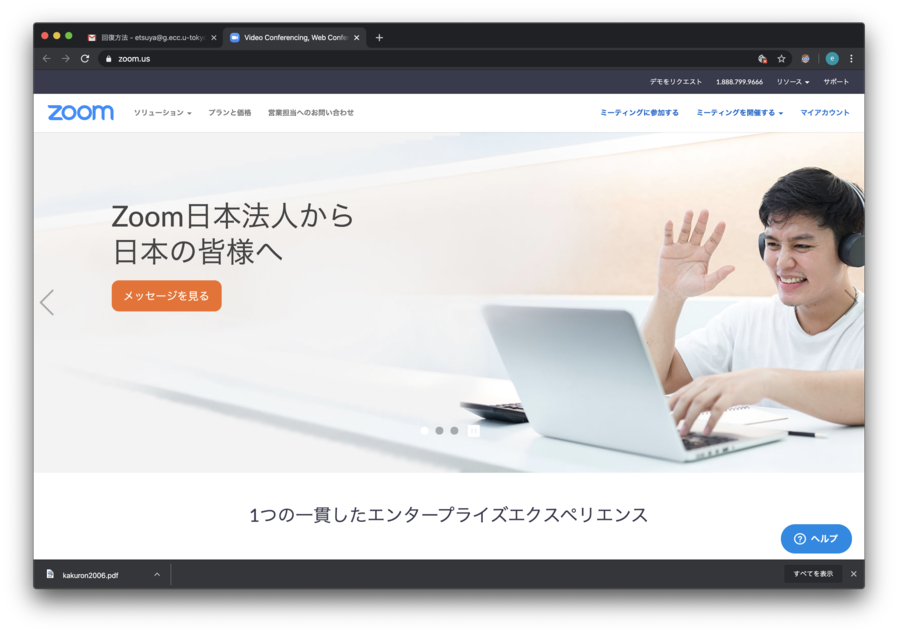
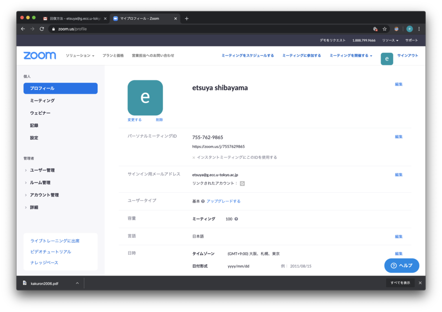
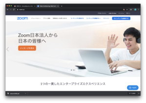
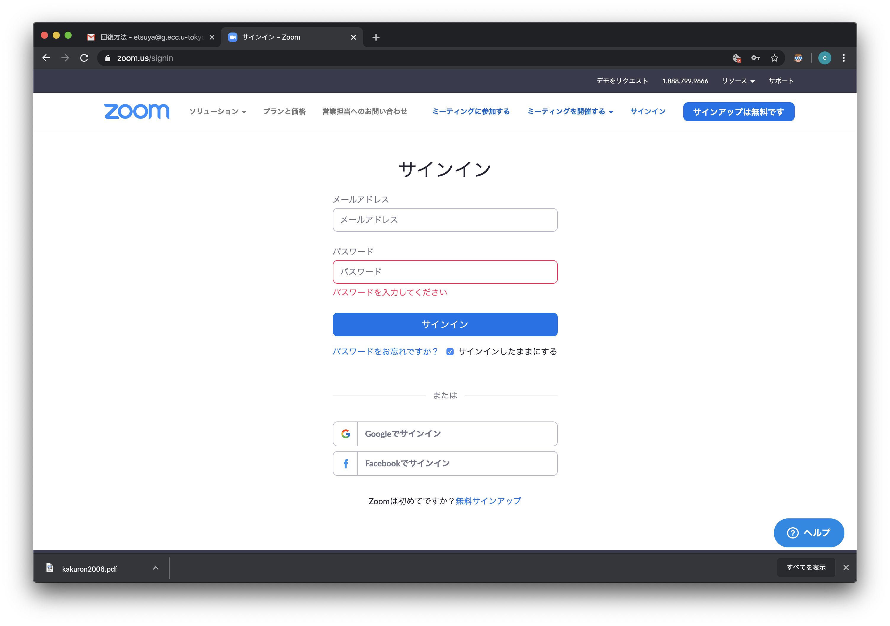
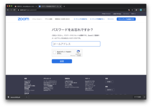

## お知らせ

* Zoomアカウントの<a href="setting_issues">初期設定時のトラブルに関するFAQ</a>

<!--
* 授業を行うためにZoomの会議を<font color="green">開催する人</font>(またはそれを代行する人)は, <a href="create_account" target="">Zoomのアカウントのアクティベーション</a>が<font color="green">必要</font>です
* 授業に<font color="purple">参加するだけの人</font>(正確には誰かが開催したZoom会議に参加(join)するだけの人)はZoomアカウントのアクティベーションは<font color="purple">不要</font>です
-->

* 教職員および3/24時点でUTokyo Accountを持っていた学生のECCSクラウドメール(G Suite for Education)のGmailアドレス (xxxxx@g.ecc.u-tokyo.ac.jp)に, 大学で契約するZoom Pro (500人までの会議とWebinarが可能) のアカウントのアクティベーションを招待するメールが届いています(3/16 教職員あて, 3/24-25 学生あてに発出)
 * アカウントのアクティベーションが必要, またはしたい人は, ECCSクラウドメールを開いてそのメールを取得し, 本ページを参考にアクティベーションを行って下さい. <a href="https://hwb.ecc.u-tokyo.ac.jp/wp/literacy/email/initialize/">ECCSクラウドメールの設定</a>をしていない方はして下さい.
 * アクティベーションしようとしたら<font color="red">「ユーザが存在しません」というエラーが出る</font>という事例が多く報告されております.
 * この事例またはその他のトラブルに遭遇したら, Zoomアカウントの<a href="setting_issues.md">初期設定に関するFAQ</a>に関する情報をご覧ください

## 本メールによってアクティベートされるZoomのライセンス

 * [Zoom Pro](https://www.zoom.us/pricing/?zcid=2502&creative=372836060623&keyword=%2Bzoom%20%E8%A8%98%E9%8C%B2&matchtype=b&network=g&device=c&gclid=Cj0KCQjwx7zzBRCcARIsABPRscOD9-6-XKTSyUy5gK7SieIY89abNP-_0OcXGIezRfUuLq-BCwSJfCAaAiN9EALw_wcB)
 * 1会議に500参加者まで
 * 4/30まで. それ以降の契約継続も検討中

## 事前準備

もしまだ, <a href="https://www.ecc.u-tokyo.ac.jp/announcement/2016/02/08_2116.html" target="_blank">「ECCSクラウドメール」 (G Suite for Education)</a> を有効化していなければ, <a href="https://utacm.adm.u-tokyo.ac.jp/webmtn/LoginServlet" target="_blank">UTokyo Account 利用者メニュー</a> から行ってください (<a href="https://hwb.ecc.u-tokyo.ac.jp/wp/literacy/email/initialize/" target="_blank">手順についての詳細</a>). xxxx@g.ecc.u-tokyo.ac.jp というメールアドレスを使える人は, すでに有効化されています．

## アカウントの作り方

1. 以下のような招待メールが教職員全員（2020年3月16日），学生全員（2020年3月24日から25日，一部の学生は作成できていないようで現在原因究明有です）にZoomからあなたのECCSクラウドメールに届いています．GmailにECCSクラウドメールアカウントでログインし、開封してください（学生には後日送付予定です）．
    


1. メールの「Zoomアカウントのアクティベート」をクリックします  
  
1. Web ブラウザーで以下の画面が出てきますので，下の「パスワードでサインアップ」をクリックします．  
  * 以前の画面で「Googleでサインイン」を押して[間違えて作ってしまった人へ](#if_you_create_a_wrong_account)
  
  
1. 氏名とパスワードを設定し，「続ける」を押します  
  
  
1. アカウントの設定は終了です．必要に応じて「Zoomミーティングを今すぐ始める」か「マイアカウント」で細かい設定をしてください  
  
  
  
以上の流れで，アカウントを作成できます．

<a name="if_you_create_a_wrong_account"> </a>
## 間違えて作ってしまった人は

上記で「Googleのサインイン」でアカウントをアクティベートしてしまうと, 正しくZoom Proのライセンスが有効になりません. 回復するために以下のどちらかを行ってください.

### 回復方法1: アクティベーションメールを再送してもらう.

情報戦略チーム jouhousenryaku.adm@gs.mail.u-tokyo.ac.jp へ以下の文面で連絡をお送りください

```
◯◯(所属)の◯◯です
UTokyo Account (10桁の共通ID)は, ◯◯◯◯◯◯◯◯◯◯です

Zoomアカウントを間違えてアクティベートしたので, アクティベーションのメールを再送してください

```

例:

```
情報基盤センターの田浦健次朗です
UTokyo Account (10桁の共通ID)は, 261....608です

Zoomアカウントを間違えてアクティベートしたので, アクティベーションのメールを再送してください

```

### 回復方法2: 自力で回復する
1. [Zoomホームページ](https://zoom.us/) へ行く
1. もし Sign In 中であれば, 以下のように「マイアカウント」というボタンが現れる
 
ので, それを押す. 以下のような画面になるので
 
「サインアウト」をクリックする.
1. 再び[Zoomホームページ](https://zoom.us/) へ行くと今度は以下のように「サインイン」ボタンが現れる
 
ので, それを押して, 以下のように入力画面を表示し,
 
<font color="red">「パスワードをお忘れですか」</font>へ進む(ここがポイント).
1. 以下のメールアドレスの窓に,
 
<font color="red">10桁の共通ID@g.ecc.u-tokyo.ac.jp</font> を入力. 「送信」すると，アクティベーション用のリンクがあなたのECCSクラウドメールアカウント (xxxx@g.ecc.u-tokyo.ac.jp) に送られてきます.  <font color="red">注:</font> 指定するメールアドレスは, 10桁の共通ID@g.ecc.u-tokyo.ac.jp ですが, 実際にはあなたがECCSを初期設定した際に指定したアカウントで読むことができます(両者はエイリアスになっています. (<a href="https://www.ecc.u-tokyo.ac.jp/announcement/2020/03/12_3139.html" target="_blank">説明</a>).
 
