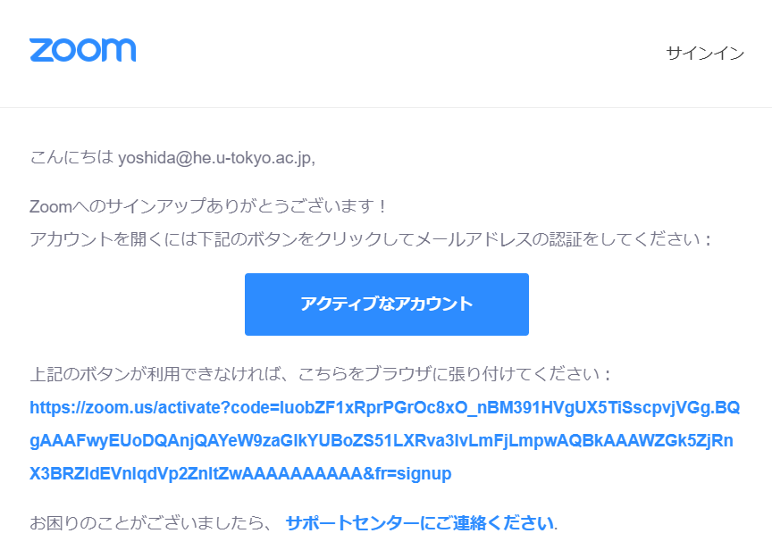
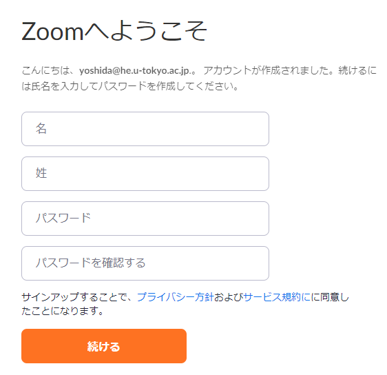
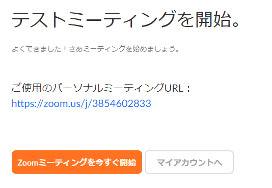

ここでは，ZOOM アカウントの作り方を説明します．  

* <a href="https://zoom.us/signup" target="_blank">サインアップのページ</a>へ移動します
* 「メールアドレス」に東京大学ドメインのメールアドレス（xxxx@xxx.u-tokyo.ac.jp）を入力して，「サインアップ」を押します  
  
  
* 以下の画面が出てきたら，入力したメールアドレスへのメールを確認します  
  
  
* メール内の「アクティブなアカウント」を押すと，Webブラウザで新たなページが開きます  
  
  
* ページ内で，アカウント作成者の「名」「姓」，設定するパスワードを「パスワード」「パスワードを確認する」に入力します  
  
  
* 次に進むと，以下の画面のように他の人を招待する画面が出てきますが，スキップしていただいても問題ありません  
  
  
* 次に進むと，以下の画面のようにテストミーティングを開始することもできますが，しなくても問題ありません  
  
  

以上で，アカウントは無事作成されました．
