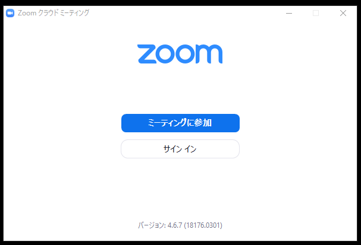
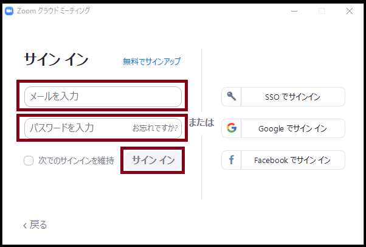
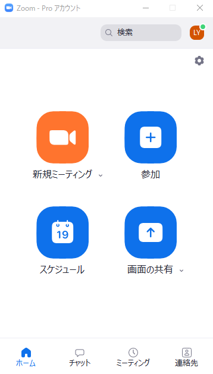
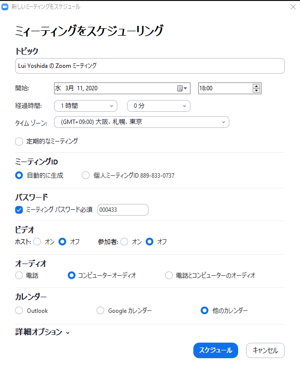
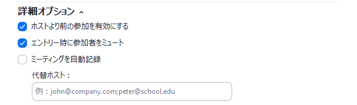
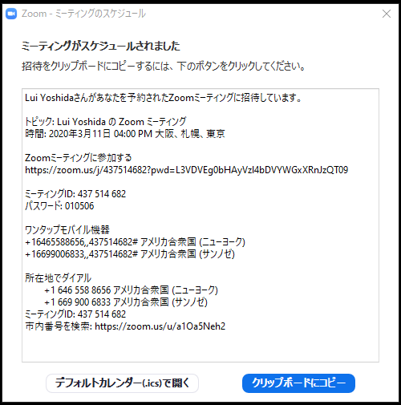

ここでは，Zoom の会議室を作る方法を説明します（今後，動画も作成する予定です）．  
    
1. Zoom を起動します
1. （サインインしていない場合）「サインイン」を押します  
  
  
1. （サインインしていない場合）作成したアカウントの「メールアドレス」「パスワード」を入力して「サインイン」を押します  
  
  
1. 「スケジュール」を押します  
  
  
1. 以下の情報を設定してミーティングをスケジュールします．  
    
     

  以下，特に補足が必要な点に絞って説明します．  
  1. **ビデオ**: ミーティング開始時にビデオを最初からオンにするかオフにするか，ホスト（開催者）と参加者別に設定可能
  1. **オーディオ**: 電話でも Zoom に繋げられてしまうため，特別な理由がない限り「コンピューターオーディオ」のみを選択することを推奨
  1. **カレンダー**: Outlook や Google カレンダーと連携可能だが，ミーティングの情報をコピー&ペーストするためにも「他のカレンダー」を選択することを推奨
  1. **詳細オプション**:  
    **ホストより前の参加を有効にする**: オフにするとホストが入らないと他の参加者も会議室に入れない．他の参加者が早めに入って少し話しても良いのであれば ON にすることを推奨  
    **エントリー時に参加者をミュート**: 最初は一方向的に説明したいときなどに ON にすること推奨  
    **認証されているユーザーしか参加できません**: これにチェックを入れ，「大学アカウントでサインイン」を選んで `g.ecc.u-tokyo.ac.jp` アカウント保持者だけが参加できるようにできる．ただし，このためには，[Zoom web portal](https://zoom.us) にサインインして，左側メニューの「設定」を選び，「ミーティング」タブの「認証されているユーザーしかミーティングに参加できません」にチェックを入れておかなければならない．

1. スケジュールの情報を確認して，「Zoomミーティングに参加する」の下に記載されている**会議室の URL を抜き出して**，メールなどを用いて参加者に通知します
    

  * 初期設定では **URL にパスワード情報が入っている**ため，パスワードを設定していたとしても別途パスワードを共有する必要はありません
  * ここで 上記 URL 以外も共有してしまうと「市内番号を検索」の右に記載されている URL にアクセスしてしまう参加者もいるため，招待情報全てではなく，**会議室の URL を抜き出して共有することをおすすめ**します  

