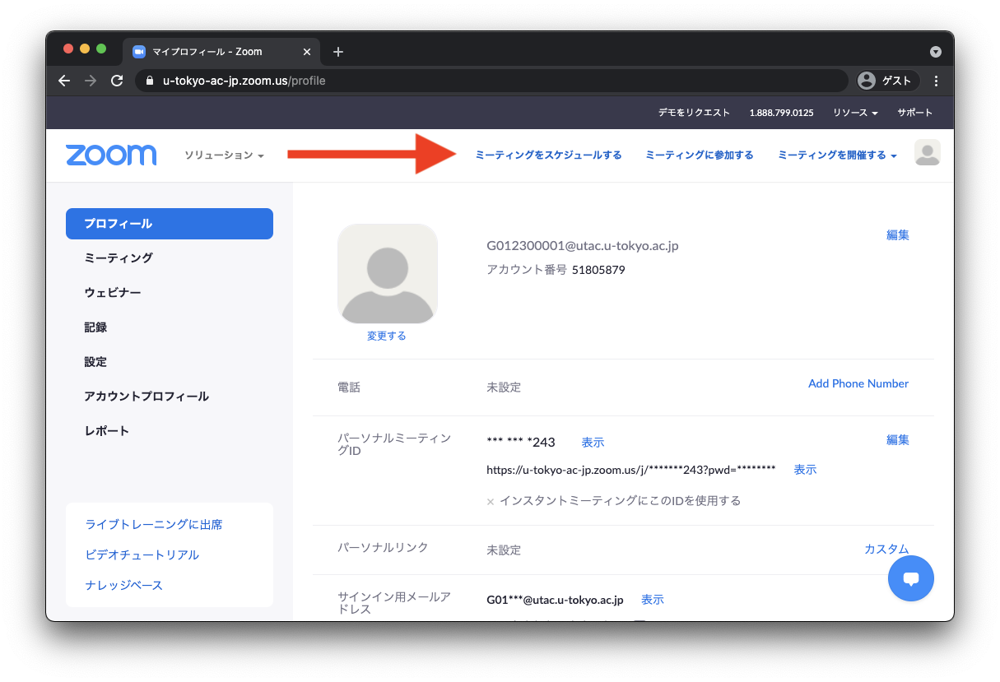

<a href="/change2021s/">2021年春のシステム変更</a>の影響で，必要な設定に変更が生じています． 
ミーティングの設定で、参加者に「大学アカウントにサインイン」することを要求している場合，その指定ドメインが <code>g.ecc.u-tokyo.ac.jp</code>ではなく，<code>*.u-tokyo.ac.jp</code>となっていることを確認してください．前者になっている場合，本学のZoomにサインインしてもミーティングに参加できません．

## ミーティングの作り方
{:#create}

ここでは，Web ブラウザを用いて Zoomミーティングを作る方法を説明します．  

1. Web ブラウザで<a href="https://zoom.us/profile" target="_blank"> Zoom のマイページ</a>へ移動し，右上の「ミーティングをスケジュールする」を押します． 
{:.medium}  

2. ミーティングの設定を行い，下にある「保存」を押すことで，ミーティングがスケジュールされます．具体的な設定項目は，以下の[「ミーティングの設定項目」](#settings)を参照してください．
{:.medium}  
{:.medium}  

3. 保存後，参加者への招待に書かれている**参加用 URL**をメールなどを用いて参加者に通知します．  
{:.medium}  
  * 初期設定では **URL にパスワード情報が入っている**ため，パスワードを設定していたとしても別途パスワードを共有する必要はありません
  * 「招待状をコピーする」で得られる文章には，電話での参加方法など多様な情報が含まれているため，招待状をコピーではなく，**会議室の URL だけを共有することをおすすめ**します．  
  * 定期的なミーティングをスケジュールした場合は，「予定項目を全て表示」を押すことによって，例外的な日時設定をすることができます（例えば，毎週火曜日にスケジュールしているけれども，ある週は木曜日にしたいなど）．

## ミーティングの編集方法
{:#edit}

ミーティングをスケジュールしたあとでも，ミーティングの設定を変更することができます．

1. Web ブラウザで<a href="https://u-tokyo-ac-jp.zoom.us/meeting#/upcoming" target="_blank"> Zoom のミーティングページ</a>へ移動します．
{:.medium} 
2. 自分のスケジュールしたミーティングが，リストとして表示されます．設定を変更したいミーティングにマウスを重ねると，右側に「編集」ボタンが表示されるので，このボタンを押します．
{:.medium}
3. 設定を変更して，下にある「保存」を押すことで，ミーティングをスケジュールします．この際，「ミーティングID」や「パスコード」を変更しない限り，会議室のURLは変わりません．
{:.medium}  

## ミーティングの設定項目
{:#settings}

以下，特に必要だと思われる点に絞って説明します．  

  * **定期ミーティング**: 週ごと，毎日，毎月など定期的なスケジュールを設定できます（参考: [全13回の授業で使う URL が変わらない部屋（会議室）を予約する方法](how/faculty_members/schedule)）．
  * **セキュリティ**: 
    * **パスコード**: **設定してください**．初期設定では URL にパスワードの情報が埋め込まれているため，パスワードを設定していたとしても URL を共有するだけで，参加者は会議室へ入ることができます．
      * URL にパスコードの情報を埋め込みたくない場合は，[Zoom の設定画面](https://zoom.us/profile/setting)にいき，「ワンクリックで参加できるように、ミーティングリンクにパスワードを埋め込みます。」をオフにします．
    * **待機室**: 参加者を一旦待機室に入れ，ホストが明示的に入室を許可する機能です．一部の参加者に対しては自動的に入室許可するように設定．待機室を設定した場合には，ミーティング開始前に[待機室の設定をする](waiting_room)に従って，意図した設定になっているかを確認してください．
    * **参加時に認証を求める**: オンにした上で「大学アカウントでサインイン」を選択すると，本学のZoomアカウントでサインインしないと入室できないようになります．オンにする場合は，`*.u-tokyo.ac.jp` と表示されることを確認してください．<strong><code>g.ecc.u-tokyo.ac.jp</code>となっている場合は，本学のZoomアカウントでサインインしていたとしても，会議室に入室できません．その場合は，編集ボタンを押して，<code>*.u-tokyo.ac.jp</code>に変更してください．</strong>詳細は[参加時に認証を求める](auth)を確認してください．
      * ただし，参加者全員が本学のZoomアカウントでサインインする必要があるため，参加者が慣れていないうちはオフを推奨します．
* **ミーティングオプション**:  
  * **参加者に参加を許可する**: オフの状態では，ホストが会議室に入室するまで他の参加者も会議室に入室できません．他の参加者が早めに入ることに支障がなければオンにすることを推奨します．設定した開始時刻の何分前から入室を許可するかを決めることもできます．
  * **入室時に参加者をミュートにする**: 最初は一方向的に説明したいときなどに ON にすることを推奨します． 