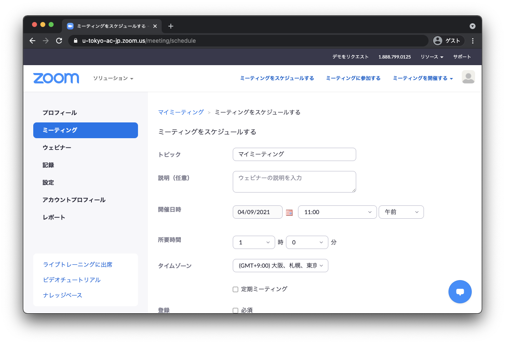

## ミーティングの作り方
{:#create}

ここでは，Web ブラウザを用いて Zoomミーティングを作る方法を説明します．  

1. Web ブラウザで<a href="https://zoom.us/profile" target="_blank"> Zoom のマイページ</a>へ移動し，右上の「ミーティングをスケジュールする」を押します． 
{:.medium}  

2. ミーティングの設定を行い，下にある「保存」を押すことで，ミーティングがスケジュールされます．具体的な設定項目は，以下の[「ミーティングの設定項目」](#settings)を参照してください．
{:.medium}  
{:.medium}  

3. 保存後，参加者への招待に書かれている**参加用 URL**をメールなどを用いて参加者に通知します．  
{:.medium}  
  * 初期設定では **URL にパスワード情報が入っている**ため，パスワードを設定していたとしても別途パスワードを共有する必要はありません
  * 「招待状をコピーする」で得られる文章には，電話での参加方法など多様な情報が含まれているため，招待状をコピーではなく，**会議室の URL だけを共有することをおすすめ**します．  
  * 定期的なミーティングをスケジュールした場合は，「予定項目を全て表示」を押すことによって，例外的な日時設定をすることができます（例えば，毎週火曜日にスケジュールしているけれども，ある週は木曜日にしたいなど）．

## ミーティングの設定項目
{:#settings}

以下，特に必要だと思われる点に絞って説明します．  

  * **定期ミーティング**: 週ごと，毎日，毎月など定期的なスケジュールを設定できます（参考: [開催日時の設定](date_and_time/)）．
  * **セキュリティ**: 
    * **パスコード**: **設定してください**．初期設定では URL にパスワードの情報が埋め込まれているため，パスワードを設定していたとしても URL を共有するだけで，参加者は会議室へ入ることができます．
      * URL にパスコードの情報を埋め込みたくない場合は，[Zoom の設定画面](https://zoom.us/profile/setting)にいき，「ワンクリックで参加できるように、ミーティングリンクにパスワードを埋め込みます。」をオフにします．
    * **待機室**: オンにすると，参加者は一度待機室に入り，ホストが明示的に許可するまで本体の会議室に入室できません．設定によっては一部の参加者に対して自動的に入室が許可されるようになりますので，待機室を利用する場合には，ミーティング開始前に，意図した設定になっているかを「[待機室を設定する](waiting_room/)」のページを参考に確認してください．東京大学の授業における設定は「[授業におけるZoom会議室の入室制限](/faculty_members/zoom_access_control)」も参考にしてください．
    * **参加時に認証を求める**: オンにした上で「大学アカウントでサインイン」を選択すると，東京大学のZoomアカウントでサインインしないと入室できないようになります．オンにする場合は，「大学アカウントでサインイン」の下に表示されるドメインが　`*.u-tokyo.ac.jp` であることを確認してください（異なる場合は「編集」を押して `*.u-tokyo.ac.jp` に変更してください）．詳細は「[参加時に認証を求める](auth/)」のページを確認してください．
      * ただし，参加者全員が本学のZoomアカウントでサインインする必要があるため，参加者が慣れていないうちはオフを推奨します．
      * 東京大学の授業における設定は「[授業におけるZoom会議室の入室制限](/faculty_members/zoom_access_control)」も参考にしてください．
* **ミーティングオプション**:  
  * **参加者に参加を許可する**: オフの状態では，ホストが会議室に入室するまで他の参加者も会議室に入室できません．他の参加者が早めに入ることに支障がなければオンにすることを推奨します．設定した開始時刻の何分前から入室を許可するかを決めることもできます．
  * **入室時に参加者をミュートにする**: 最初は一方向的に説明したいときなどに ON にすることを推奨します． 

## （参考）アプリから会議室を作る方法

Zoomのアプリ上で会議室を作ることもできます．ただし，このページで説明しているブラウザから作る方法の場合と比べ，設定できる項目が少ないため，注意してください．
