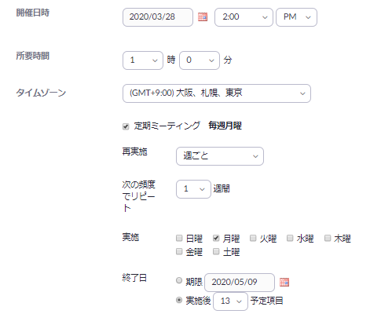

* 2020/03/28 に更新しました
* 以前掲載していた Zoom  ソフトウェアを用いた作り方は[こちら](create_room_software)をご覧ください．  

ここでは，Web ブラウザを用いて Zoom の会議室を作る方法を説明します．  
授業の定期的なミーティングを設定する具体的な方法は[こちら](how_to_use_in_classroom_faculty_members)を御覧ください．  
   
    
1. Web ブラウザで<a href="https://zoom.us/profile" target="_blank"> Zoom のマイページ</a>へ移動し（サインインしていない場合は，Zoom のアカウントでサインインします），右上の「ミーティングをスケジュールする」を押します．  
    
  
1. 条件を設定して，下にある「保存」を押すことで，ミーティングをスケジュールします．  
  （設定の一部）
    
     
  

  以下，特に必要だと思われる点に絞って補足します．  
  * **定期ミーティング**: 週ごと，毎日，毎月など定期的なスケジュールを設定できます（参考: [全13回の授業で使う URL が変わらない部屋（会議室）を予約する方法](how_to_use_in_classroom_faculty_members#schedule)）．
  * **ミーティングパスワード**: 設定しても構いませんが，初期設定では URL にパスワードの情報が埋め込まれているため，パスワードを設定していたとしても URL を共有するだけで，参加者は会議室へ入ることができます．
  * **ミーティングオプション**:  
    **ホストより前の参加を有効にする**: オフにするとホストが入らないと他の参加者も会議室に入れない．他の参加者が早めに入って少し話しても良いのであれば ON にすることを推奨  
    **入室時に参加者をミュートにする**: 最初は一方向的に説明したいときなどに ON にすること推奨  
    **認証されているユーザーしか参加できません**: <a href="https://zoom.us/profile/setting" target="_blank">Zoom のユーザー設定</a>において，「認証されているユーザーしかミーティングに参加できません」をオンにすると，本学の Zoom アカウントでサインインしないと入室できない「大学アカウントでサインイン」を選択できるようになります（正確には，g.ecc.u-tokyo.ac.jp のドメイン制限をします．ドメインは開催者側で編集可能です）．ただ，参加者全員が本学のZoomアカウントでサインインする必要があるため，慣れていないうちはオフが推奨  
  
1. 保存後，参加者への招待に書かれている**参加用 URL**をメールなどを用いて参加者に通知します．  
  * 初期設定では **URL にパスワード情報が入っている**ため，パスワードを設定していたとしても別途パスワードを共有する必要はありません
  * 「招待状をコピーする」で得られる文章には，電話での参加方法など多様な情報が含まれているため，招待状をコピーではなく，**会議室の URL だけを共有することをおすすめ**します．  
  * 定期的なミーティングをスケジュールした場合は，「予定項目を全て表示」を押すことによって，例外的な日時設定をすることができます（例えば，毎週火曜日にスケジュールしているけれども，ある週は木曜日にしたいなど）．

    

