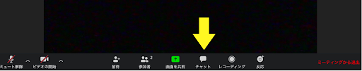

授業中に Zoom メニュー「チャット」を押すと，全員とテキストチャットができます．この機能を使うと，チャットを用いて学生は質問したり，教員は必要な情報をテキストで送信したりすることができます．
特に，教員は学生の質問を授業の流れを遮ることなく受け取り，都合の良いときに口頭あるいはチャットで答えることができるようになります．

## 基本操作
### パソコンでの使い方

1. 画面下方にカーソルを移動すると，「チャット」というアイコンが現れます．それをクリックすると右にチャット一覧が表示されます． 
※注意　ウィンドウが小さいとアイコンが隠れてしまうので注意してください．その場合は「詳細」アイコンを押すと出てきます． 

2. 「宛先」を選択して，書きたいメッセージを入力したら，Enterボタンを押します．宛先は各参加者または「全員」宛にすることができます．主に「全員」にするとよいでしょう． 
※注意　文章を改行したいときはShift＋Enterによって改行できます．

3. 送受信すると，下のようにメッセージが表示されます． 

4. 「チャット」ウィンドウを開いているとき，メッセージが送られてくると，下の画面のように通知アイコンが表示されるので確認しておきましょう．ただし，画面にメッセージがすべて表示されている状態だと通知がつかないので注意してください。TAに監視してもらうと見逃しがなくなるかと思われます。

5.	「チャット」ウィンドウを閉じているとき，メッセージが送られてくると，次のようにアイコンが光ります．学生からのメッセージの指示があれば確認しておきましょう．

### スマホ・タブレットでの使い方

1.	画面下の「詳細」メニューを開いて「チャット」をタッチしますと，チャット画面が開きます. 

2.	「宛先」を選択して，書きたいメッセージを入力したら，Enterボタンを押します．宛先は「全員」，または他の参加者宛にすることができます．主に「全員」にするとよいでしょう． 

3.	送受信すると，次のようにメッセージが表示されます． 

4.	ホーム画面のとき，メッセージが送られてくると，次のように通知が届きます． 

## 応用操作

### 資料のURLを共有する
チャット機能を応用した便利な機能として，データのやり取りが可能です．チャット機能を使って，webサイトのURLや，クラウドに保存されているファイルのURLをチャット中に貼り付けて共有することができます．もっとも，資料を送信しても読まれないと意味がないので，口頭やチャットでファイル送信の合図を送っておきましょう．

### セッション
ブレークアウトセッション中にもチャット機能を使うことができます．その場合，チャット相手はセッション参加者に限られますが，グループ全体のときと同様に相手を選ぶことができます．

### 自動保存
Zoomには「ログ機能」があり，相手とのチャットのやり取りを自動的に保存してくれます．議事録のような使い方をしたり，相手と共有したファイルの情報を保存しておくのに便利です．やり方はかんたん．チャット画面の「…」から「チャットを保存」を選択するだけです．すると自動で格納フォルダとチャットを記録したtxtファイルが生成されます．ただし，スマホやタブレットではこの機能はないのでご注意ください．

