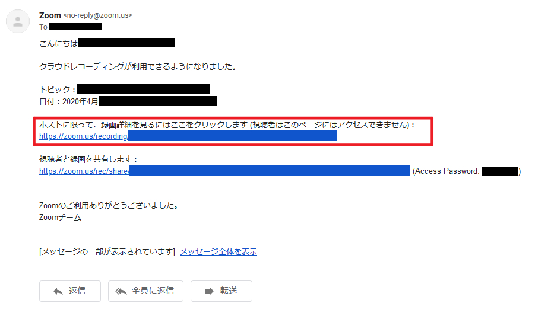
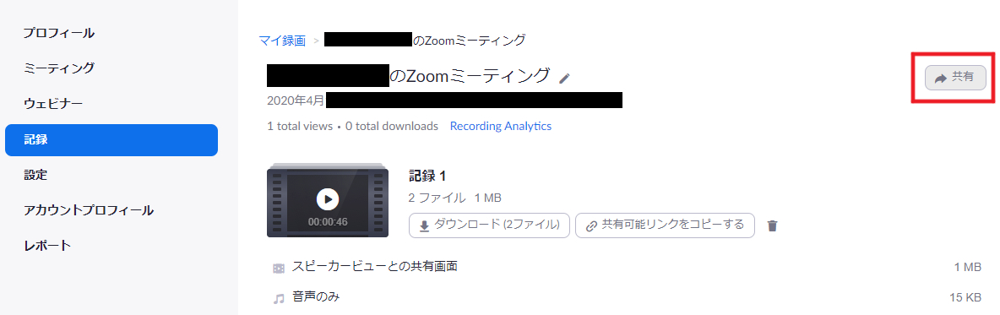

ここでは，Zoom Cloud にミーティングを録画し，学内限定で共有する方法を説明します．  
大学が契約しているPro版アカウント（共通ID10桁@g.ecc.u-tokyo.ac.jp）では，クラウドレコーディング機能を使うことができます．

1. ミーティング時に,「クラウドにレコーディング」を選択します（[「クラウドにレコーディング」が表示されないときは](#no_menu)）． 

2. レコーディングの終了後，録画ファイルが利用可能になると，Zoomからメール通知が届きます．メール内の「ホストに限って、録画詳細を見るにはここをクリックします」のリンクから，Zoomアカウントの「記録」ページ（[https://zoom.us/recording](https://zoom.us/recording)）にアクセスします．
  * Zoom側が動画をレンダリングするため，メール通知が届くまでに，時間がかかることがあります．

3. 「共有」をクリックします． 

4. 「この記録を共有する」をオンにします．学内限定にするためには，「認証されているユーザーしか表示できません」にチェックをいれます．アカウントのサインインユーザーが，u-tokyo.ac.jpになっていることを確認します．

5. 「視聴者はダウンロードできます」をオフにします．学生のダウンロードを禁止しない場合は，オンにしてください．  

6. 記録リンク情報をクリップボードにコピーし，ITC-LMSやメールなどで情報を共有します．
  * 「記録リンク情報」のアドレス・パスワードは、メール通知内「視聴者と録画を共有します」のものと同じです．

参考URL：[Zoomヘルプセンター　クラウド記録](https://support.zoom.us/hc/ja/articles/203741855-%E3%82%AF%E3%83%A9%E3%82%A6%E3%83%89%E8%A8%98%E9%8C%B2)

## （教員編）録画ファイルの共有を解除する
ここでは，Zoom Cloud内の録画ファイルの共有を解除する（共有用URLを無効化する）方法を説明します．

1. Zoom の「記録」ページ（[https://zoom.us/recording](https://zoom.us/recording)）に大学のPro版アカウント（共通ID10桁@g.ecc.u-tokyo.ac.jp）でアクセスします．

2. 「記録」タブを選択し，共有を解除したい録画ファイルの「共有」メニューを開きます．

3. 「この記録を共有する」をオフにします．

4．ITC-LMSやメールなどで、リンクの期限切れを告知します．もしくはリンクを削除します．

注意：
Zoomのクラウドは保存できる容量が限られているため，共有リンクを無効化するよりも，ファイルを削除することをおすすめします．

## 「クラウドにレコーディング」がメニューにない時は，クラウドレコーディング機能を有効にする

1. ZoomのWebサイト（ [https://zoom.us/](https://zoom.us/)）に，大学のアカウント（共通ID10桁@g.ecc.u-tokyo.ac.jp）でログインします．

2. 左側のメニューから「設定」を選択し，「記録」のページを開きます．

3. 「クラウド記録」をオンにします．

4. 学内限定公開にしたい場合は，その準備として「認証されているユーザーしかクラウドレコーディングを表示できません」がオンになっていることを確認します．

