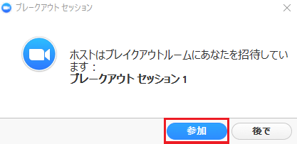
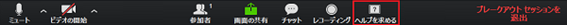

## ブレークアウトとは？
ブレークアウト機能を使うと，メインの会議室から参加者を別々のルーム（＝ブレークアウトルーム，分科会室ともいう）に分割することができます．オンライン授業でグループワークを行う場合は、このブレークアウトが用いられます． 
ブレークアウトルームは，それぞれが独立した会議室です．ホストである教員は、複数のブレークアウトルーム間を自由に移動できますが，参加者である学生は,教員が設定しない限り,自由に移動することはできません．

## ブレークアウトが行われることになったら
ブレークアウトの実施にあたり，学生側が準備することは特にありません。ブレークアウトルームへの振り分けは，教員側（ホスト）が行います． 
ブレークアウトは事前に実施時間が決まっており，ブレークアウトの開始後，教員があらかじめ設定した時間が経過すると自動的に画面が切り替わり，メインルームに戻ります．対面の授業でのグループワークと違い，ディスカッションの延長を行うことはできないことが多いので,時間内に，計画的にディスカッションを進める必要があります．

### ブレークアウトルームへの移動
教員側が「全参加者を自動で分科会室に移動」という設定をしている場合は，自動的にブレークアウトルームに移動します． 
そうでない場合は，画面に表示される「ブレークアウトルームに参加する」というボタンを選択すると，ブレークアウトルームに移動します．  

### ブレークアウトルームでのディスカッション
ブレークアウトルームで用いることができる機能は，基本的にメインの会議室と同じですが，ブレークアウトルーム特有の機能もあります．
 + 発言する
    * 発言を行う際にはミュートを解除します．
 + チャットを使う
    * ブレークアウトルームでチャットを使用することができます．このとき，チャットの送信先は、同じブレークアウトルームにいる参加者に限定されます．他のブレークアウトルームにいる参加者にメッセージが届くことはありません．
    * また，ブレークアウトルームに移動後も，移動前にメインルームで行ったチャットの内容を見ることができます．同様に、ブレークアウトルームで行ったチャットの内容は，メインルームに戻った後も見ることができます．つまり，チャットに表示される内容は，人によってそれぞれ異なるということになります．
 + レコーディングを行う
    * ホスト（教員）が録画を許可した場合，ブレークアウトルームでのディスカッションを参加者のローカルでレコーディングすることができます．
 + 教員（ホスト）をブレークアウトルームに呼ぶ
   * 「ホスト招待」のボタンを押すと，教員がブレークアウトルームに参加していない，または別のブレークアウトルームに参加している時などに，教員を自分達のいるブレークアウトルームに呼ぶことができます．  
    
   ただし，他のブレークアウトルームがホストを招待している場合は招待できません．時間を置いて，もう一度招待ボタンを押してください．

### ブレークアウトが終了したら
予め教員が設定した時間が経過すると，ブレークアウトルームからメインルームに自動的に移動します．
