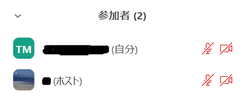
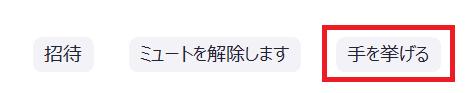
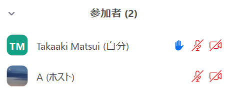
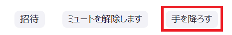
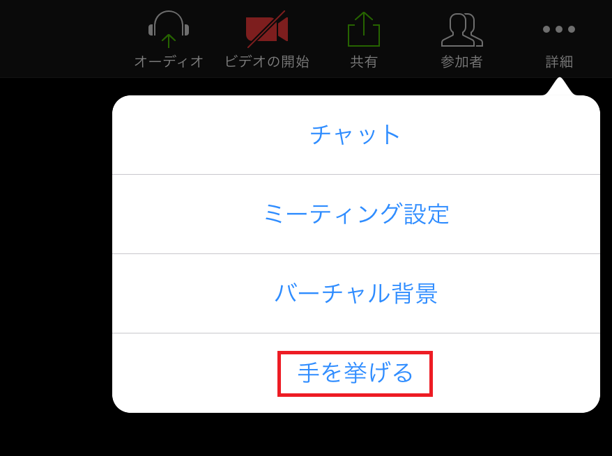
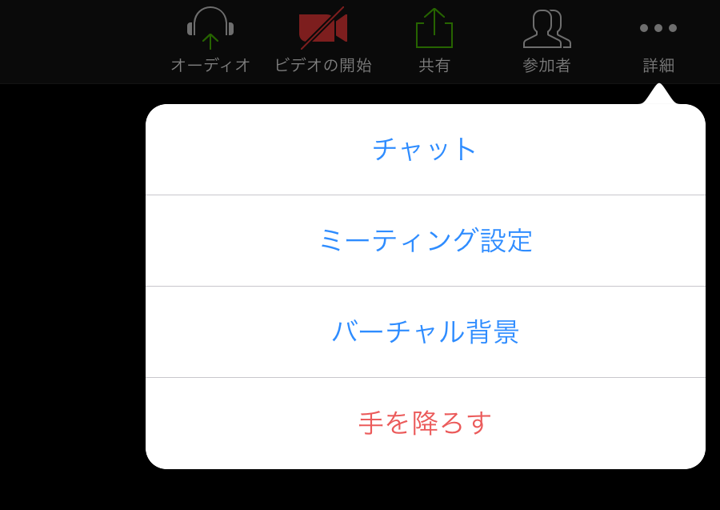

Zoomでは，学生は，「手を挙げる」「反応」などの機能を用いることで，実際に手を挙げたり声を出したりすることなく，教員に対して合図を送ることができます．

## 「手を挙げる」機能の使い方（PC）

1. 画面下に表示されるメニューの［参加者］を押すと,画面右側に参加者のリストが表示されます.

2. リストの下にある［手を挙げる］を押します.

3. 参加者リストの名前の横に手のマークがつきます.

4. 手を降ろす場合は,参加者リストの下にある［手を降ろす］を押します.

ショートカットキーを利用して手を挙げたり下げたりすることもできます.  
* Windows: Alt+Y
* Mac: オプション+Y

## 手を挙げる」機能の使い方（タブレット）

1. 画面右上の［詳細］をタップし,表示されるメニューから［手を挙げる］を押します.  

2. 手を降ろす場合も画面右上の［詳細］をタップし,表示されるメニューから［手を降ろす］ボタンを押します.  

## 「反応」機能の使い方

画面下に表示されるメニューの［反応］を選択すると,「拍手」や「賛成」のサインを送ることができます. 10秒後に自動的に消えます．

拍手や賛成の反応は10秒後に自動的に消えます.

## 「非言語的なフィードバック」機能の使い方（オプショナル）
教員が「非言語的なフィードバック」機能を有効にしている場合, 学生はさまざまなサイン（非言語的なフィードバック）を送ることができます. 非言語的なフィードバックは, 手を挙げると同様, 参加者リストの下部から送ることができます. 非言語的フィードバックは教員の指示にもとづいて使用するようにしてください.

