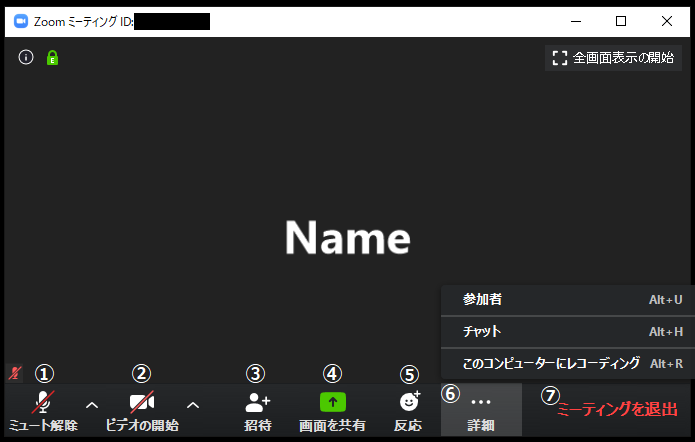
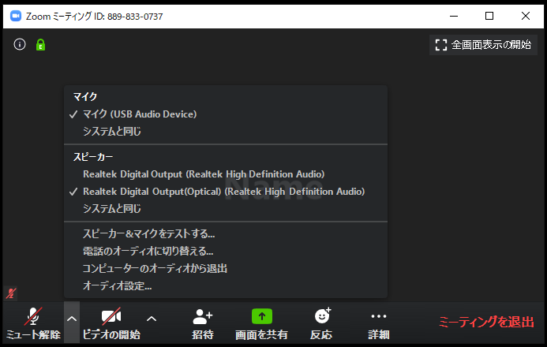
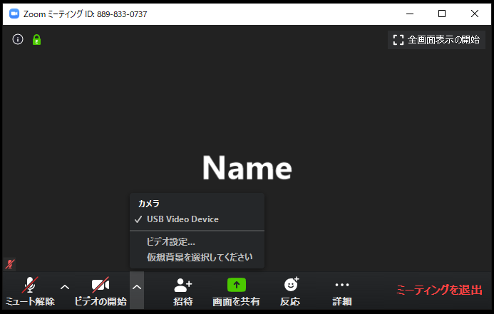
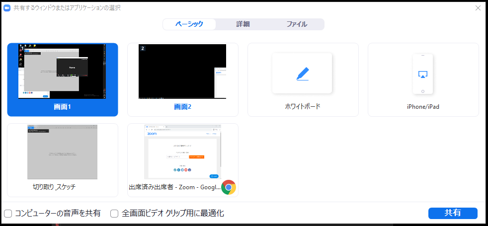

ここでは，Zoom の会議室の具体的な使い方を説明します（今後，動画でも使い方を紹介する予定です）．  

会議室に入ると以下のような画面になります（画像は参加者1名です）．  
Zoom の画面にマウスカーソルを合わせると下にメニューが出てきます．  
    
メニューについて左から順にそれぞれ簡単に説明します（バージョンによってはメニュー項目の一部がない場合もあります）．
  1. **マイクマーク** : これを押すことによってミュート（消音）にしたり，ミュートを解除できたりします（画面では現在ミュート状態であるため「ミュート解除」と表示されています）．横にある上マークを押すとマイクに関する設定ができるようになります．
  1. **ビデオマーク** : これを押すことによってビデオをオンやオフにできます（画面では現在カメラがオフ状態であるため「ビデオの開始」と表示されています）．横にある上マークを押すとビデオに関する設定ができるようになります．
  1. **招待** : メールなどを使って招待を送れます．開催者および参加者は基本的に会議室の URL を知っているため，それを共有すれば招待できることから，このボタンはそこまで使いません．
  1. **画面を共有** : 自身のデバイスの画面を共有できます．
  1. **反応** : 「拍手」や「賛成」の意思を表明できます．
  1. **詳細** : 画面に入りきれなかったメニューがここに入ります（画面の横幅が十分大きい場合は全てのメニューが画面内に表示されて「詳細」が表示されないことがあります．  
      **参加者** : 参加者一覧を表示します．  
	  **チャット** : テキストチャットを行います．  
	  **このコンピューターにレコーディング** : ホストが許可をしている場合レコーディングができます．このボタンは開催関係者以外は利用しないことが多いです．  
  1. **ミーティングを退出** : ミーティングを退出します．押した後確認画面が出るため，ボタンを押したらいきなり退出するわけではありません．
  
  
以下，主に利用するメニュー項目について，追加で詳細を説明します．

## マイクの詳細設定
  
  
  
マイクマーク横の上マークを押すと，追加でメニューが出てきます．以下，それぞれについて簡単に説明します．
  * **マイク** : 使いたいマイクを選択できます（別途マイクを付けている場合，複数の選択肢が出てくるため，目的のものを選択してください）．
  * **スピーカー** : 使いたいスピーカーを選択できます（別途スピーカーを付けている場合，複数の選択肢が出てくるため，目的のものを選択してください）．
  * **スピーカーとマイクをテストする** : メニュー名の通り，スピーカーとマイクをテストできます．
  * **電話のオーディオに切り替える** : 電話で参加するための情報が出てきます．基本的には使いません．
  * **コンピューターのオーディオから退出** : メニュー名の通り，コンピュータのオーディオから退出します．ミュートと異なり，退出してしまうため，ミュートにしたい場合はマイクマークを押してください．基本的には使いません．
  * **オーディオ設定** : オーディオに関する設定ができます．「ミーティングの参加時にマイクをミュートに設定」「スペースキーを長押しして，一時的に自分をミュート解除」など詳細な設定ができます．
  
  
## ビデオの詳細設定
  
  
  
ビデオマーク横の上マークを押すと，追加でメニューが出てきます．以下，それぞれについて簡単に説明します．
  * **カメラ** : 使いたいカメラを選択できます（別途カメラを付けている場合，複数の選択肢が出てくるため，目的のものを選択してください）．
  * **ビデオ設定** : ビデオに関する設定ができます．「ミーティングの参加時にビデオをミュートに設定」「ビデオに参加者の名前を常に表示」など詳細な設定ができます．
  
  
## 画面の共有
  
メニュー「画面の共有」を押すと，共有する画面の選択肢が出てきます．希望のものを選択して「共有」を押すと，画面の共有が始まります．
  
  
  
  * 「画面」を選択すると，共有する人の画面そのものが全員に共有されます（画像のようにマルチモニタなどで画面が複数ある場合は画面1，画面2と選択肢が増えます）．
  * 「ホワイトボード」を選択すると自由に描けるホワイトボードが全員に共有されます．
  * 「iPhone/iPad」を選択すると iPhone/iPad の画面共有ができるようになります（プラグインが必要）．同じ WiFi ネットーワーク内にあるデバイスから AirPlay 経由で共有できます．
  * 現在開いているウィンドウも選択肢に表示されます．ウィンドウ単位で画面共有することもできます．ウィンドウ以外の場所を見られたくない場合は，そのウィンドウを選択して画面共有することをおすすめします．
  
  
## 参加者
  
メニュー「参加者」を押すと，参加者一覧が見られる画面が出てきます．
    
  
  * 「手を挙げる」: これを押すと，開催者および参加者が「手を挙げている」ことがわかるようになります．(ver.5.4.7以降の場合、「手を挙げる」は「参加者」からではなく、「反応」ボタンから行うことができます.)
  * 自分の名前のところにマウスカーソルを合わせると，ミュートのオン，オフ，詳細より表示される名前の変更,プロファイル画像の変更が行えます.
  

  
## チャット
  
メニュー「チャット」を押すと，テキストチャットができるようになります．ここで，注意が必要なのは，途中からログインすると過去のテキストチャットが確認できない点です．そのため，テキストを送付したいメンバーが全員いる状態でテキストを送付することが重要になります．
    
  
  * 「送信先」を変更することで，メッセージの送信先を「全員」や個人に変更できます．デフォルトでは全員に送信されるようになっています．
  * 「ファイル」を選択することによって，コンピュータにあるファイルや Dropbox などにあるファイルを送信できるようになります．
