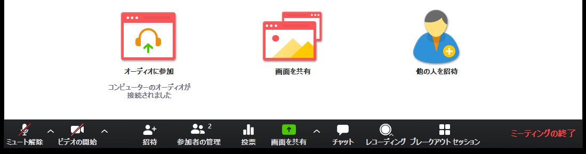

ここでは，開催者特有の Zoom の使い方を説明します．  
基本的な使い方については<a href="how_to_use" target="_blank">こちら</a>をご覧ください．  
  

## 追加機能の設定方法とおすすめ設定
個別に設定することによって，参加者に対して質問できる「投票」やグループで議論できる「ブレイクアウト」などの機能を追加で使えるようになります．  
そこで，ここでは，追加機能の設定方法とおすすめの設定を紹介します．
  
1. Zoom アカウントの<a href="https://zoom.us/profile/setting" target="_blank">設定ページ</a>（個人の「設定」→「ミーティング」）へ行きます．
  * 取得したアカウントでログインしてください  
    
  
1. 必要な設定を ON にします．おすすめの設定は以下のとおりです．
  * （必要に応じて ON）**認証されているユーザーしかミーティングに参加できません**: これを ON にして「大学アカウントでサインイン」を選択すると，ECCS クラウドメール（xxxx@g.ecc.u-tokyo.ac.jp）のアカウントでサインインしている人のみ入室できるように制限ができます
  * （基本 ON 推奨）**チャット自動保存**: ON にするとチャットを自動で保存してくれます（逆にしていないと手動で保存しない限り手元にチャットのテキストが残りません）．くわしくは<a href="https://support.zoom.us/hc/ja/articles/115004792763-%E3%83%9F%E3%83%BC%E3%83%86%E3%82%A3%E3%83%B3%E3%82%B0%E5%86%85%E3%83%81%E3%83%A3%E3%83%83%E3%83%88%E3%82%92%E4%BF%9D%E5%AD%98%E3%81%99%E3%82%8B" target="_blank">Zoom ヘルプセンター「ミーティング内チャットを保存する」</a> も参照のこと
  * （基本 ON 推奨）**投票中です**: 開催者から参加者に対して質問をすることができます（詳しくは後述）．
  * （基本 ON 推奨）**ブレイクアウトルーム**: 参加者をサブグループに分けて議論や作業するよう促せます（詳しくは後述）．
  * （必要に応じて ON）**字幕機能**: 音声を文字で補足したい時に利用できます．

## 開催者特有のメニュー
  
開催者特有のメニューについてそれぞれ簡単に説明します（バージョンによってはメニュー項目の一部がない場合もあります．また，上記のように別途設定が必要な項目もあります）．    
    
  
  1. **参加者の管理** : ある参加者をミュートにしたり，全員ミュートにしたり，参加者に自分でミュート解除できないようにしたり，それ以上参加者が増えないようにミーティングをロックしたりできます．
  1. **投票（設定必要）** : 参加者に対して投票を促すことができます．質問自体は Web ブラウザで作成する必要があり，「編集」や初めて質問を作る場合は「質問の追加」を押すことで，質問を作成することができるようになります．
  1. **レコーディング** : ミーティングの様子をレコーディングできます．
  1. **ブレイクアウト（設定必要）** : 参加者をサブグループに分けることができます．人数を決めて自動で割り当てることもできますし，手動で割り当てることもできます．
  

