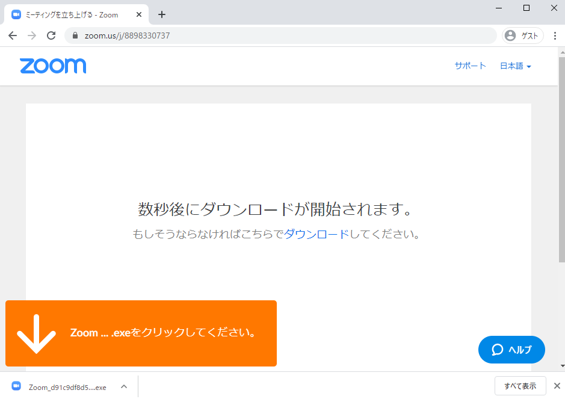

## はじめに

* ここでは Web会議システム ZOOM の特徴や使い方について説明します．
* 2020年3月11日現在，2020年4月30日までは 本学のドメイン（xxxx@xxx.u-tokyo.ac.jp）のメールアドレスで作成した ZOOM の無料アカウントを用いることで時間無制限で利用できます（通常は連続利用40分の制限あり）．

## 目次 TODO

## 特徴（TODO あとで）
* 会議室の URL からアクセスすることで Web 会議室に参加可能（TODO 全部同じだから共通の情報としてくくり出して良いかも，やはり最初のページに比較表がほしい）
* 同時接続可能数は無料アカウントだと100，有料アカウントにすると500か1000）
* 参加者はアカウントを作らなくても参加可能（開催者はアカウントを作り必要あり．また，開催者および参加者双方ソフトウェアをインストールする必要あり）

## 機能の説明
TODO 画面を出しながらどのような機能があるかを説明

## 利用の流れ
* 開催者・参加者共通
  * PC，タブレット，スマートフォンなど接続用デバイスを用意する
    * マイクやカメラが内蔵されていない場合はそれらも用意する
    * 一台のPCを同じ部屋の複数人で共有したり，講義室で登壇する人の姿を写したりする場合など，PCと参加者の距離が遠い場合，外付けのUSBカメラや高感度マイクを接続することを推奨します
  * ZOOM ソフトウェアやアプリを接続用デバイスへインストールする
  * 会議室へ参加する
* 開催者
  * 会議室を作成する
  * 会議室の情報を周知する

## （開催者・参加者共通）ソフトウェアをインストールする

* PC の場合
  * <a href="https://zoom.us/download" target="_blank">ダウンロードページ</a>へ移動して，ミーティング用Zoomクライアントをダウンロードして ZOOM をインストールしてください
  * 
	
* スマートフォン・タブレットの場合
  * <a href="https://zoom.us/download#mobile_app" target="_blank">ダウンロードページ</a>へ移動して，Zoomモバイルアプリをインストールしてください

## （開催者・参加者共通）会議室へ参加する

### PC の場合
URL（https://zoom.us/j/xxxxxxxxxx xは数字）を使って入る方法と ID（9～10桁の数字） を使って入る方法があるため，それぞれについて説明します．

* URL を使って参加する
  * 会議室の URL にアクセスする
  * Web ブラウザー上で Zoom Meetings を開くを押す（ZOOM がインストールされてない場合は，その画面からダウンロード可能であるため，そのままダウンロードして ZOOM をインストールする）
    * 
  * 名前を設定していない場合，名前設定を促されるため名前の設定をする
    * 
  * URL・ID 共通の流れへ

* ID を使って参加する
  * ZOOM を起動する
  * 「ミーティングに参加」を押す
    * 
  * ①にミーティングID（9～10桁の数字）を入力，②に名前を入力して，「参加」を押す
    * 
  * URL・ID 共通の流れへ

* URL・ID 共通の流れ
  * カメラがついていて，ビデオプレビューダイアログを表示する設定になっている場合，ビデオ付きで参加するかビデオなしで参加するか選択できるため，希望の方を選択する
    * 
  * オーディオ（音声）の参加方法を聞かれた場合，「コンピューターでオーディオに参加」を選択する
    * 
  * 以上の流れで参加できる

### タブレット・スマートフォン の場合
TODO

## （開催者）会議室を作成する

## （開催者）会議室の情報を周知する

## 授業で使える機能

