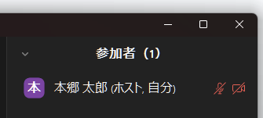
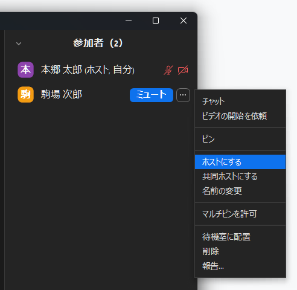
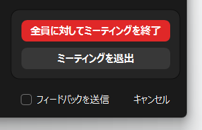
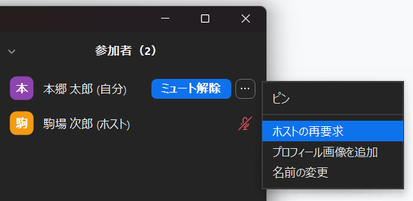
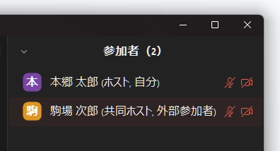

## Zoom ミーティングを管理する
### ミーティング管理機能の種類
Zoom ミーティングを管理するための機能は，「ミーティングの設定変更や記録確認に関する機能」と「ミーティングの進行に関する機能」の二つに大きく分類することが可能です．ミーティングの管理に関わる役割（後述する「[ホスト](#ホスト)」「[共同ホスト](#共同ホスト)」など）が利用することのできる機能のそれぞれの範囲は，この枠組みを用いることで整理することができます．たとえば，ホストは2種類の機能の両方が使える一方で，共同ホストは後者の「[ミーティングの進行に関する機能](#ミーティングの進行に関する機能)」しか使うことができません

### ミーティングの設定変更や記録確認に関する機能
ミーティングの設定変更や記録確認に関する機能としては，具体的には以下の機能が挙げられます．
- [ミーティングに待機室を設定](https://utelecon.adm.u-tokyo.ac.jp/zoom/create_room/waiting_room/)する
- [ミーティングの参加者に認証を求める](https://utelecon.adm.u-tokyo.ac.jp/zoom/create_room/auth/)
- ミーティングの[レポート](https://support.zoom.us/hc/ja/articles/201363213-Zoom-%E3%83%AC%E3%83%9D%E3%83%BC%E3%83%88%E5%85%A5%E9%96%80)を確認する
- ミーティングを開始する

### ミーティングの進行に関する機能
ミーティングの進行に関する機能としては，具体的には以下の機能が挙げられます．
- [ブレイクアウトルーム](https://utelecon.adm.u-tokyo.ac.jp/zoom/usage/breakout/)の作成
- [投票](https://utelecon.adm.u-tokyo.ac.jp/zoom/usage/poll/)を作成する
- 参加者をミュートにする

### ミーティングの管理の方法
ミーティングを作成した人は原則として[^1]自動的に「[ホスト](#ホスト)」という役割に割り当てられ，上記の2種類の管理機能の両方が利用可能です．加えて作成者以外の方を「[共同ホスト](#共同ホスト)」「[代替ホスト](#代替ホスト)」といった役割に設定することで，ミーティングの管理を補助してもらうことができます．これらのミーティングの管理に関わる役割について，以下で説明します．

## ホスト
### ホストとは
ホストとは，ミーティングの作成者に対して付与される役割のことです．一つのミーティングに対し，一人だけ存在します．ミーティング中に誰がホストになっているかを確認するには，ミーティング画面下部の「参加者」ボタンを選択します．

表示された参加者の一覧のうち，ホストになっている参加者には名前の右側に「（ホスト）」の表示があります．

### ホストができること
ホストは，[ミーティングの設定変更や記録確認に関する機能](#ミーティングの設定変更や記録確認に関する機能)と，[ミーティングの進行に関する機能](#ミーティングの進行に関する機能)の両方が利用でき，ミーティングの管理に関する役割の中で最も多くの機能を扱える役割です．
### ホストの譲渡
ホストが利用できる[2つの機能](#ミーティング管理機能の種類)のうち，[ミーティングの進行に関する機能](#ミーティングの進行に関する機能)を行う権限に関しては，ミーティングの開催中に他の参加者に譲渡することが可能です．[ミーティングの設定変更や記録確認に関する機能](#ミーティングの設定変更や記録確認に関する機能)については譲渡することはできません．
- **ただし，他の参加者にミーティングの進行に関する機能を使って補助してもらう場合は，ホストを譲渡するよりも，下で説明する「[共同ホスト](#共同ホスト)」に割り当てたほうが便利な場合があります．**
- **また，画面共有の権限など，個別具体的な機能についてはホスト自体を譲渡することなく特定の参加者に許可をすることが可能です**  
  **→ [Zoom 画面共有の許可と制限](https://utelecon.adm.u-tokyo.ac.jp/zoom/usage/screen_sharing/security/-)**

**ホストの譲渡は，自身からホスト権限を解除して，なおかつ他の参加者にホスト権限を割り当てたい場合に利用します．**具体的には，本来ホストとして表示されるべき人の代わりにミーティングを作成してしまった場合や，自分がホストであることを他の参加者に対して明示したくない場合に利用することが考えられます．ホストを譲渡する具体的な方法は以下の通りです．
1. ミーティング画面下部の「参加者」ボタンを選択します

2. ミーティング中の「参加者」欄に表示されている自分以外の参加者のうち，ホストに割り当てたい参加者にマウスを合わせます
3. 表示されたケバブメニュー（「…」のアイコン）をクリックし，「ホストにする」を選択します

なお，元々のホストは，「[ホストの再要求](#ホストを回復する)」で再びホストに戻ることが可能です．

### ホストキーの使用
ホストは，あらかじめ他の参加者に「ホストキー」とよばれるコードを共有しておくことで，ミーティング開始時に自身が不在の場合であっても，代わりに他の参加者にホストをつとめてもらうことができます．この機能は，ホストがミーティングに遅れて参加する場合[^2]で，他の参加者に一時的にホストを担ってもらいたい場合などに利用します．この場合，元々のホストがミーティングに参加すると「[共同ホスト](#共同ホスト)」に割り当てられますが，「[ホストの再要求](#ホストを回復する)」を行うことでホストに復帰することが可能です．
ホストキーはホストキーを発行したホストが作成した全てのミーティングに対して共通なため，セキュリティ上慎重な運用が求められます．**一時的にホストを担ってもらいたい方が東京大学の Zoom アカウントを利用している場合は，下で説明する「[代替ホスト](#代替ホスト)」に割り当てた方が便利な場合があります．**具体的な利用方法は以下のページをご覧ください．  
→[ホストキーの使用](https://support.zoom.us/hc/ja/articles/205172555)

### ホストの退出
ホストが進行中のミーティングを退出する場合，以下のように「全員に対してミーティングを終了」と「ミーティングを退出」の2つの選択肢が表示されることがあります．

これは，1つのミーティングに対しては原則として[^3]常に1人のホストが存在している必要があるため，ホストがミーティングを退出する場合，ミーティング自体を終了させるか他の参加者にホストを移動させる必要があるために表示されているものです．他の参加者にホストを割り当ててミーティングを退出する場合の具体的な手順は以下のページをご覧ください．  
→[ホストコントロールを引き継ぎ，ミーティングから退出する](https://support.zoom.us/hc/ja/articles/201362573)

### ホストの意図しないミーティング離脱
インターネット回線が切断されたなどの理由でホストが意図せずミーティングから離脱することになった場合，一定時間経過後，以下の順番で他の参加者にホストが移動することが確認されています．元々のホストは，再度ミーティングに参加することにより自動的にホストを回復することができます．
- ミーティングに共同ホストが存在する場合  
  ミーティングに共同ホストが存在する場合は共同ホストにホストが移動します．共同ホストが複数人存在する場合は，その中で当該のミーティングの最初の参加者に移動します．

- ミーティングに共同ホストが存在しなかった場合  
  ミーティングに共同ホストが存在しなかった場合は，東京大学の Zoom アカウントのうち最初の参加者に移動します．離脱したホスト以外がすべて東京大学の Zoom アカウントでないアカウントで参加していた場合は，当該のミーティングの最初の参加者に移動します．

上記の動作により，ミーティングに共同ホストが存在しない状態でホストが意図せず離脱した場合，想定しない参加者にホストが移動してしまう可能性があります．**悪意のある参加者にホストが移動する可能性を低減するため，不特定多数が参加するミーティングにおいては共同ホストを設定することを推奨します．**

### ホストを回復する
ホストが他の参加者に移動したあと（[ホストの譲渡](#ホストの譲渡)，[ホストキーの使用](#ホストキーの使用)，[ホストの退出](#ホストの退出)，[ホストの意図しないミーティング離脱](#ホストの意図しないミーティング離脱)などによる），元々のホストが再びホストに戻ることを希望する場合は，以下の方法でホストを回復することができます．

ミーティング中の「参加者」欄に表示されている自身の名前にマウスを合わせ，表示されたケバブメニュー（「…」のアイコン）をクリックし，「ホストの再要求」を選択することで，再びホストに戻ることが可能です．

## 共同ホスト
### 共同ホストとは
共同ホストとは，あるミーティングにおいて，[ミーティングの進行に関する機能](#ミーティングの進行に関する機能)に関して，ホストから管理権限を付与された役割のことです．ホストと異なり，同一ミーティングに対し複数名が存在することが可能です．ミーティング中に誰が共同ホストになっているかを確認するには，「参加者」ボタンを選択します．

表示された参加者の一覧のうち，共同ホストになっている参加者には，名前の右側に「（共同ホスト）」の表示があります．

### 共同ホストができること・できないこと
- [ミーティングの設定変更や記録確認に関する機能](#ミーティングの設定変更や記録確認に関する機能)に関しては利用することができません
- [ミーティングの進行に関する機能](#ミーティングの進行に関する機能)に関してはホストとほとんど同様に利用することができます．なお，参加者を共同ホストに指定できるのはホストだけで，共同ホストが他の参加者をさらに共同ホストに指定することはできません．

### 共同ホストを使うとき
具体的には，以下のような状況で使うことが想定されます．
- 授業内演習の進行をTAに補助してもらうため，共同ホストに設定する
- 会議の幹事を共同ホストに設定することで，進行を複数人で分担して行う

### 共同ホストに設定する方法
#### ミーティング進行中に他の参加者を指定する
ホストは，ミーティングの進行中に他の参加者を指定することで共同ホストに設定することが可能です．具体的な手順に関しては以下のページをご参照ください．  
→[ミーティングで共同ホストを使用する方法](https://support.zoom.us/hc/ja/articles/206330935-%E5%85%B1%E5%90%8C%E3%83%9B%E3%82%B9%E3%83%88%E3%81%AE%E6%9C%89%E5%8A%B9%E5%8C%96%E3%81%A8%E8%BF%BD%E5%8A%A0#h_9c3ee7f2-b70c-4061-8dcf-00dd836b2075)
#### 事前に共同ホストを設定する
[進行中に指定する方法](#ミーティング進行中に他の参加者を指定する)では，ミーティング開催中にしか共同ホストを設定することができません．ミーティングの開始前にあらかじめ共同ホストを設定しておきたい場合は，指定したい東京大学の Zoom アカウントを，下で説明する「[代替ホスト](#代替ホスト)」に指定することで実現できます．これは，代替ホストに指定されたユーザーがミーティングに参加した場合，ホストもしくは共同ホストとして設定されるからです．この方法を用いることで，定期的なミーティングの場合などで毎回共同ホストを設定する手間を省くことが可能です．

## 代替ホスト
### 代替ホストとは
代替ホストとは，あるミーティングにおいて，そのミーティングの開始権限を[ホスト](#ホスト)から付与された役割です．ホストと異なり，同一ミーティングに対し複数名が存在することが可能です．代替ホストとして指定されたユーザーは，実際のミーティング内ではホストもしくは[共同ホスト](#共同ホスト)として表示されます．ホストと代替ホストの中で，一番最初にミーティングに参加したユーザーがミーティング内でのホストとなり，それ以外は共同ホストとして表示されます．**なお，代替ホストに設定できるのは，東京大学の Zoom アカウントに限定されます**．

### 代替ホストができること・できないこと
- [ミーティングの設定変更や記録確認に関する機能](#ミーティングの設定変更や記録確認に関する機能)に関しては，「ミーティングの開始」のみ行うことが可能で，それ以外は利用することができません
- [ミーティングの進行に関する機能](#ミーティングの進行に関する機能)に関しては，[ホスト](#ホスト)・[共同ホスト](#共同ホスト)とほとんど同様に利用することができます

### 代替ホストを使うとき
具体的には，以下のような状況で使うことが想定されます．
- 説明会で，主催者側の誰でもミーティングを始められるようにしたいため，あらかじめ主催者側のメンバーを代替ホストに設定しておく
- TAに授業の進行を手伝ってもらいたいが，毎回手動で共同ホストに設定するのは手間なため，あらかじめ代替ホストに設定しておく

### 代替ホストに設定する方法
代替ホストに設定する具体的な手順に関しては，以下のページをご参照ください．  
→[代替ホストを割り当てる](https://www.sodan.ecc.u-tokyo.ac.jp/hack/alternative-host/)

## スケジュール作成特権
### スケジュール作成特権とは
スケジュール作成特権とは，他のユーザーに対し，自分の名義でミーティングを作成することを許可する権限のことです．**スケジュール作成特権を付与されたユーザー（以下「子ユーザー」とする）は，付与したユーザー（以下「親ユーザー」とする）のすべてのミーティングにおいて代替ホストとして設定されるため，セキュリティ上慎重な運用が必要になります．なお，スケジュール作成特権を付与できるのは，東京大学の Zoom アカウントに限定されます．**

### スケジュール作成特権の下でできること・できないこと
- [ミーティングの設定変更や記録確認に関する機能](#ミーティングの設定変更や記録確認に関する機能)に関しては，以下の通りです
  - 親ユーザーの代わりにミーティングをスケジュールすることができます
  - 親ユーザーが設定したミーティングについて，自由に開始・編集・削除することができます．このため，子ユーザーは既存の親ユーザーのミーティングに対して以下のような設定に関する変更を行うことができます
    - [ミーティングに待機室を設定](https://utelecon.adm.u-tokyo.ac.jp/zoom/create_room/waiting_room/)する
    - [ミーティングの参加者に認証を求める](https://utelecon.adm.u-tokyo.ac.jp/zoom/create_room/auth/)
  - 録画されたレコーディングや，レポートなどに関しては，子ユーザーは利用することができません
- [ミーティングの進行に関する機能](#ミーティングの進行に関する機能)に関しては，[ホスト](#ホスト)・[共同ホスト](#共同ホスト)とほとんど同様に利用することができます

### スケジュール作成特権を使うとき
具体的には，以下のような状況で使うことが想定されます．
- 教員である自分が主催するミーティングについて，秘書にあらかじめスケジュールを行ってもらうため，スケジュール作成特権を付与する

### スケジュール作成特権を付与する方法
スケジュール作成特権を付与する具体的な手順に関しては，以下のページをご参照ください．  
→[スケジュール作成特権を設定する方法 ](https://support.zoom.us/hc/ja/articles/201362803-%E3%82%B9%E3%82%B1%E3%82%B8%E3%83%A5%E3%83%BC%E3%83%AB%E4%BD%9C%E6%88%90%E7%89%B9%E6%A8%A9#h_a9476921-e417-4d02-bf62-7bc96554f9a4)

[^1]: 例外として，後述するスケジュール作成特権を用いてミーティングを作成した場合には付与されません
[^2]:  ホストがミーティングを開始する前に参加者がミーティングに参加するためには，[ミーティング作成時](https://utelecon.adm.u-tokyo.ac.jp/zoom/misc/app/#%E3%82%A2%E3%83%97%E3%83%AA%E3%81%A7%E3%81%AE%E4%BC%9A%E8%AD%B0%E5%AE%A4%E3%81%AE%E4%BD%9C%E3%82%8A%E6%96%B9)の詳細オプションで「ホストより前の参加を有効にする」を有効にしている必要があります
[^3]: ミーティング作成時の詳細オプションで「ホストより前の参加を有効にする」を有効にしている場合，ホストが参加するまでの間は，ホスト不在でミーティングが進行します