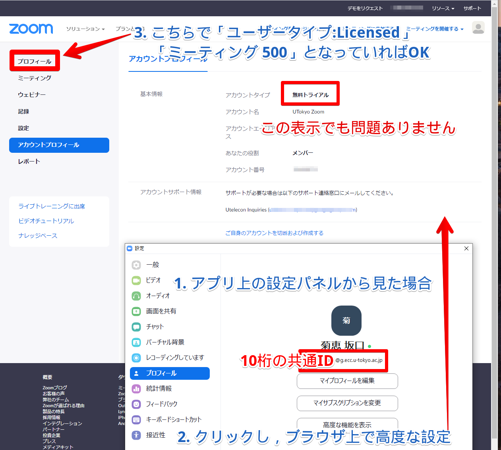

Zoomの初期設定・利用開始時のトラブルに関するFAQ
=================

私はZoomのアカウントを作る(アクティベートする)必要あるの?
-----------------

* 「会議を開催する人」は必要. つまり授業をするために会議の設定をする人, 典型的には教員, またはそれを代行するTAは必要
* Zoomの機能を用いて「g.ecc.u-tokyo.ac.jpで認証されたユーザに参加者を限定」された会議に参加する人は必要. 一部の授業ではオンライン授業へのアクセスを制御するためにこうしていますので, そのような授業に参加する場合は作って下さい
* それ以外の会議に, 参加するだけの人は不要です

「アカウントのアクティベーションを招待するメール」が送られていると聞いたがどう受け取れば良い?
-----------------

* ECCSクラウドメール (なんとか@g.ecc.u-tokyo.ac.jp というアドレス) にとどいています. 「なんとか」はECCSクラウドメールの初期設定で自分で設定した文字列です.
* ECCSクラウドメールを使ったことがない人は<a href="https://hwb.ecc.u-tokyo.ac.jp/wp/literacy/email/initialize/" target="_blank">設定</a>して下さい
* その後 <a href="https://gmail.com" target="_blank">Gmail</a> から上記アカウントでログインして下さい. すでに他のGmailアカウントをお持ちの場合は一旦ログアウトして下さい
* こちらから<a href="https://mail.google.com/a/g.ecc.u-tokyo.ac.jp" target="_blank">ログイン</a>することもできます

ECCSクラウドメール(なんとか@g.ecc.u-tokyo.ac.jp)をチェックしたが「アカウントのアクティベーションを招待するメール」が見当たらない
-----------------

* 迷惑メールフォルダに入っていないかご確認下さい
* 教職員には3/16, 学生には3/24-25にお送りしており, その時点でUTokyo Accountのなかった方にはメールが送られていない可能性があります
* 2020年4月からの新入生もUTokyo Accountは, 通常はその時点で割り当てられているはずですが, 所属により, そうでないこともあるかもしれません
<!--* 本当に登録されてないのにアクティベートすると危険?-->
<!--* ここに書かれている<a href="https://forms.office.com/Pages/ResponsePage.aspx?id=T6978HAr10eaAgh1yvlMhI_ifmf7qdFDpTYBBcm0ltJUOUxJQ1VWMjhDSTZKTUU1Wk1LVEUyNTlLUS4u" target="_blank">対処</a>をすることでアクティベート出来る可能性があります-->
* それもうまく行かなければ<a href="https://forms.office.com/Pages/ResponsePage.aspx?id=T6978HAr10eaAgh1yvlMhHUY5ws7h1xGr9koV-KGC8RUNUhHRjdZRjI0NzVNV1FSTVZXT09YOU5UTy4u" target="_blank"> 再送を依頼</a>して下さい

アカウントのアクティベーションを招待するメールを受取り, アクティベートするボタンを押したが「そのようなユーザはいない」と言われた
-----------------

* 原因は不明ですがかなりの人に発生しています. ここに書かれている<a href="https://forms.office.com/Pages/ResponsePage.aspx?id=T6978HAr10eaAgh1yvlMhI_ifmf7qdFDpTYBBcm0ltJUOUxJQ1VWMjhDSTZKTUU1Wk1LVEUyNTlLUS4u" target="_blank">対処</a>で直ったという話がありますのでやってみて下さい

メールを受取り, アクティベートするボタンを押したが「期限切れ」と言われた
-----------------

* <a href="https://forms.office.com/Pages/ResponsePage.aspx?id=T6978HAr10eaAgh1yvlMhI_ifmf7qdFDpTYBBcm0ltJUOUxJQ1VWMjhDSTZKTUU1Wk1LVEUyNTlLUS4u" target="_blank">ここに書かれている対処</a>で直るかもしれません

User TypeがLicensedではなくBasicになってしまっている
-----------------

* Zoomに, 10桁の共通ID@g.ecc.u-tokyo.ac.jp でサインインしているかご確認下さい. 確認方法
  * [Zoomホームページ](https://zoom.us/) にアクセス
  * MY ACCOUNT でプロフィールを見て, Sign-In Emailが10桁の共通ID@g.ecc.u-tokyo.ac.jp となっていることを確認する
  * その場合, User Type が Licensed, 容量 (Capacity) が Meeting 500, Webinar 500と表示されるはずである
  * 「アカウントプロフィール」の画面では**無料トライアル**と表示されますが, 問題ありません
  
<!-- * **** そうなっていなかったら **** (例えばZoomに登録していない状態で10桁@g.ecc.u-tokyo.ac.jp でサインアップしちゃったら?) -->
* 他のアカウントでサインインしていた場合, 一旦サインアウトして, 10桁の共通ID@g.ecc.u-tokyo.ac.jp でサインインし直して下さい
* 10桁の共通ID@g.ecc.u-tokyo.ac.jp でサインインできなければ, <a href="https://forms.office.com/Pages/ResponsePage.aspx?id=T6978HAr10eaAgh1yvlMhI_ifmf7qdFDpTYBBcm0ltJUOUxJQ1VWMjhDSTZKTUU1Wk1LVEUyNTlLUS4u" target="_blank">ここに書いてある対処</a>でアクティベート出来るかも知れません

以上すべてがうまく行かなかったら
-----------------

* utelecon-inquiries@googlegroups.com へご連絡下さい
* その際解決のヒントとするため, 以下をお知らせ下さい
  * UTokyo Account (10桁の数字. 共通ID)
  * 自分で設定したECCSクラウドメールアドレス なんとか@g.ecc.u-tokyo.ac.jp
  * 10桁の共通ID@g.ecc.u-tokyo.ac.jp で[Zoom](https://zoom.us/)にサインインできるか
  * 出来る場合, User Type, 容量 (Capacity) がどう表示されているか?

