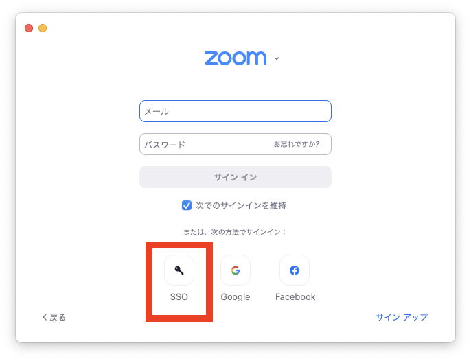

東京大学のZoomアカウントでのサインインには，[UTokyo Account](https://www.u-tokyo.ac.jp/adm/dics/ja/account.html)が必要です．UTokyo Accountをまだ使ったことがなければ，先に「（学生向け）[オンライン授業を受けるために](/oc/)」「（教職員向け）[オンライン授業を始めるために](/faculty_members)」を確認してください．

東大の所定のZoomアカウントとは異なる，<strong class="alert">10桁の共通IDではないメールアドレス（ECCSクラウドメールの自分で設定したメールアドレス <code>xxxx@g.ecc.u-tokyo.ac.jp</code> など）のアカウントを利用している場合，以下の方法ではサインインできません．</strong>「<a href="/notice/zoom-address-new">UTokyo Account以外のサインインでのZoomの利用について</a>」の案内をご覧ください．

## ブラウザからサインインする方法
{:#browser}



## アプリからサインインする方法
{:#app}

1. Zoomアプリで「サインイン」ボタンを押すなどして，Zoomのサインイン画面を開いてください．
{:.medium}
1. サインイン画面で，「SSO」または「SSOでサインイン」と書かれた文字を探して押してください（使っている端末やアプリのバージョンによって異なります）．この画面のメールアドレス・パスワード欄にUTokyo Accountの情報を入力してもサインインできません．
{:.medium}
{:.medium}
1. 「会社のドメイン」欄に `u-tokyo-ac-jp` と入力してください（ `ac` の前後はピリオドではなくハイフンであることに注意してください）．
{:.medium}
1. ブラウザでUTokyo Accountのサインイン画面が表示されるので，サインインしてください（UTokyo Accountにサインイン済みの場合は，この画面を経ずにそのままサインインが完了します）．
{:.medium}
    

        
ヘルプ：「このサイトにアクセスできません」などのエラーが表示される場合

        ブラウザで「このサイトにアクセスできません」「申し訳ございません。このページに到達できません」「サーバが見つかりません」「アクセスしようとしているサイトが見つけられません」などのエラーが表示される場合は，上の手順で「会社のドメイン」を正しく入力できていません．Zoomアプリの画面に戻り，「会社のドメイン」欄に<code>u-tokyo-ac-jp</code>と入力しているか，もう一度確認してください．特に，<code>ac</code>の前後はピリオドではなくハイフンであることに注意してください．
    

この手順がうまくいかないときは<a href="/support/">サポート窓口</a>に相談してください．

## 手順動画
{:#movie}

<iframe width="560" height="315" src="https://www.youtube.com/embed/5QIg6dU1cYI" title="YouTube video player" frameborder="0" allow="accelerometer; autoplay; clipboard-write; encrypted-media; gyroscope; picture-in-picture" allowfullscreen></iframe>

