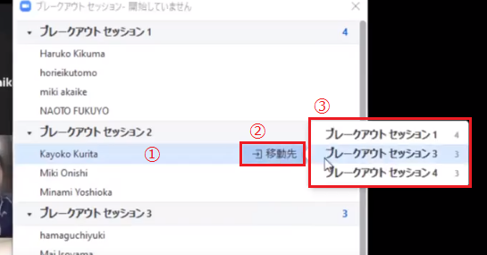
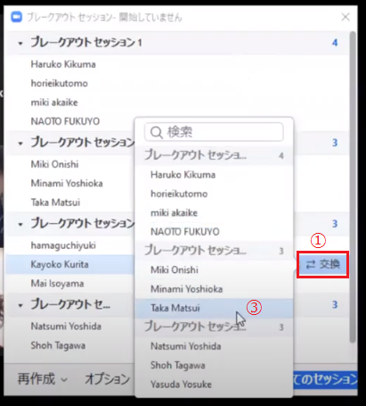
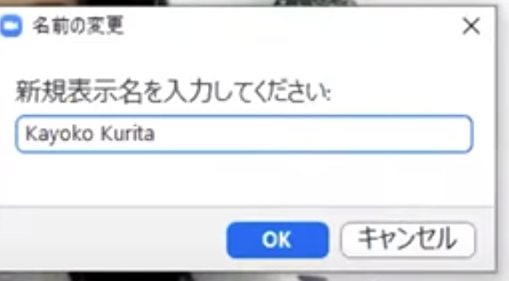
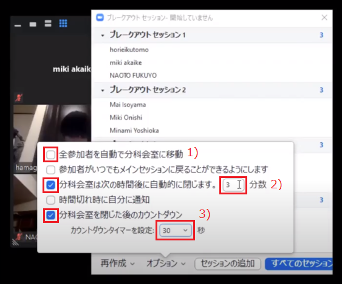
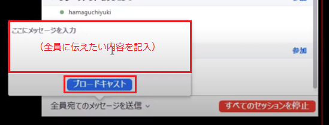

## ブレークアウトルームとは？
* ブレークアウトルーム機能を使うと，メインの会議室から参加者を別々のルーム（＝ブレークアウトルーム，分科会室ともいう）に分割することができます．オンライン授業でグループワークを行う場合は、このブレークアウトルームが用いられます．
* ブレークアウトルームの参加者には，メインの会議室と同様に，オーディオ，ビデオ，画面共有機能が提供されます．
* それぞれのブレークアウトルームは独立しているため，参加者は，他のブレークアウトルームでの会話内容を視聴することはできません．
* ホストである教員は、複数のブレークアウトルーム間を自由に移動できますが，参加者である学生は，教員が設定しない限り，自由に移動することはできません．
* 最大で50のブレークアウトルームが作成可能です（200人以下であれば50，201～400人であれば30，401～500人であれば20のブレークアウトルームが作成できます）．
  * なお，東京大学のZoomアカウントで作成されたミーティングでは，参加者人数に関わらず最大で100個のブレークアウトルームを作成することができるようになりました．
  * 参考: [https://support.zoom.us/hc/en-us/articles/206476313-Managing-Video-Breakout-Rooms](https://support.zoom.us/hc/en-us/articles/206476313-Managing-Video-Breakout-Rooms)

## ブレークアウトルームの授業での活用方法
オンライン授業において，グループワークを行いたいときに用いることができます．

## ブレークアウトルームの準備
ブレークアウトルームの具体的な実施方法について説明します．

### ブレークアウトルームの設定方法
1. 詳細（図中1）＞「ブレークアウトセッション」（図中2）を選択 
  
2. 参加者の「ブレークアウトセッション」への割り当てを行う（詳細後述，「グループの割り当て」を参照）  
  

3.	オプション（時間等）を設定する  
4.	ブレークアウトを実行する 
設定が完了したら，ウィンドウ右下「すべてのセッションを開始」を選択する． 
  

### グループの割り当て（自動）
この場合，参加者はホストが指定した数のブレークアウトセッションに自動で振り分けられます．  
#### 手順
1.	詳細（図中1）＞「ブレークアウトセッション」（図中2）を選択 

2.	「〇人の参加者を次に割り当て」に，作成する「ブレークアウトセッション」の数を入力する．     

3.	振り分け方法で，「自動」を選択する．
4.	「セッションの作成」をクリックする
入力した「ブレークアウトセッション」数に従い，zoom側が自動的に作成した振り分けが画面に表示されます．
5.	参加者の振り分けを調整する
ホストは手動で，参加者の振り分けを下記のように調整することが可能です． 

    1. 振り分けをやり直す：「再作成」を選択． 
    2. セッションの数を増やす：ウィンドウ下中央の「セッションの追加」を選択． 
    

    3. 特定の参加者を別のセッションへ移動させる：移動させたい参加者の名前の上にカーソルを移動させます（図中1）．次に，「移動先」（図中2）＞移動先のセッション（図中3）を選択． 
    

    4. 特定の参加者を，別のセッションにいる特定の参加者と交換する：交換したい参加者の名前の上にカーソルを移動させ，「交換」をクリック＞交換相手の参加者を選択． 
      
    5. セッション名を変更する：「ブレークアウトセッション（番号）」にカーソルを移動＞「名前の変更」 
    
    6. セッションを削除する：「ブレークアウトセッション（番号）」にカーソルを移動＞「削除」 
    ※削除すると，削除されたセッションに振り分けられていた参加者はどこにも振り分けられていない状態になります．以下の7)の操作を行い，参加者を振り分け直します． 
    7. 振り分けられていない参加者を，特定のセッションに振り分ける：振り分けたいブレークアウトセッションにカーソルを移動＞そのセッションの人数の表示を選択＞（振り分けられている参加者名の下に，どこにも振り分けられていない参加者が表示される）＞そのセッションに参加させたい参加者を選び，チェックをつける． 
      

### グループの割り当て（手動）
この方法を選ぶと，参加者は自動では振り分けられません．
#### 手順
1.	詳細（図中1）＞「ブレークアウトセッション」（図中2）を選択． 

2.	「〇人の参加者を次に割り当て」に，作成する「ブレークアウトセッション」の数を入力する．     

3.	振り分け方法で，「手動」を選択する．
4.	「セッションの作成」をクリックする．
5.	参加者の振り分けを行う．
    1. 振り分けたいブレークアウトセッションにカーソルを移動する．
    2. そのセッションの人数の表示（または「割り当て」）をクリック．    
    ※当該のセッションに1名以上が割り当てられている場合は人数が，誰も割り当てられていない場合は「割り当て」と表示される．
    3. 表示される参加者一覧から，そのセッションに参加させたい参加者を選び，チェックをつける．
6.	参加者の振り分けを調整する． 
上記の「参加者の振り分けを調整する」と同様に調整が可能です．

#### 手動で割り当てを行うときの工夫
参加者の名前を，グループに応じた名前に設定する（番号やグループ名を，名前の頭に挿入する）ことで，表示される参加者名がソートされ，手動での割り当てを楽に行うことができるようになります． 

名前の変更は，参加者が自身で行うことも，ホストが行うこともできます．

**「名前の変更」の方法**
1.	画面下の「参加者」をクリック．
2.	名前の表示にカーソルを合わせ，「詳細」，「名前の変更」の順にクリック． 

### オプションの設定    
ウィンドウ左下「オプション」を選択し，時間と移動の設定を行います． 

#### ブレークアウトセッションへの移動の設定
「全参加者を自動で分科会室に移動」にチェックを入れると，ブレークアウトセッションの開始後に，参加者は自動的に各セッションに移動します． 
チェックを入れない場合，参加者のブレークアウトセッションへの移動にはばらつきが生じます．ブレークアウトセッションの開始後，各参加者の画面に，ブレークアウトセッションへの移動の可否を尋ねるウィンドウが現れ，参加者が移動を承認すると，各セッションに移動します． 

#### 時間の設定
「分科会室は次の時間後に自動的に閉じます」にチェックをつけ，任意の時間を入力します． 
※「分科会室」はブレークアウトセッションのことを指します． 
※予め，ブレークアウトセッションを閉じる時間を指定した直後にある，「時間切れ時に自分に通知」にチェックを入れることで，指定した時間が経過した際に通知がきます．通知が来た時，「ブレークアウトルームの公開を維持」をクリックすることで，ブレークセッションの延長を行うことができます. 

#### セッション終了後，メイン会議室に移動するまでの時間を設定する
「分科会室を閉じた後のカウントダウン」にチェックを入れ，「カウントダウンタイマーを設定」に，任意の時間を入力します．この時間は，ブレークアウトセッション終了後，参加者の画面がブレークアウトセッションからメイン会議室に切り替わるまでの時間です．

## ブレークアウトルーム実施中の操作

ブレークアウトルームの実施中，ホストは，次のような操作が可能です．  

### 各セッションの様子を個別に見る 
様子を見たいセッションを選び，「参加」をクリックします．セッションを退出すると，メイン会議室に移動します． 
共同ホストも，ホストと同様に，セッション間を自由に行き来することができます．したがって，TAを共同ホストにすれば，複数人でブレークアウトセッションの様子を見ることができます． 
※ホストが各セッションに参加せずに，各セッションの進捗を把握する方法としては，Googleのスプレッドシートを共有し，参加者に進捗状況を記入してもらう，などが考えられます．

### ヘルプを求められたセッションに参加し，学生を助ける
学生は，「ヘルプを求める」機能を使い，ホストを呼ぶことができます．学生が「ヘルプを求める」ボタンを押すと，ホスト（＝教員）に，学生がヘルプを求めていることが表示されます．併せて表示される，「ブレークアウトルームに参加する」を押すと，ヘルプを求めているブレークアウトルームに移動し，学生を直接ヘルプすることが出来ます．

 

### 参加者全員に指示を届ける
対面授業でのグループワーク実施時とは異なり，セッションの実施中，各セッションに対して，ホスト（＝授業の実施者）が一斉に声を届ける（＝音声を使って一斉に指示をする）ことはできません．その代わりになる機能として，異なるブレークアウトルームにいる参加者全員宛てに，メッセージを送信することができます．
1.	ウィンドウ左下「全員宛てのメッセージを送信」をクリック．（図中②）
2.	テキストボックスにメッセージを入力．
3.	「ブロードキャスト」を選択． 

### セッションを停止する
開始したセッションを，所定の時間より早く終了する場合は，「セッションを停止する」を選択します．

### セッションに参加できなかった参加者を追加で振り分ける
ブレークアウトセッション開始後に遅れて授業に参加した参加者や，ブレークアウトセッション開始後に，一度会議室全体から退出してしまった参加者を，特定のセッションに振り分け直すことができます．上記の「グループの割り当て（自動）」「5. 7) 振り分けられていない参加者を，特定のセッションに振り分ける」の操作を行い，再振り分けを行います． 
ブレークアウトセッションの途中で，ある参加者が，接続の不具合などから，一度退出し，その後zoom会議室に再入室した場合，もともと参加していたブレークアウトセッションに自動で移動させられることはありません．参加者はホストが待機しているメインの会議室に現れるため，再振り分けが必要になります． 
また，実施中でも参加者をブレークアウトセッション間で移動させることは可能です．ブレークアウトセッションの管理画面から，各ブレークアウトセッションの右端にある「割当」または「数字（＝セッションに割り当てられている人数）」をクリックすると，割り当てが可能になります．

## ブレークアウトセッションを行うときの注意点
+ セッションの実施中，各セッションに対して，ホストが音声によって指示を届けることはできません．その代わり，ブロードキャスト機能を使い，メッセージを送ることは可能です．
+ セッションの実施中，学生が教員にヘルプを求めたとき，教員が直接ヘルプするためには，セッションに入室する必要があります． 
+ ホストは，各セッションの会話内容を全体的に把握することはできません．そのため，各グループの進捗を把握するには，Googleドキュメントを使うなど，工夫が必要です．
+ セッションの開始後，初期設定では実施時間を延長することはできません（議論する時間が足りず，延長しようとしてもできない）．延長をできるようにするには，ブレークアウトセッションを閉じる時間を指定した後に出てくる，「時間切れ時に自分に通知」にチェックを入れる必要があります．
+ 教員が1回の会議または授業の中で，複数回ブレークアウトセッションを行う場合，直前のセッションと同じ振り分けは再び用いることができますが，それより以前の振り分けを再利用することはできません．
+ 各ブレークアウトルームで，チャットを用いて「全員宛て」にメッセージを送信した場合，そのメッセージは同じブレークアウトルームにいる相手にしか共有されません．チャットの履歴は，当該のメッセージを送受信した本人のところにのみ残ります．したがって，ブレークアウトルームでの議論をチャットに記録し，メインルームに戻った場合，その記録は同じブレークアウトルームにいた相手のチャットにしか残りません．

## Q&A

### Q. あらかじめブレークアウトセッションを作成し，学生を振り分けておくことは可能ですか．
A. 可能ですが，条件があります．振り分けを記入したCSVファイルを取り込むことで，あらかじめ各セッションに学生を振り分けることができます（ブラウザの「マイアカウント」＞「ミーティング」＞「編集」から，ファイルを取り込みます）．ただし，この場合は，当日に参加者が使用するメールアドレスが，CSVファイル事前登録したメールアドレスと一致する必要があります．

### Q. ブレークアウトセッション開始後に，セッションの時間を延長することはできますか．
A．ブレークアウトセッションを作成する際に，「時間切れ時に自分に通知」にチェックを入れることで，指定した時間が経過した際に通知がきます．通知が来た時，「ブレークアウトルームの公開を維持」をクリックすることで，ブレークアウトセッションの延長を行うことができます.

### Q. 事前に決まっているグループや，議論するテーマに沿って学生をグループ分けしたいときに，効率よく振り分けを行う方法はありますか．
A．学生の名前を変更してもらうことでフラグをつけ，振り分けを行うといった方法があります．会議中に，参加者は自分の表示名を変更することができます．この機能を使い，学生には，名前の先頭に番号やテーマ名などを入力してもらうように指示します．すると，振り分け時に変更された名前によって参加者がソートされるため，この番号ないしテーマ名に沿って，振り分け調整を行うことが可能になります．

### Q. 共同ホストはブレークアウトルームを作成できますか．
A. できます．2020年12月のバージョン5.4.6から，共同ホストもブレークアウトルームを作成できるようになりました．できない場合は，アプリのバージョンをアップデートしてみてください．

### Q. 共同ホストは，ブレークアウトルームに介入できますか．
A. 共同ホストも，ホストと同様，ブレークアウトルーム間を自由に移動することができます．