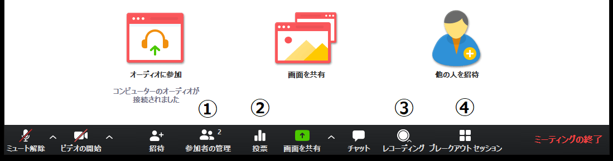

ここでは，Zoom でミーティングに参加している時の具体的な使い方を説明します．  

会議室に入ると以下のような画面になります（画像は参加者1名です）．  
Zoom の画面にマウスカーソルを合わせると下にメニューが出てきます．  
    
メニューについて左から順にそれぞれ簡単に説明します（バージョンによってはメニュー項目の一部がない場合もあります）．
  1. **マイクマーク** : これを押すことによってミュート（消音）にしたり，ミュートを解除できたりします（画面では現在ミュート状態であるため「ミュート解除」と表示されています）．横にある上マークを押すとマイクに関する設定ができるようになります．
  1. **ビデオマーク** : これを押すことによってビデオをオンやオフにできます（画面では現在カメラがオフ状態であるため「ビデオの開始」と表示されています）．横にある上マークを押すとビデオに関する設定ができるようになります．
  1. **招待** : メールなどを使って招待を送れます．開催者および参加者は基本的に会議室の URL を知っているため，それを共有すれば招待できることから，このボタンはそこまで使いません．
  1. **画面を共有** : 自身のデバイスの画面を共有できます．
  1. **反応（リアクション）** : 「拍手」や「賛成」，「手を上げる」等のマークや，様々な絵文字を使用することで，意思を表明できます．
  1. **詳細** : 画面に入りきれなかったメニューがここに入ります（画面の横幅が十分大きい場合は全てのメニューが画面内に表示されて「詳細」が表示されないことがあります．  
    * **参加者** : 参加者一覧を表示します．  
    * **チャット** : テキストチャットを行います．  
    * **このコンピューターにレコーディング** : ホストが許可をしている場合レコーディングができます．このボタンは開催関係者以外は利用しないことが多いです．  
  1. **ミーティングを退出** : ミーティングを退出します．押した後確認画面が出るため，ボタンを押したらいきなり退出するわけではありません．
  
  
以下，主に利用するメニュー項目について，追加で詳細を説明します．

## マイクの詳細設定
  
  
  
マイクマーク横の上マークを押すと，追加でメニューが出てきます．
  * **マイク** : 使いたいマイクを選択できます（別途マイクを付けている場合，複数の選択肢が出てくるため，目的のものを選択してください）．「システムと同じ」を選択すると，コンピュータの設定と同じマイクが使用され，コンピュータの設定を変えるとZoomでも変更が反映されるようになります．
  * **スピーカー** : 使いたいスピーカーを選択できます（別途スピーカーを付けている場合，複数の選択肢が出てくるため，目的のものを選択してください）．「システムと同じ」はマイクと同様です．

他の項目を含む詳しい使い方，動画での説明については，「[マイクとカメラ](mic_cam/)」をご覧ください．
  
## ビデオの詳細設定
  
  
  
ビデオマーク横の上マークを押すと，追加でメニューが出てきます．
  * **カメラ** : 使いたいカメラを選択できます（別途カメラを付けている場合，複数の選択肢が出てくるため，目的のものを選択してください）．
  
他の項目を含む詳しい使い方，動画での説明については，「[マイクとカメラ](mic_cam/)」をご覧ください．
バーチャル背景の使い方については，「[バーチャル背景](mic_cam/virtual_background/)」をご覧ください．
  
## 参加者
  
メニュー「参加者」を押すと，参加者一覧が見られる画面が出てきます．
    
  
  * 自分の名前のところにマウスカーソルを合わせると，ミュートのオン，オフ，詳細より表示される名前の変更,プロファイル画像の変更が行えます.
  
また，主催者はこれに加えて以下のようなことができます：
  * ある参加者をミュートにする・すべての参加者をミュートにする
  * 参加者が自分でミュート解除できないようにする
  * それ以上参加者が増えないようにミーティングをロックする

<!-- 詳しくは，「[参加者タブ](participants/)」をご覧ください． -->
  
## 画面の共有
  
メニュー「画面の共有」を押すと，共有する画面の選択肢が出てきます．希望のものを選択して「共有」を押すと，画面の共有が始まります．
  
  
  
  * 「画面」を選択すると，共有する人の画面そのものが全員に共有されます（画像のようにマルチモニタなどで画面が複数ある場合は画面1，画面2と選択肢が増えます）．
  * 「ホワイトボード」を選択すると自由に描けるホワイトボードが全員に共有されます．
  * 「iPhone/iPad(ケーブル使用)」を選択すると iPhone/iPad の画面共有ができるようになります（プラグインが必要）．「iPhone/iPad(AirPlay使用)」を選択することで、同じ WiFi ネットーワーク内にあるデバイスから AirPlay 経由で共有することもできます．
  * 現在開いているウィンドウも選択肢に表示されます．ウィンドウ単位で画面共有することもできます．ウィンドウ以外の場所を見られたくない場合は，そのウィンドウを選択して画面共有することをおすすめします．
  * 画面左下「音声を共有」にチェックを入れることで，共有する人のデバイス上で再生される音声も，全員に共有されます．画面共有で動画を再生する場合は，この項目にチェックを入れることをおすすめします．
  
詳しい使い方については，「[画面共有](screen_sharing/)」をご覧ください．
  
## チャット
  
メニュー「チャット」を押すと，テキストチャットができるようになります．ここで，注意が必要なのは，途中からログインすると過去のテキストチャットが確認できない点です．そのため，テキストを送付したいメンバーが全員いる状態でテキストを送付することが重要になります．
    
  
  * 「送信先」を変更することで，メッセージの送信先を「全員」や個人に変更できます．デフォルトでは全員に送信されるようになっています．
  * 「ファイル」を選択することによって，コンピュータにあるファイルや Dropbox などにあるファイルを送信できるようになります．

詳しい使い方については，「[チャット](chat/)」をご覧ください．

## リアクション

メニュー「リアクション」を押すと， 「拍手」や「賛成」，「手を上げる」等の意思を表明できる画面が出てきます．表明したいものをクリックすると，すべての参加者にリアクションが表示されます．

詳しい使い方については，「[リアクション](reaction/)」をご覧ください．

## 開催者特有のメニュー

開催者特有のメニューについてそれぞれ簡単に説明します（バージョンによってはメニュー項目の一部がない場合もあります．また，上記のように別途設定が必要な項目もあります）．    
    
  
  1. **投票（設定必要）** : 参加者に対して投票を促すことができます．質問自体は Web ブラウザで作成する必要があり，「編集」や初めて質問を作る場合は「質問の追加」を押すことで，質問を作成することができるようになります．
     * 詳しくは「[投票](poll/)」をご覧ください．
  1. **ブレイクアウト（設定必要）** : 参加者をサブグループに分けることができます．人数を決めて自動で割り当てることもできますし，手動で割り当てることもできます．
     * 詳しくは「[ブレークアウト](breakout/)」をご覧ください．
  1. **レコーディング** : ミーティングの様子を録画できます．
     * 詳しくは「[録画](recording/)」をご覧ください．
