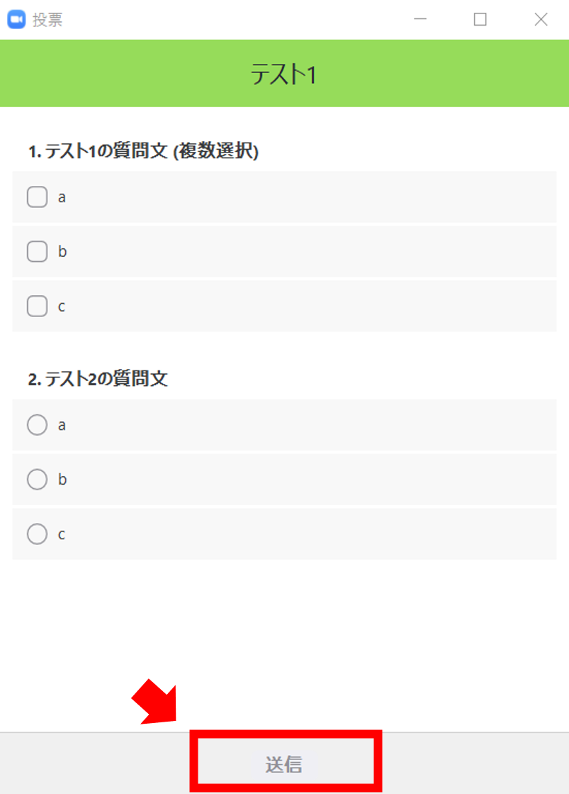
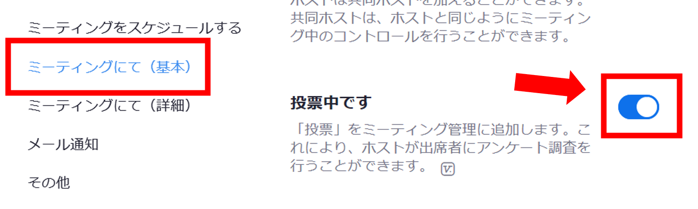
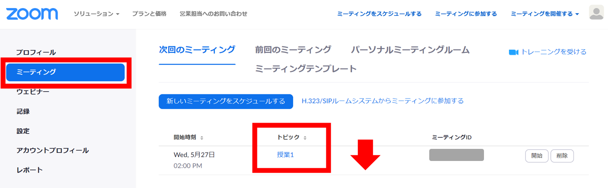
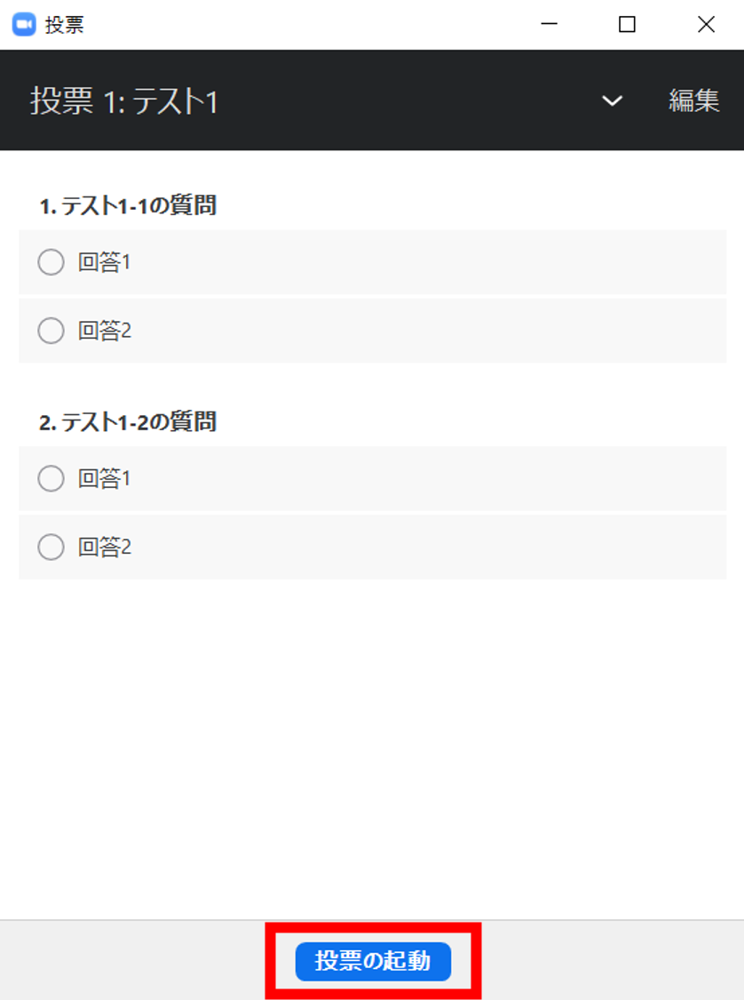
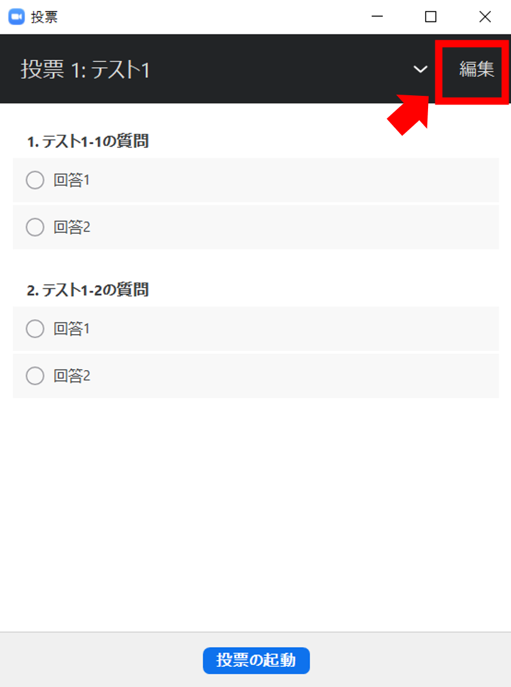
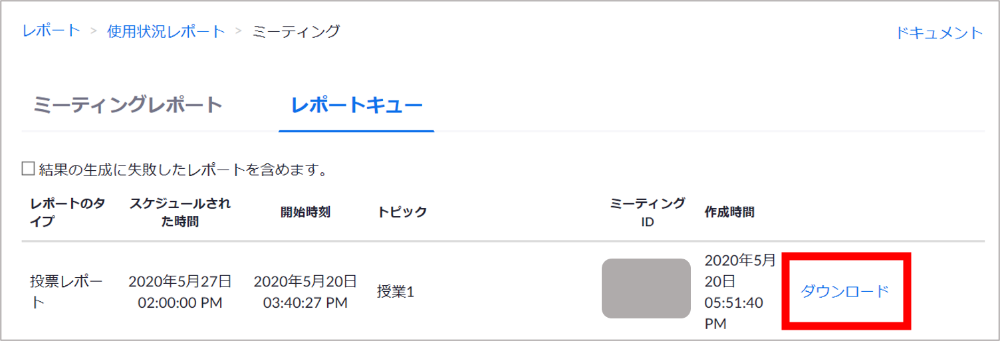

Zoomの「投票」機能を用いて，授業中に受講者に向けて多肢選択のアンケートを実施できます．

## 投票に参加する（参加者向け）

授業中に教員がアンケートを実施する場合があります．教員がアンケートの集計を開始すると，学生側の画面には，次のような回答フォームが表示されます． 
下図の「テスト1」においては，質問1への回答では複数の選択肢にチェックを入れることができます．質問2では，1つしか回答を選ぶことができません． 
回答を選択したら，「送信」ボタンをクリックします． 
注意：送信後に回答を修正することはできませんので，送信前によく確認しましょう．  

  

アンケート結果を教員が共有すると，学生側の画面には次のように結果が表示されます．  
この画面上では，誰がどのような回答を行ったのかについての詳細を共有されることはありません．ただし，個人個人の回答内容は，教員に共有される場合があります（※1）．    

  

※1　教員はアンケートを作成する際に，学生の回答を匿名で集計するか否かを選ぶことができます．教員が匿名での集計を選択しない場合，教員は授業後に，誰がどの回答を行ったのかを確認することができます．なお，教員が匿名で集計しない場合は，学生は匿名でアンケートに回答することはできません．

## 授業を始める前に
ここから先は主催者（教員）向けの内容です。

### 投票機能の有効化（大学がライセンスを付与したアカウントの場合，最初から有効化されています）
投票機能を用いるには，まず投票機能を有効化する必要があります．
1. Webブラウザ上でZoomにサインインし，「マイアカウント」のページを表示します．こちらのURLをクリックし，サインインすると，「マイアカウント」のページが表示されます．[https://zoom.us/profile](https://zoom.us/profile)
2. 画面左側のタブの「設定」＞「ミーティングにて（基本）」から，「投票中です」の項目をオンにします．

注意：投票機能は，あらかじめスケジュ―ルを設定したミーティングにおいてしか，用いることができません．

### Zoomミーティングのスケジューリング
Webブラウザ上でZoomにサインインし，画面上部の「ミーティングをスケジュールする」をクリックすると，下図の画面が表示されます．画面を下にスクロールし，「ミーティングオプション」の項目の中から，「認証されているユーザーしか参加できません」にチェックを入れます．この項目にチェックを入れなくとも，授業中にアンケートを実施したり結果を学生に提示したりすることはできますが，授業終了後に投票結果をダウンロードすることができません．

### 投票項目の作成
授業前にあらかじめ投票項目を作成しておくための説明をします．なお，Zoomの投票機能では，多肢選択式（複数回答可）のアンケートを実施することはできますが，記述式回答のアンケートを集めることはできません．また，作成した投票項目を（別の授業での再利用などのために）複製することはできません． 
記述式回答のアンケートを取りたい場合については，後述の「記述式回答のアンケートを取る方法」を参照してください．

1. Webブラウザ上でZoomにサインインし，「マイアカウント」のページを表示します．画面左側のタブの「ミーティング」を選択します．「トピック」欄に，既にスケジュールされた授業名が一覧で表示されています．「トピック」欄から，投票項目を作成したい授業名をクリックします．授業の「管理画面」が表示されます．

2. 画面を下にスクロールすると，「投票をまだ作成していません」と書かれたボックスがあります．ボックス右側の「追加」をクリックすると，投票項目を編集する画面に移ります．

3. 投票項目に必要な事項を入力し，保存します．
 + 「投票のタイトル」や「質問文」「回答項目」を適宜設定します．
 + 「匿名にしますか？」の項目にチェックを入れることで，回答者を匿名にしてアンケートを取ることができます．
 + 「質問を追加」することで，１回のアンケートの中に複数の質問項目を設けることができます．

4. 投票を複数回行いたい場合は，２）の「追加」ボタンを押して，新たに投票項目を作成します．

## 授業開始後

### 投票の実施
1. Zoomビデオ画面下の「投票」ボタンを押します． 
ビデオ画面の大きさによっては，「投票」ボタンが表示されていない場合があります．その場合は「詳細」ボタンを押し，「投票」を押してください．

2. 投票をあらかじめ設定していない場合には，下図の画面が表示されます． 
「質問の追加」ボタンをクリックすると，Webブラウザが起動し，投票項目を編集する画面が表示されます．投票項目に必要な事項を入力し，保存してください．
  
投票項目をあらかじめ作成していた場合は，投票の内容が表示されます． 
複数の投票項目を作成した場合は，最初に作成した投票項目（上図の例では投票1）が表示されます．他の投票項目を表示する場合は，プルダウンタブから選択してください．（下図の例では投票1～3の中から選びます．）

  
授業開始後に投票項目を追加／修正する場合は，「編集」をクリックすると，Webブラウザが起動し，投票項目を編集する画面が表示されます．投票項目に必要な事項を入力し，保存してください．

3. 「投票の起動」ボタンを押すと，投票が開始されます．

4. 学生からの投票が集まると，次のような画面が表示されます．右上には投票受付開始からの経過時間が表示されます． 
「投票の終了」ボタンを押すと，投票受付を終了します．

5. 「ポーリングを再開」を押すと，投票をもう一度やり直すことができます．これまでの集計結果は消去されます．このため，すでに投票を行った学生も，もう一度投票する必要があります．

6. 「結果の共有」ボタンを押すと，学生の画面にアンケート結果が表示されます． 
学生側には，下図の画面が表示されます．
  
教員側の画面では，下図の画面が表示されます．

「結果の共有を停止」すると，学生側で表示されていた投票結果画面が消えます．なお，この画面では，匿名でないアンケートの結果であっても，「誰がどのような回答をしたか」については，教員側も学生側も確認できません．  
    注意：授業後に投票結果をダウンロードできない場合に備えて，授業中にアンケート結果をスクリーンショット等で保存するとよいでしょう．

## 授業後
### 投票結果のダウンロード
授業終了後に，投票結果をCSV形式でダウンロードすることができます．

1. Webブラウザ上でZoomにサインインし，「マイアカウント」のページを表示します．画面左側のタブの「レポート」をクリックし，「ミーティング」をクリックします．

2. 「投票レポート」を選択し，投票結果をダウンロードしたい授業トピック横の「作成」をクリックします．

3. 「レポートキュー」の画面が表示されます．「ダウンロード」を押すと，投票結果をcsv形式でダウンロードできます．

## 投票の代替手段
投票機能以外にも，「手を挙げる」機能や「反応」機能を使って，簡単なアンケートを取ることが可能です．

 + 「手を挙げる」機能を使う 
画面下に表示されるメニュー内の「参加者」をクリックすると，参加者のリストが表示されます．このリストの下側に「手を挙げる」ボタンがあり，これを押すと挙手することができます．また，教員はこのリストによって，誰が挙手しているかを確認することができます．挙手している学生の名前の右側に，挙手を表す「手」のマークが表示されます．

 + 「反応」機能を使う 
画面下に表示される「反応」をクリックすると，「拍手」と「いいね」の2種類の絵文字の選択肢が表示されます．学生はこれを用いて，反応を示すことができます．学生が選択した絵文字は，各学生の画面左上に表示されます．

## 記述式回答のアンケートを取る方法

記述式回答のアンケートを取りたい場合は，Zoomの投票機能以外の機能を使う必要があります．例えば，Googleフォームを用いて記述式回答のフォームを作成し，回答フォームのURLをZoomで授業中に学生に共有する方法が考えられます．Zoomビデオ画面下に表示される「チャット」機能を用いて，URLを学生に送信することができます．

下図はGoogleフォームで記述式回答のアンケートフォームを作成します．多肢選択式の質問もできます．「記述式」を選択すると，短文で記述回答する問題を設けることができます．「段落」を選択すると，長文で記述回答する問題を設けることができます．

アンケートフォームを作成完了後，学生に共有するためには「送信」ボタンを押します．

「フォームを送信する」画面が表示されます．下図の赤枠で示したアイコンを押すと，アンケートフォームを共有するためのURLが生成されます．「コピー」を押します. 
＊なお，アンケートフォームをメールで送信することもできます．この場合は，赤枠で示したアイコン左側の「メール」のアイコンを押して，学生のメールアドレス宛などに送信して共有できます．

アンケートフォームを共有するためのURLを「コピー」したのち，Zoomのチャット機能でURLを投稿すると，共有することができます．Zoomビデオ画面下部から「チャット」を選んで押すと，チャット画面が画面右側に表示されます．アンケートフォームのURLを貼り付けて，Enterを押して投稿すると，URLを学生に共有できます．

