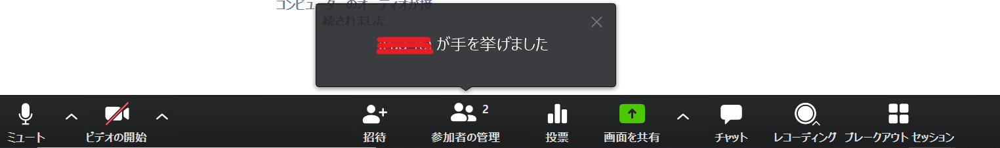
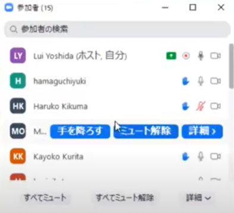
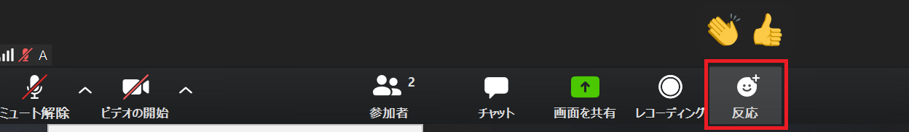
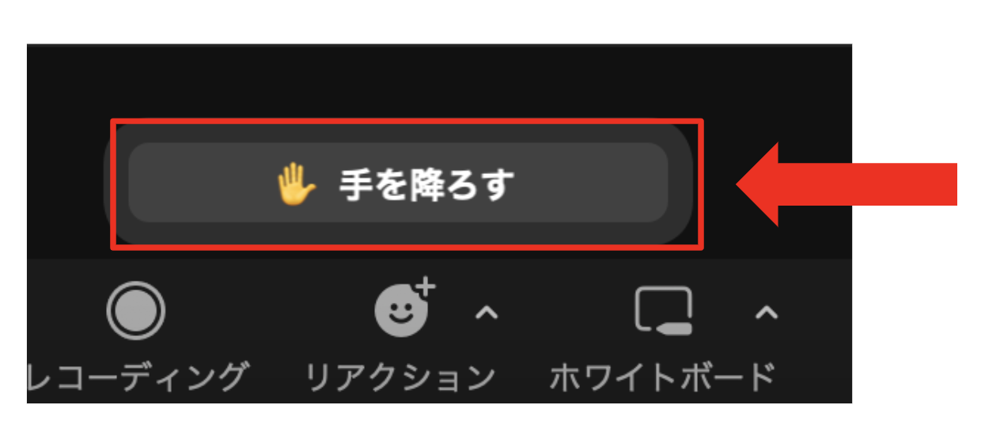
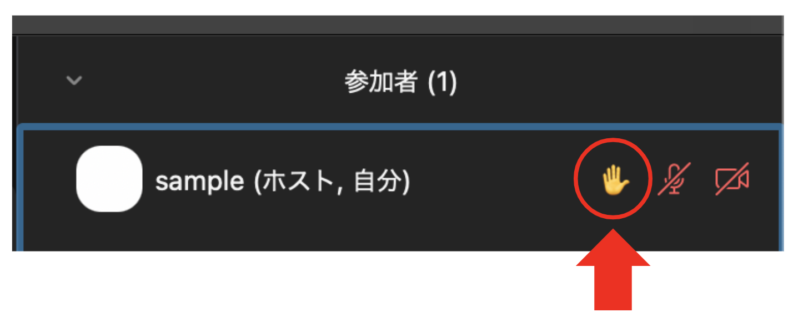
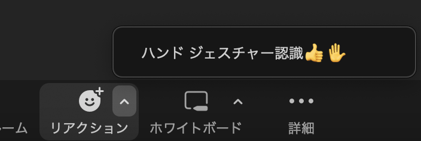
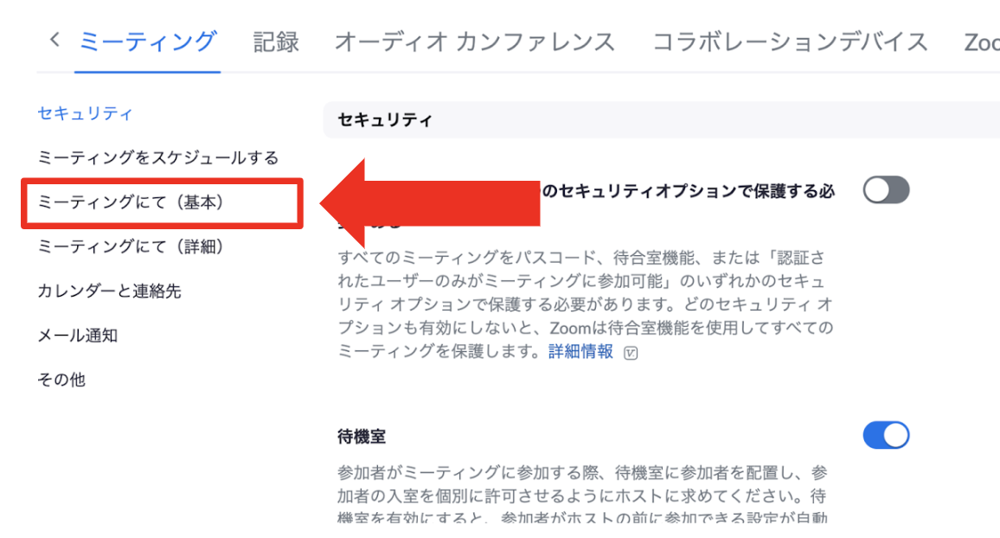

## リアクション機能とは

Zoom上で，声を出したりチャットで文章を送ったりする以外の方法で，主催者や話者に合図を送る方法です．  
『手を挙げる』『絵文字』『非言語フィードバック』の3種類があります．

## リアクション機能の用途

### 手を挙げる
  - 対面の教室で実際に『手を挙げる』ことの代替として用います．
  - 対面の教室で実際に挙手する場合と同様に，質問をしたい人がいるかの確認や，説明を理解しているかなどを簡単に尋ねるといったことができます．

### 絵文字
  - 「面白い」「嬉しい」などといった，感情の表現をすることに用います．
  - 10秒後に自動で消えるので，リアルタイム性の高い反応が期待できます．
  - 参加者が気軽に簡易的に反応を送ることできるので，ビデオやチャットを用いなくとも一緒に盛り上がることができます．

### 非言語フィードバック
  - 「はい」「いいえ」「より遅く」「より早く」などといった，話者に対するフィードバックを送ることに用います．
  - 『意思表示アイコン』と呼ばれることもあります．

## 【参加者向け】リアクションの出し方

### パソコンの場合  
1. 画面下の帯部分から［リアクション］を選択します．（［リアクション］ボタンが画面上にない場合には，右下にある［詳細］ボタンをクリックすると，［リアクション］の項目が出てきます．）  
2. 帯の上部に表示されるメニューから，出したいリアクションを選択します．  

### スマートフォン・タブレットの場合
1. 画面下の帯部分から［詳細］を選択します．  
2. 帯の上部に表示されるメニューから，出したいリアクションを選択します．  

## 【参加者向け】リアクションの消し方
画面下の帯部分の上にある，表示中のリアクション（［手を降ろす］など）のボタンをクリックすると削除できます．  
ただし，絵文字は手動で削除できません（出してから10秒後に自動で消えます）．

### 「手を挙げる」「非言語フィードバック」「絵文字」の挙動の違い
「手を挙げる」や「非言語フィードバック」は，参加者またはホストが手動で削除するまで，その表示が消えません．一方で，絵文字は10秒で自動的に消えます．

## 【全員向け】リアクションの確認方法
画面下の帯部分から［参加者］を選択すると，一覧化された参加者の名前の横にリアクションが表示されます．  
また，参加者のビデオ画面部分の左上にも表示されます．  

## 【主催者向け】より詳細な情報

### ホストとしてのリアクション管理
  - ホストは，特定の参加者や参加者全員のリアクションを，まとめて消すことができます．
    - 参加者が「手を挙げ」ている場合，画面下の帯部分から［参加者］を選択し，参加者の名前の上にマウスを置いて［手を降ろす］をクリックすると，その参加者の「手を降ろす」ことができます．
    - すべて参加者のリアクションを一度に消去するには，［参加者］，［すべてのフィードバックを消去］の順にクリックします．
  - 各々のリアクションのアイコンの上の数字は，そのアイコンをクリックした参加者の数を示しています．

### ホストするミーティングでのリアクションの有効化
  - 自らがホストするミーティングで，リアクションのうち『絵文字』『非言語フィードバック』のぞれぞれを有効化するかを選択できます．初期設定では，全て有効になっています．
  - 使用できる絵文字の種類を『すべての絵文字』『選択した絵文字』の中から選ぶことができます．『選択した絵文字』を選んだ場合，参加者は 6 つの標準的な絵文字を用いてリアクションを表出できます．
  - 有効化・無効化の方法  
    1. 「[Zoom ブラウザからサインインする方法](https://utelecon.adm.u-tokyo.ac.jp/zoom/signin/#browser)」の手順でZoomにサインインします．  
    2. ［マイアカウント］をクリックし，［設定］ ( [https://u-tokyo-ac-jp.zoom.us/profile/setting](https://u-tokyo-ac-jp.zoom.us/profile/setting) ) をクリックします．
    3. ［ミーティング］をクリックし，［ミーティングにて（基本）］をクリックします．
    4. 「非言語フィードバック」「ミーティングリアクション」それぞれを有効化するか選択します．（補足：「絵文字」機能は「ミーティングリアクション」「ミーティングのリアクション」などと呼称されることがあります．）

## 【参加者向け】より詳細な情報

### リアクション用のスキントーンの設定
Zoom では，リアクションのスキントーンを設定することができます．

#### パソコンの場合
1. 「[アプリからサインインする方法](https://utelecon.adm.u-tokyo.ac.jp/zoom/signin/#app)」の手順でZoomにサインインします．  
2. 右上のプロフィール画像をクリックしてから，［設定］をクリックします．
3. ［一般］タブを選択し，［リアクション］の［スキントーン］からスキントーンを選択します． 

#### スマートフォン・タブレットの場合
1. Zoom アプリを開きます．
2. ［詳細］タブを選択し，［ミーティング］をタップします．
3. ［一般］の［リアクション スキントーン］からスキントーンを選択します．

### ハンドジェスチャー認識機能
 - Zoom では，参加者がハンドジェスチャーを一定時間以上の連続して行っているのを認識して，『手を挙げる』/『手を降ろす』，『賛成』（👍）のリアクションを自動的に表示する機能があります．  
 - ハンドジェスチャー認識機能は，パソコンの Zoom クライアントで，ハンドジェスチャー認識機能を有効にしていてかつビデオをオンしているときに利用できます．
 - 有効化・無効化は，以下のいずれかの方法で，参加者各々が設定できます．
   - 下の帯部分の［リアクション］の右上のボタンから有効化する
   - 右上のプロフィール画像をクリックしてから，［設定］をクリックし，［一般］タブを選択し，［ハンドジェスチャー認識］をオンにします．