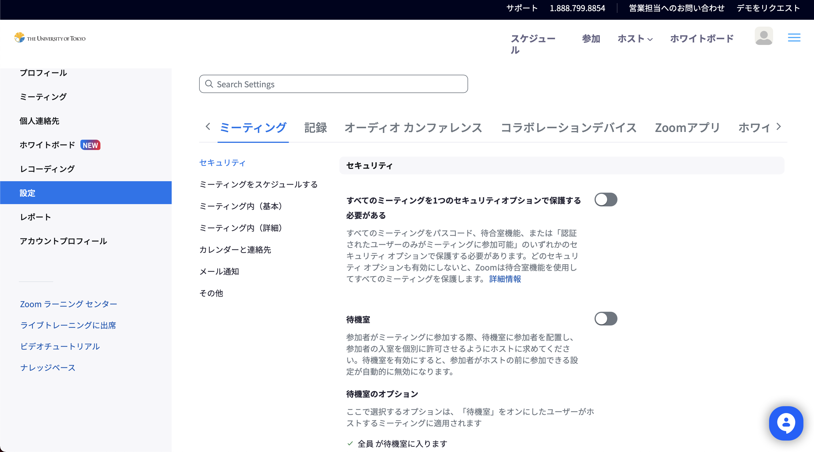
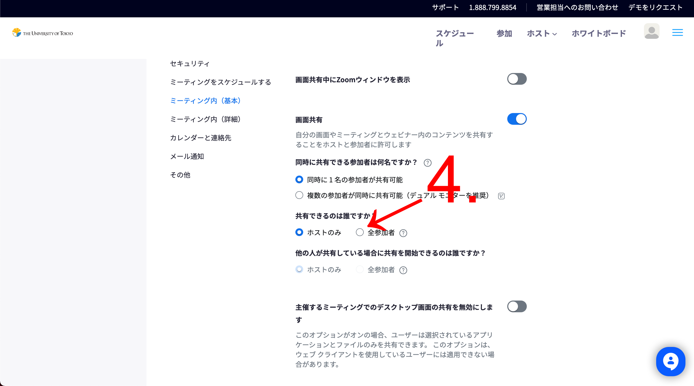

## はじめに
Zoomの[画面共有](..)機能を使うと，自分の画面や画面の一部を他の参加者の画面に表示させることが可能です．しかし，デフォルトの設定では画面共有を行えるのはホストのみで，ホスト以外の参加者にも画面共有を許可するためには設定の変更が必要です．

このページでは，ホストが参加者の画面共有を許可する方法について，他の参加者全員に許可する方法と，特定の参加者のみに許可する方法を説明します．また，後半では関連する設定として，既に画面共有がされている場合に強制的に画面共有を切り替えることを全参加者に許可する方法について説明します．

## 全員に画面共有を許可する（セキュリティ設定の変更）
ミーティング中，デフォルトの設定では画面共有を行うことができるのはホストのみですが，設定を変更することでホストは全参加者の画面共有を許可することができます．多数の参加者が画面共有する場合に便利な設定です．

1. 画面下部のコントロールツールバーにある「セキュリティ」を押してください．
2. 「画面の共有」を押してください．

   ※もう一度1.を行って，「画面の共有」にチェックが入っていれば，設定が変更できています．

### デフォルトで全員に画面共有を許可する設定方法
ミーティング中に画面共有を許可する設定は，そのとき参加しているミーティングでのみ有効です．しかし，参加中のミーティングのみではなく，自分がホストとなる全てのミーティングに対して，全参加者の画面共有を許可することもできます．

1. 「[Zoom ブラウザからサインインする方法](../../../signin/#browser)」の手順でZoomにサインインしてください．
2. 画面左のメニューから「設定」を押してください．

3. 画像のような設定画面が表示されていることが確認できたら，「ミーティング内（基本）」の中の「画面共有」の項目までスクロールしてください．

4. 「画面共有」の右のスイッチが青色のオン状態になっていることを確認して，「共有できるのは誰ですか？」の項目を「全参加者」に変更してください．

## 特定の参加者に画面共有を許可する（共同ホストの追加）
自分がホストのミーティング中，特定の参加者のみに画面共有を許可したい場合には，共同ホストの追加という方法が有効です．共同ホストに追加された参加者は，ホストにしかできない操作の一部を行う権限を持つため，画面共有を行うことができるようになります．複数の教員やTAが参加する講義などで便利な設定です．

共同ホストの追加方法や，共同ホストが可能となる操作の内容については，「[ホスト，共同ホストができること](../../../misc/host_cohost/)」を参照してください．

## （関連する設定）画面共有の強制的な切り替えを全参加者に許可する
ミーティング中に複数の参加者の画面共有が許可されている場合，デフォルトの設定では，ホストは別の参加者の画面共有の終了を待たずに新たな画面共有を強制的に開始することができます．一方で，ホスト以外の参加者は，別の参加者の画面共有中に新たに画面共有を開始したい場合にはその画面共有の終了を待つ必要があります．しかし，設定を変更することで，ホストはホスト以外の参加者にも画面共有の強制的な切り替えを許可することができます．ミーティングにおいて発表者の切り替えをスムーズに行いたい場合などに便利な設定ですが，悪意のある妨害も可能となることに注意が必要です．具体的な設定の手順は以下の通りです．

1. 画面下部のコントロールツールバーにある「画面共有」の右の「^」マークを押してください．
2. 「高度な共有オプション」を押してください．
3. 「アドバンス共有オプション」のダイアログが表示されるので，以下のように選択することで，全ての参加者が強制的に画面共有を切り替えることが可能になります．
   - 「同時に共有できる参加者は何名ですか？」：「同時に1名の参加者が共有可能」
   - 「共有できるのは誰ですか？」：「すべての参加者」
   - 「他の人物が共有しているときに共有を開始できる人物」：「すべての参加者」

### デフォルトで画面共有の強制的な切り替えを全参加者に許可する設定方法
参加中の特定のミーティングのみでなく，自分がホストとなる全てのミーティングで，画面共有の強制的な切り替えを全参加者に許可することもできます．

1. 「[Zoom ブラウザからサインインする方法](../../../signin/#browser)」の手順でZoomにサインインしてください．
2. 画面左のメニューから「設定」を押してください．

3. 写真のような設定画面が表示されていることが確認できたら，「ミーティング内（基本）」の中の 「画面共有」までスクロールしてください．

4. 「画面共有」内の項目について，それぞれ以下のように選択して，「保存」を押してください．
   - 「同時に共有できる参加者は何名ですか？」：「同時に1名の参加者が共有可能」
   - 「共有できるのは誰ですか？」：「全参加者」
   - 「他の人が共有している場合に共有を開始できるのは誰ですか？」：「全参加者」
   
   
