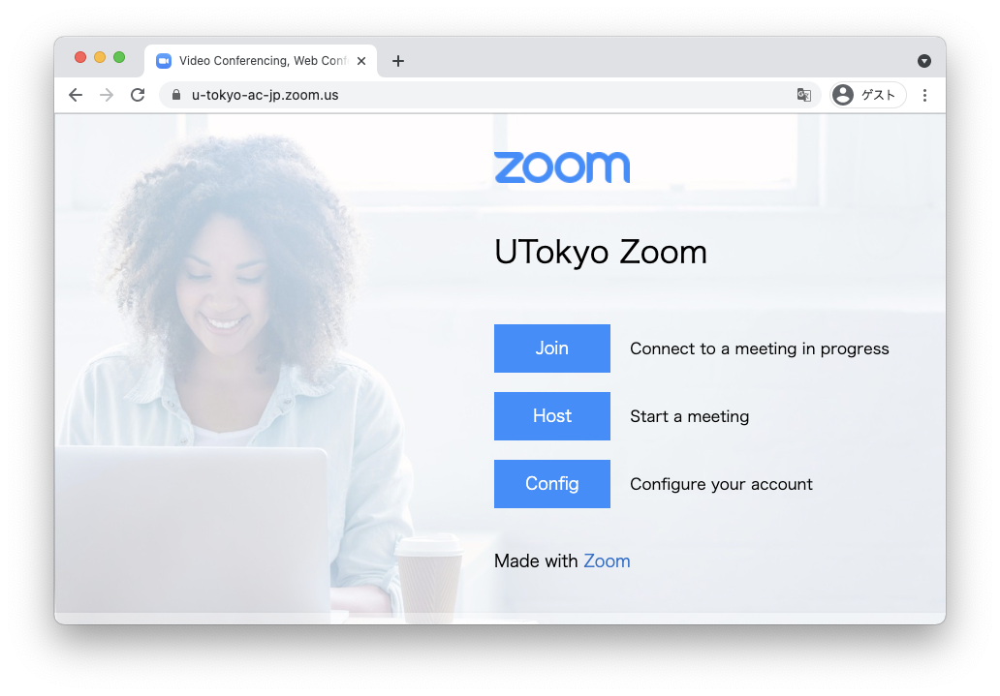
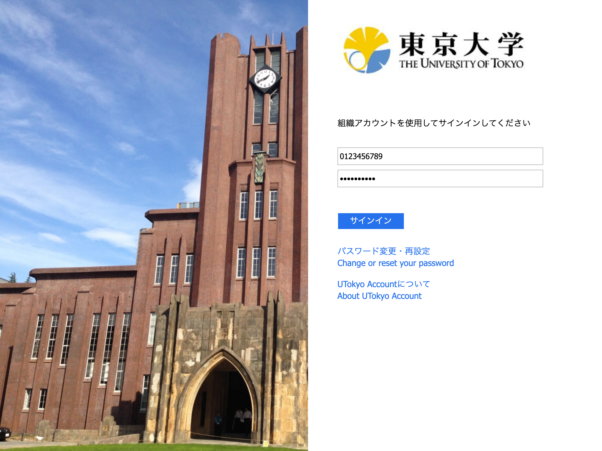
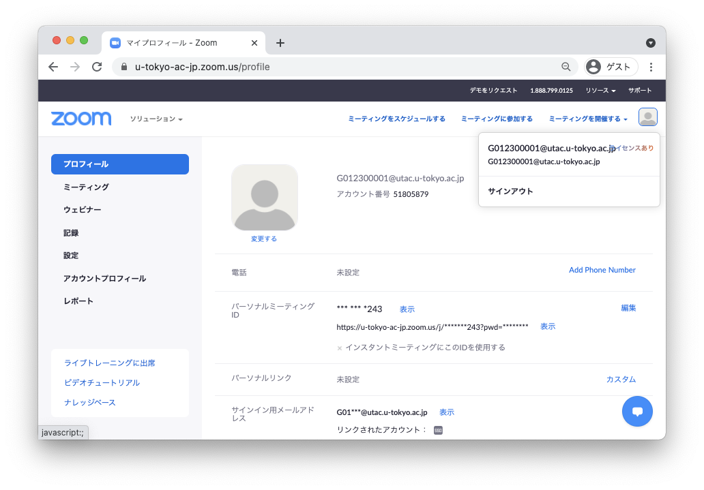
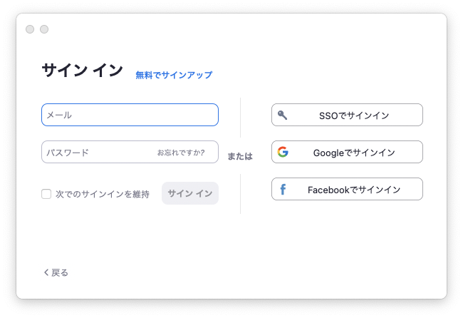
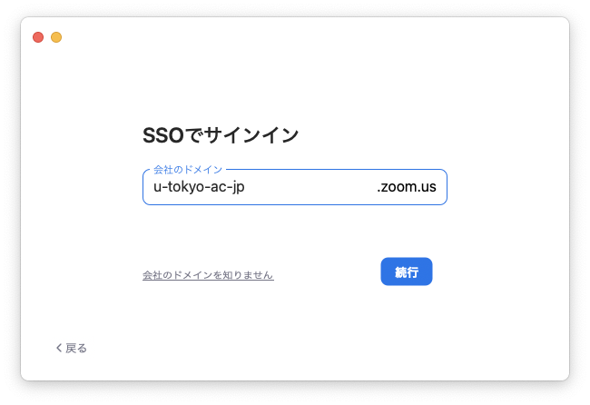

東京大学のZoomアカウントでのサインインには，[UTokyo Account](https://www.u-tokyo.ac.jp/adm/dics/ja/account.html)が必要です．UTokyo Accountをまだ使ったことがなければ，「（学生向け）[オンライン授業を受けるために](/oc/)」「（教職員向け）[オンライン授業を始めるために](/faculty_members)」に書かれている手順を確認してください．

東大の所定のZoomアカウントとは異なる，<strong style="color: red;">10桁の共通IDではないメールアドレス（ECCSクラウドメールの自分で設定したメールアドレス <code>xxxx@g.ecc.u-tokyo.ac.jp</code> など）のアカウントを利用している場合，以下の方法ではサインインできません．</strong>「<a href="/notice/zoom-address-new">10桁の共通IDではないZoomアカウントの利用について</a>」の案内をご覧ください．

## ブラウザからサインインする方法
{:#browser}

1. 東京大学専用のZoomのページ [https://u-tokyo-ac-jp.zoom.us/](https://u-tokyo-ac-jp.zoom.us/) にアクセスしてください．
2. 「UTokyo Zoom」と書かれたページが表示されるので，そのページにある「Config」と書かれたボタンを押してください．
{:.medium}
3. UTokyo Accountでサインインしてください（UTokyo Accountにサインイン済みの場合は，この画面を経ずにそのままサインインが完了します）．
{:.medium}

  
この手順がうまくいかないときのヘルプ

  <ul>
    <li><strong>上のリンクにアクセスしても「UTokyo Zoom」と書かれたページが表示されない場合</strong>：前から持っていた自分のアカウントで既にZoomにサインインしているときに起きます．<a href="https://zoom.us/profile">Zoomの設定画面</a>の右上のアイコン（自分のアイコンか，設定していない場合は人のマーク）をクリックして，「サインアウト」してから，アクセスし直してください．</li>
  </ul>
  これらを確認して，それでもうまくいかなければ，<a href="/supports/">サポート窓口</a>に相談してください．

## アプリからサインインする方法
{:#app}

1. Zoomアプリで「サインイン」ボタンを押すなどして，Zoomのサインイン画面を開いてください．
{:.medium}
2. サインイン画面で，「SSO」または「SSOでサインイン」と書かれた文字を探して押してください（この画面のメールアドレス・パスワード欄にUTokyo Accountの情報を入力してもサインインできません）．
{:.medium}
3. 「会社のドメイン」欄に `u-tokyo-ac-jp` と入力してください（ `ac` の前後はピリオドではなくハイフンであることに注意してください）．
{:.medium}
4. ブラウザに移動するので，UTokyo Accoutでサインインしてください（UTokyo Accountにサインイン済みの場合は，この画面を経ずにそのままサインインが完了します）．
{:.medium}

この手順がうまくいかないときは<a href="/supports/">サポート窓口</a>に相談してください．

## 手順動画
{:#movie}

<iframe width="560" height="315" src="https://www.youtube.com/embed/5QIg6dU1cYI" title="YouTube video player" frameborder="0" allow="accelerometer; autoplay; clipboard-write; encrypted-media; gyroscope; picture-in-picture" allowfullscreen></iframe>

