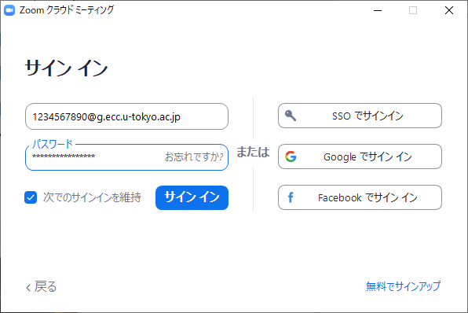
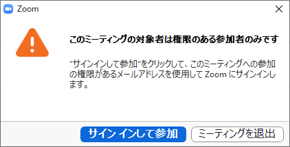
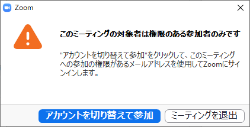
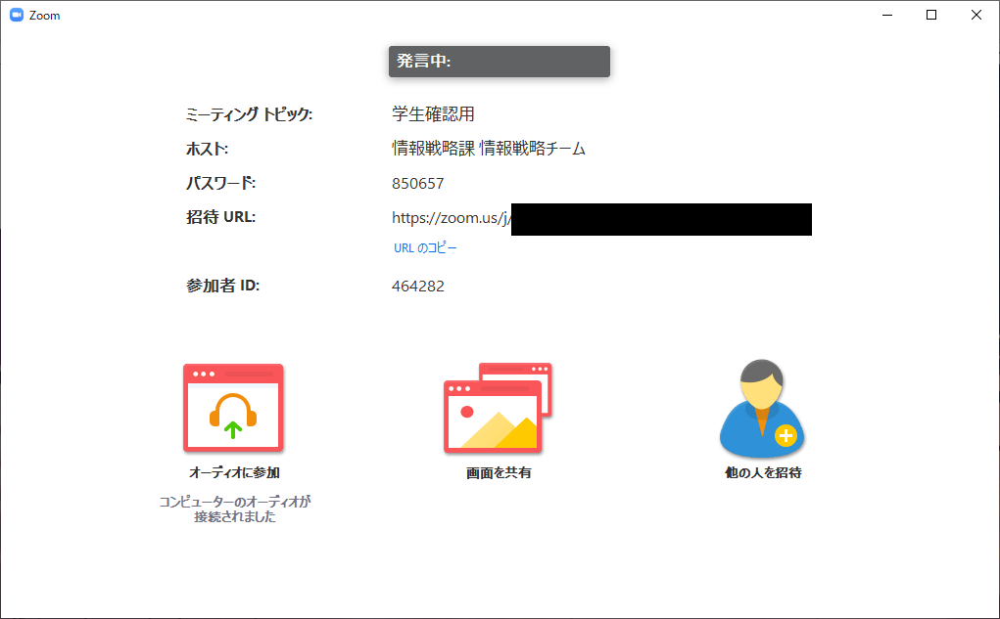
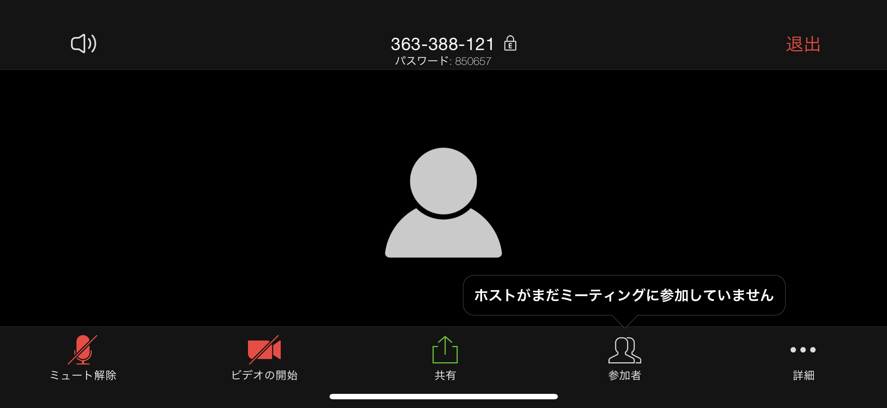

## サインアップとサインイン
* Zoomでは，アカウントを作成することを「サインアップ」，サインアップしたアカウントで使うことを「サインイン」といいます．
* Zoomでは，アカウント名（登録名）としてメールアドレスを使います．アカウントはメールアドレスに紐づけられます．
* サインインする目的には以下のようなことがあります
  * サインインしたアカウントのライセンスでしか使えない機能を使う．
  * サインインしたアカウントの設定を利用する．ミーティングを開催するときのいろいろな設定をアカウントごとに変えられます．一度設定しておけば，アカウントにサインインすることでその設定を利用できます．
  * 参加できるミーティングを「認証」により制限しているミーティングに参加する
* 「認証」により制限していないミーティングには，サインアップやサインインをしていなくても参加できます．

## 2つのECCSクラウドメールアドレス
* ECCSクラウドメールのメールアドレスは，ab12345678@g.ecc.u-tokyo.ac.jpのような当初に割り当てられたアドレスか，sanshiro-hongo@g.ecc.u-tokyo.ac.jpのようなこれを変更したアドレスになっていると思います．
* これとは別に，1234567890@g.ecc.u-tokyo.ac.jp のような，数字10桁の<a href="https://utlecon.github.io/glossary">共通ID</a>で始まるのメールアドレスがあります．
* この2つのメールアドレスは，どちらに送っても同じECCSクラウドメールに届く有効なメールアドレスです．

## Zoomのライセンスとメールアドレス
* 東京大学の教職員，学生は，参加できる人数が多いライセンス（以下，東大ライセンスと呼びます)を使用できます．このライセンスは，<b><u>1234567890@g.ecc.u-tokyo.ac.jp のような，数字10桁の<a href="https://utlecon.github.io/glossary">共通ID</a>で始まるメールアドレスに紐づけられています．</u></b>
* <b><u>ZoomとECCSクラウドメールは，システムとしては連動していません．</u></b>
* <b><u> 数字10桁の共通IDで始まるアドレスでサインアップしないと，東大ライセンスを使うことはできません．ECCSクラウドメールのパスワードとZoomのパスワードも別々です．片方を変更してももう一方は変更されません．</u></b>
* また，数字10桁の共通IDで始まるメールアドレスと，普段ECCSクラウドメールで使っているメールアドレスの関係はZoomにはわからないので，この２つのアドレスでそれぞれZoomにサインアップすることもできてしまいます．この場合，後者のアドレスのライセンスは東大ライセンスにはなりません．
* さらにややこしいことに，Zoomは，サインアップした後で登録メールアドレスを変更することもできます．この変更先のメールアドレスにECCSで普段使っているメールアドレスを使うと，このメールアドレスで東大ライセンスを使えることになります．
* 東大ライセンスになっているかどうかは，パソコンでは，<a href="https://zoom.us/profile">https://zoom.us/profile</a>でユーザータイプがLicensedになっていることで確認できます．
* 東大ライセンスでのサインアップに関するトラブルシューティングについては<a href"https://utelecon.github.io/zoom/setting_issues">ここ</a>をクリックしてください。

## WindowsとMacでのサインイン
Zoomミーティングにはブラウザのみで参加することもできますが，機能が制限されていること，ブラウザにより動作が異なることなどから，アプリでの利用をおすすめします．ブラウザでURLをクリックして，アプリを立ち上げることができます．このとき，<b><u> ブラウザとZoomアプリの関係に注意する必要があります．</u></b>
* ブラウザでのサインイン
  * <a href="https://zoom.us/signin">https://zoom.us/signin</a>からサインインすることができます．
  * サインインしたブラウザで，ZoomミーティングのURLをクリックすると，サインインした状態でミーティングに参加できます．この，<b><u>サインインしているブラウザでZoomミーティングのURLをクリックする，またはアドレスバーにZoomミーティングのURLを入力する</u></b>方法が一番簡単です．
  * ChromeとFirefoxというように，複数のブラウザを使っている場合，サインインしていないブラウザでZoomミーティングのURLをクリックしても，サインイン状態でミーティングには参加できません．
  * ただし，アプリでサインインしている時には，ブラウザでサインインしていなくともサインイン状態で参加できます．
* アプリでのサインイン
  * 必ずサインインしたブラウザからZoomミーティングに参加するのであれば，アプリでのサインインは不要です．
  * アプリを直接起動し，サインインしていない状態では以下のようなウィンドウが出てきます．
  
  * 「サインイン」をクリックして，Zoomに登録しているメールアドレス(変更していなければ1234567890@g.ecc.u-tokyo.ac.jp のような，数字10桁の共通IDで始まるメールアドレス)でサインインします．
　　  

## 講義への参加とZoomの認証
* 東京大学と関係のない第三者がオンライン講義に参加して講義を妨害する行為を防ぐために，「認証」による参加制限をしている講義があります．
* 「認証」による参加制限がないZoomミーティングには，どのようなメールアドレスでサインアップしたアカウントからも，また，サインインしていない状態でも参加できます．
* 「認証」を要求しているミーティングでは，指定のメールアドレスドメインでサインインした状態でミーティングに参加する必要があります．東京大学のオンライン講義では，xxxxx@g.ecc.u-tokyo.ac.jpのメールアドレスでサインインした状態で参加します．
* <b><u> xxxxx@g.ecc.u-tokyo.ac.jpでサインインしていれば，東大ライセンスでないアカウントでも「認証」が必要な講義に参加できます．

## 認証に失敗したとき
* サインインしていないときや，g.ecc.u-tokyo.ac.jp以外のメールアドレスでサインインしているときには，以下のような表示が出ます．「サインインして参加」または「アカウントを切り替えて参加」をクリックして，g.ecc.u-tokyo.ac.jpのメールアドレスでサインインします．Zoomで登録メールアドレスを変更していなければ，1234567890@g.ecc.u-tokyo.ac.jp のような，数字10桁の共通IDで始まるメールアドレスです．

   

## サインインして参加できるかどうかのテスト
* 以下の「認証テストミーティング」をクリックすると，g.ecc.u-tokyo.ac.jpでサインインしていないと参加できないミーティングにつながります．テストに使用してください．

  * <a href="https://zoom.us/j/363388121?pwd=d2Q5ZWEveFd3VWg4Z0RkVytMOExPQT09"> 認証テストミーティング </a>
* このミーティングは，普段は参加者がいないため，参加するとWindows/Macでは以下のような画面が出ます．
  
* iPhoneなどでは，以下のような画面になります．
  

